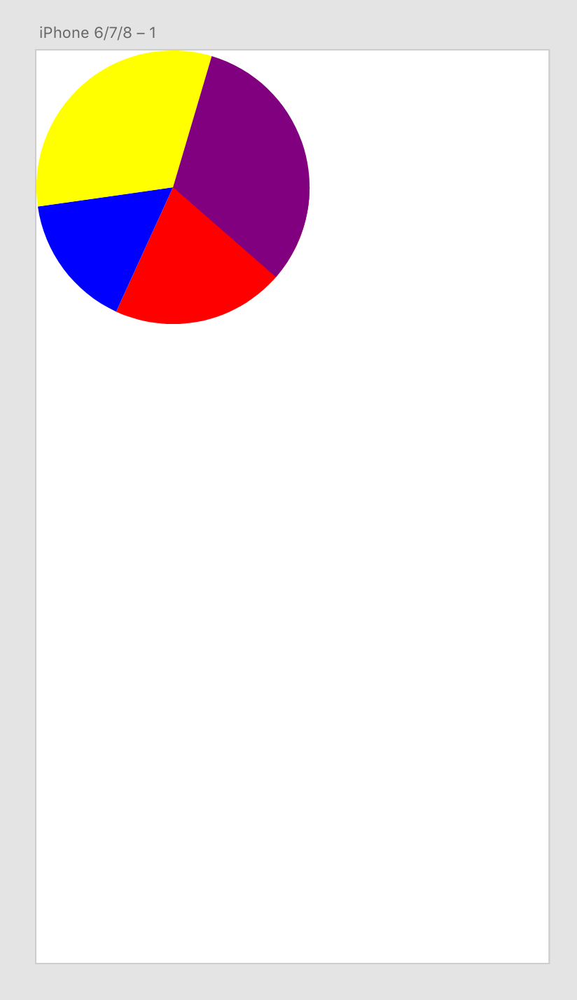

# How to Create Path Objects
This sample demonstrates how to create path objects in XD by showing how to draw wedge shapes.

<!-- Image or GIF if necessary -->
<!--  -->

<!-- doctoc command config: -->
<!-- $ doctoc ./readme.md --title "## Contents" --entryprefix 1. --gitlab --maxlevel 2 -->

<!-- START doctoc generated TOC please keep comment here to allow auto update -->
<!-- DON'T EDIT THIS SECTION, INSTEAD RE-RUN doctoc TO UPDATE -->
## Contents

1. [Technology Used](#technology-used)
1. [Prerequisites](#prerequisites)
1. [Development Steps](#development-steps)
1. [Next Steps](#next-steps)
1. [Other Resources](#other-resources)

<!-- END doctoc generated TOC please keep comment here to allow auto update -->

## Technology Used
- References: [XD Scenegraph - Path](references/selection.md)

## Prerequisites
- Basic knowledge of HTML, CSS, and JavaScript.
- Basic knowledge of [Paths](https://developer.mozilla.org/en-US/docs/Web/SVG/Tutorial/Paths)
- [Getting Started Guide](../getting-started-guide)

## Development Steps

### 1.  Get references to the `Path` and `Color` classes from XD’s `scenegraph` module
```
const { Path, Color } = require("scenegraph");
```
`Path` and `Color` classes are imported and ready to be used.

### 2. Create the main function, `drawWedges`

```
function drawWedges(selection) {
    ...
}
```
Note that `selection` parameter will be used inside the function.

### 3. Create a helper function to calculate the coordinates
```
const coords = (radius, radian) => (radius * Math.cos(radian)) + "," + (radius * Math.sin(radian));
```
`coords` function takes `radius` and `radian` as paramters and return the corresponding x,y coordinates.

### 4. Create another helper function to draw paths
```
const draw = (chartRadius, startAngleRadian, endAngleRadian, wedgeColor) => { // [1]
    const pathData = `M0,0 L${coords(chartRadius, startAngleRadian)} A${chartRadius},${chartRadius},0,0,1,${coords(chartRadius, endAngleRadian)} L0,0`; // [2]
    const piece = new Path(); // [3]
    piece.pathData = pathData; // [4]
    piece.fill = new Color(wedgeColor); // [5]
    piece.translation = { x: chartRadius, y: chartRadius };  // [6]
    selection.insertionParent.addChild(piece); // [7]
}
```
1. This function accepts four parameters - the pie chart radius (`chartRadius`), start radian of the wedge (`startAngleRadian`), end radian of the wedge (`endAngleRadian`), and color of the wedge (`wedgeColor`)
2. Based on these paramenters, `pathData` is constructed. For more information on how to write path data, please refer to [Paths](https://developer.mozilla.org/en-US/docs/Web/SVG/Tutorial/Paths)
3. Create a new instance of `Path`
4. Set `pathData`
5. Set the color of the path object
6. Move the path object so the coordinates of the top left of the wedge is `0,0`
7. Insert the object into the artboard

### 5. Draw four wedges
```
draw(100, 0, 2, "red");
draw(100, 2, 3, "blue");
draw(100, 3, 5, "yellow");
draw(100, 5, 7, "purple");
```
Note that start radian and end radian of each wedge is intentially configured to make a piechart all together.



## Next Steps

Description

- [How to debug](how-to-debug)

## Other Resources
- [Title](link)
- [Title](link)