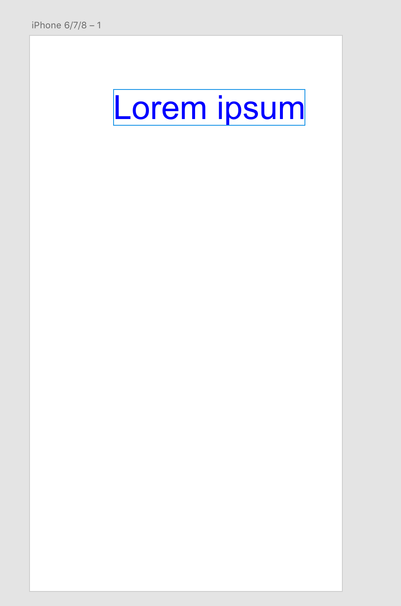

# How to import a local file

Description

<!-- Image or GIF if necessary -->


<!-- doctoc command config: -->
<!-- $ doctoc ./readme.md --title "## Contents" --entryprefix 1. --gitlab --maxlevel 3 -->

<!-- START doctoc generated TOC please keep comment here to allow auto update -->
<!-- DON'T EDIT THIS SECTION, INSTEAD RE-RUN doctoc TO UPDATE -->

## Technology Used
- References: (XD File I/O)[references/selection.md]

## Prerequisites
- Basic knowledge of HTML, CSS, and JavaScript.
- (Getting Started Guide)[../getting-started-guide]

## Development Steps

### 1.  Get references to the `Text` and `Color` classes from XD’s `scenegraph` module
```
const { Text, Color } = require("scenegraph");
```
`Text` and `Color` classes are imported and ready to be used.

### 2. Import XD's `localFileSystem` module
```
const fs = require("localFileSystem").localFileSystem;
```
since this example uses File I/O to import a file from user's local drive, we need to require XD's `localFileSystem` module.

### 3. Create an asynchronous function
```
async function loadText(selection) {}
```
Since XD's File I/O is an async method which uses `await`, your function needs to be an async function.

### 4. Invoke the file chooser
```
const [aFile] = await fs.getFileForOpening();
```
This will invoke the default file chooser on user's machine


### 5. Read the content
```
const contents = await aFile.read();
```
`read()` method is used to extract the content from the chosen file.

### 6. Create an XD text instance
```
const text = new Text();
text.text = contents;
text.styleRanges = [
    {
        length: text.text.length,
        fill: new Color("#0000ff"),
        fontSize: 40
    }
];
```
Note that `text.text` is populated with the content read from the chosen file and `styleRanges` property is configured as above.

### 7. Insert the text and move the text inside the artboard
```
selection.insertionParent.addChild(text);
text.moveInParentCoordinates(100, 100);
```
Note that `moveInParentCoordinates` method is used to move the text inside the artboard.



## Next Steps

Description

- [How to debug](how-to-debug)

## Other Resources
- [Title](link)
- [Title](link)