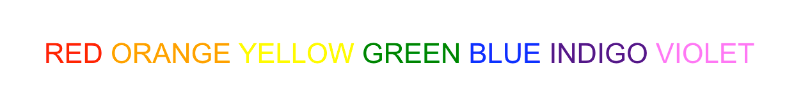
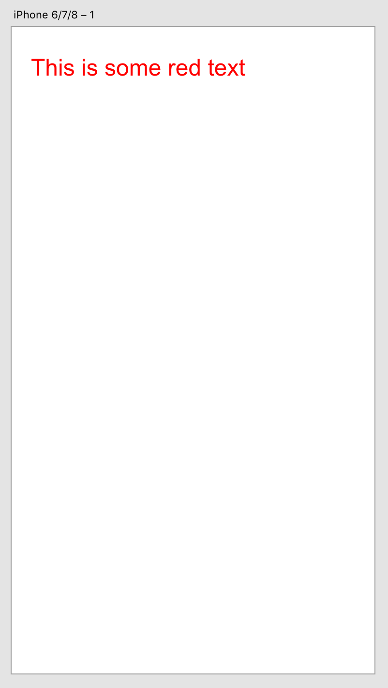

# How to style text

Creating styled text in Adobe XD is easy! In this guide, we'll show you how to create a text element with a specific color and font size, and also a text element with multiple inline colors.



<!-- doctoc command config: -->
<!-- $ doctoc ./readme.md --title "## Contents" --entryprefix 1. --gitlab --maxlevel 2 -->

<!-- START doctoc generated TOC please keep comment here to allow auto update -->
<!-- DON'T EDIT THIS SECTION, INSTEAD RE-RUN doctoc TO UPDATE -->
## Contents

1. [Technology Used](#technology-used)
1. [Prerequisites](#prerequisites)
1. [Development Steps](#development-steps)
1. [Next Steps](#next-steps)

<!-- END doctoc generated TOC please keep comment here to allow auto update -->

## Technology Used
- References:
    - [SceneGraph API](https://adobe-xd.gitbook.io/plugin-api-reference/scenegraph-reference/scenegraph)
    - [Text Node](https://adobe-xd.gitbook.io/plugin-api-reference/scenegraph-reference/scenegraph#text)
    - [`styleRanges`](https://adobe-xd.gitbook.io/plugin-api-reference/scenegraph-reference/scenegraph#text-styleranges-array)
    - [Color](#)

## Prerequisites
Basic knowledge of HTML, CSS, and JavaScript.

## Development Steps

### 1. Import Node Types from the SceneGraph API

We'll need both the [Text](https://adobe-xd.gitbook.io/plugin-api-reference/scenegraph-reference/scenegraph#text) and [Color](https://adobe-xd.gitbook.io/plugin-api-reference/scenegraph-reference/scenegraph#color) classes from XD's [SceneGraph Module](https://adobe-xd.gitbook.io/plugin-api-reference/scenegraph-reference/scenegraph).

```js
const { Text, Color } = require("scenegraph");

function addRedText() {
    /* rest of the code goes here */
}
```

### 2. Creating a Text Node

Before we can create any text _styles_, we need to create a text node first, and assign some text to it.

```js
const node = new Text();
node.text = "This is some red text";
```

### 3. Create a style range

```js
node.styleRanges = [{
    length: node.text.length,
    fill: new Color("#FF0000"),
    fontSize: 24
}];
```

There are a few things you should notice about this step:

* `styleRanges` is an array of objects; you can have more than one style for a text node.
* Each style is given a `length` which determines the characters to which the style is applied. Specifying the length of our text string ensures that the color is applied to the entire text node.
* Text color is specified by the `fill` property. We're using a CSS color which equates to red.
* The size of the text is specified by `fontSize`.

### 4. Add the text node to the scenegraph

```js
selection.insertionParent.addChild(node);
node.moveInParentCoordinates(100, 100);
```

If you execute this code within a plugin, you'll see the following result:



### 5. Multiple styles

As indicated in step 3, the `styleRanges` property takes an _array_ of objects. This means we can have more than one style in a text node. Let's use that to our advantage and create a text node that lists out the classical colors of the rainbow. Each word will be given the same color.

Just like before, we need to create a new text node, but we'll also take the opportunity to create an array of colors in the rainbow:

```js
function addRainbowText() {
    const node = new Text();

    const colors = [
        "red", "orange", "yellow",
        "green", "blue", "indigo",
        "violet"
    ];

    /* rest of code goes here */
}
```

Next, we can assign the colors to the text node using `Array#map` and `Array#join`:

```js
node.text = colors.map(color => color.toUpperCase()).join(" ");
```

All this will do is take each value in the `colors` array, convert it to uppercase, and then return that list as a string separated by spaces.

Now comes the fun part: we need to build an array of styles, each applying only to the desired word. We can use `Array#map` again, and calculate the length of each word. If we add `1` to that length, we'll include the whitespace as well.

```js
node.styleRanges = colors.map(color => ({
    length: color.length + 1, // includes the space
    fill: new Color(color), // color understands color names
    fontSize: 24
}));
```

> **Tip:**
>
> The `Color` constructor understands some color names. If we'd wanted to use a color that Adobe XD didn't understand, we'd have had to come up with the appropriate CSS color version instead.

And, like the last example, we can add the text node to the scenegraph:

```js
    selection.insertionParent.addChild(node);
    node.moveInParentCoordinates(100, 100);
```

Upon running this code, you should see the following:


## Next Steps

Description

- [How to debug](how-to-debug)
- [Investigate the style properties that are available](https://adobe-xd.gitbook.io/plugin-api-reference/scenegraph-reference/scenegraph#text-styleranges-array)