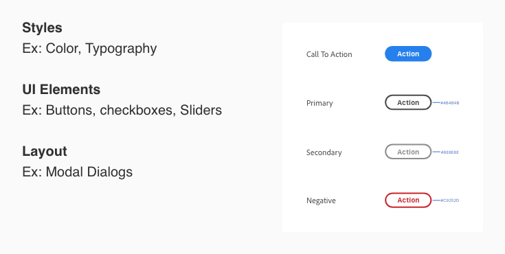

# **Plugin Design Guidelines**

## Designing a plugin experience

These guidelines will help you define the best user experience for your plugin. Based on your users workflow and the plugin action, different UX guidelines should be considered as you create a plugin.
 
Plugins can interact with the user at different levels, for example, some plugins will have quick actions which in some use cases won’t render UI, and some will include multiple actions that need UI. 

## UX Guidelines

**These guidelines will go over the different plugin UX patterns.**

### 1. **[Usability & Behavior](./ux_guidelines/Usability_Behavior.md)**

Guide your users as they interact with your plugin, for example when they first interact with your plugin what can they expect and how can they get the most out of your plugin. 

### 2. **[Interface Guidelines](./ux_guidelines/Interface_Guidelines.md)**

How will user navigate your plugin, what is best entry point and what surface can your plugin can use.

### 3. **[Provide Feedback](./ux_guidelines/Provide_Feedback.md)**

Provide users with feedback as they interact with your plugin, this can be alert & success messaging, permission dialogs or loaders & progress bars to let them know something is running in the background. 

## UI Resources & Toolkits

**UI Resources will have information on UI components, examples and a sticker sheet you can use to build your plugin**

**[View Sticker Sheet](./ui_resources/Sticker_sheet.md)**

