# **Interface Guidelines**

These are guidelines and best practices on the surfaces your plugin can use.

----------
# **Navigation**

These guidelines provide clarity on the different entry points a plugin can have. 

## Entry points

An entry point is how users access your plugin, users can access a plugin through the menu bar or a keyboard shortcut.

### Menu bar

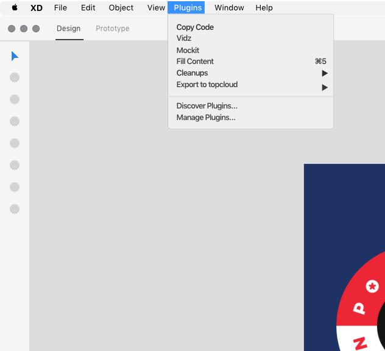

### Keyboard shortcuts 

If you are considering having a shortcut for your plugin, make sure to keep these guidelines in mind. 

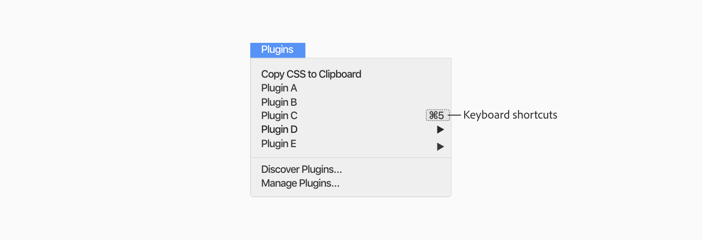
 
**Keep in mind** 
- If the user has another plugin with the same shortcut already installed, the new installed plugins shouldn’t expect to have that same shortcut.  
- Can use a combination of **“Shift” “Alt/Option”** and **“Control”**
- Keyboard shortcuts are used by **power users**
- A keyboard shortcut can be used as an entry point but account for possible shortcut collisions

### Entry Point Considerations
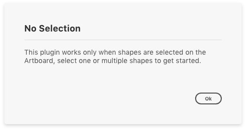

**Incompatible selection**
- As a best practice avoid the “no selection” error if possible. Consider another workflow in this use case. An example is to utilize the clipboard even if the user doesn’t have the right selection. 
- When a plugin can’t complete an action based on the object selected, then render an information dialog. 

## **Menu bar**
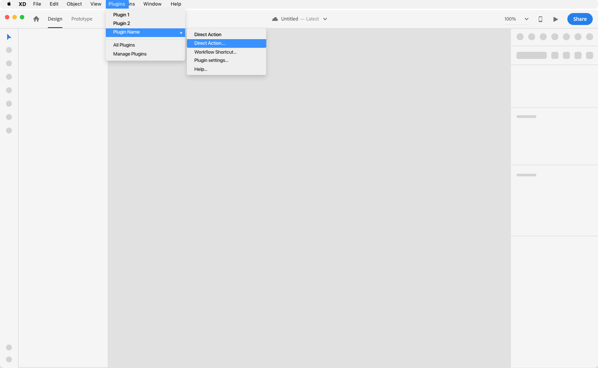

### UX Pattern
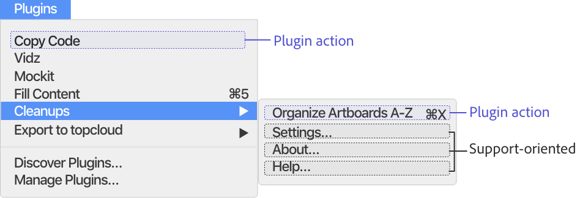

**Content**

> **Plugin actions (entry point)** - Executes a plugin action or open modal.

> **Support-oriented items** - Provide help links, about tutorials or global settings.

> - **Settings** - If the plugin handles default preferences then consider having “plugin settings” as part of the submenu. (ex: export options, spacing rules)
> - **About** - Users can refer back to onboarding materials such as tutorials and guides on how to use the plugin. 
> - **Help** - Provide the user with an external link to help documentation or an email through the submenu.

## Top Menu 

### **Use Case**

If your plugin has **one action or workflow shortcut** then the action can be the top menu item. 

### **UI Pattern**

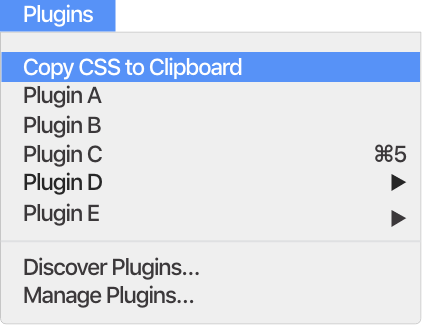

**Plugin Label** 

> A. Long label names will truncate

> C. The top menu label is the plugin name

> D. Limit the use of emoji’s as part of the label

## Submenu items

### **Use Cases**

if your plugin needs to handle **multiple actions** or **workflow shortcuts** then consider having them in the submenu.

### **UI Pattern**

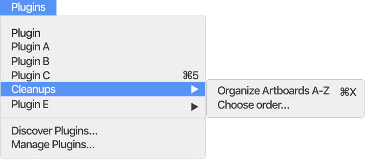

**Plugin Label** 
> A. Long label names will truncate
> B. Top menu label is the plugin name
> C. Submenu labels - action labels should have a descriptive name (i.e: Copy CSS)
> D. When a plugin needs further user action in order to continue, then at the end of the submenu label should use “…”
> E. Limit the use of emoji’s as part of the label

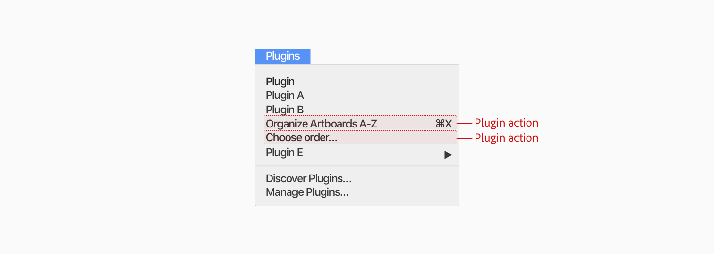

**Don’t**
> Don’t add multiple actions for one plugin as top-level items.

# **Layout**

There are different surface areas a plugin can render, this can vary based on the type of action and amount of context you need to provide your user.

## Plugin UI

if the plugin is a simple script or doesn’t need a lot of user input then a modal UI is not required. If the user needs to set preferences, choose content or complete a step process before running the plugin then you can use the modal dialog UI. In the use case of alerts such as permission dialogs then UI would be recommended. 

**Modal Dialog** - If the plugin needs to run an action before the user starts a new action then the **modal** would be recommended for that use case. 

**Alert modal dialog** - This can also be used if the plugin needs to alert the user of an error or ask for permission. *[(see Alert Dialogs & Messaging)](./ux_guidelines/Provide_Feedback.md)* 

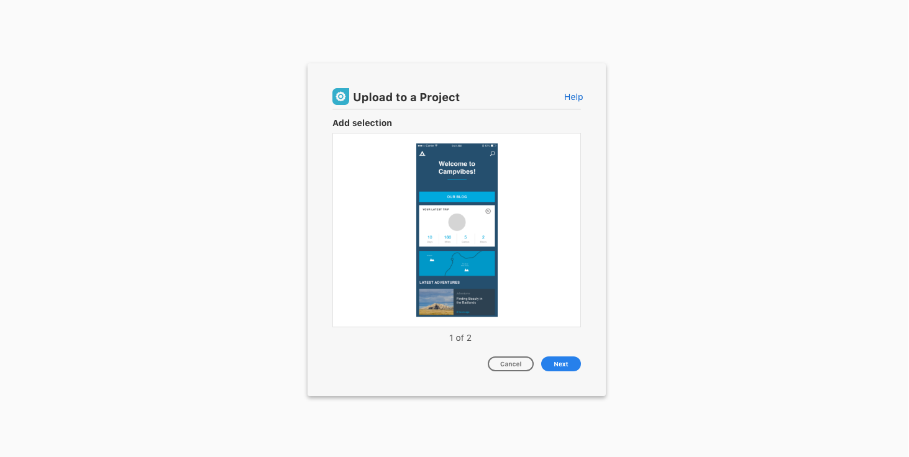

## **Modal Dialog** 

A modal dialog is considered blocking UI - best used when the plugin needs to run an action and the user shouldn’t change selection, since user doesn’t have access to the canvas while using modal dialog UI.

### UI Pattern
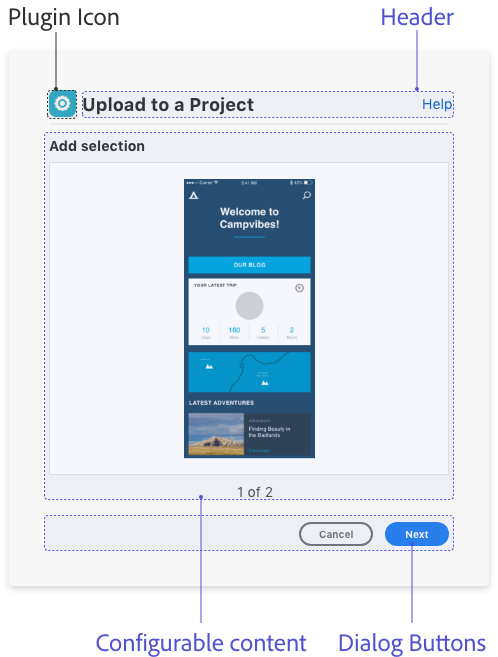

**Content**
> **Header** 

> Have a clear header for the dialog. 
e.g. “name of plugin”, “description of workflow”

> **Configurable content**
This is what the user can interact with before executing the plugin action. 

> **Dialog Buttons**
Include a modal dismissal button to allow the user to cancel/close the modal and a call to action button (blue) to highlight the primary action. 

> **Plugin Icon**
You can include a plugin icon to let the user know they are interacting with your plugin in the modal dialog

## **Buttons & key commands**

### Use cases 

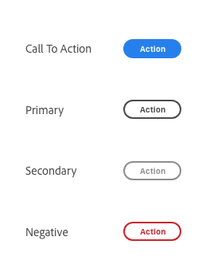

> **Call to action** 
The call to action button communicates strong emphasis and is reserved for encouraging critical actions. There should only be one visible call to action button per section. 

> **Primary** 
The primary button is used for medium emphasis. It should be used in place of a call to action button when the action requires less prominence, or if there are multiple primary actions of the same importance on the page. It can be displayed either in standard style (visible stroke) or in quiet style.

> **Secondary**
The secondary button is for low emphasis. It is meant to be paired with other button types to surface less prominent actions, and should never be the sole button in a group. It can be displayed either in standard style (visible stroke) or in quiet style.

> **Negative**
The negative button is for high emphasis of negative or destructive actions. It should be used sparingly. It can be displayed either in standard style (visible stroke) or in quiet style.

### UX patterns

> **Button Group Overflow**
When horizontal space is limited, button groups stack vertically. They should appear in ascending order based on importance, with the most critical action at the bottom.

> **Use 2 button styles maximum**
The top-level action within a button group should be a call to action, primary, or negative button. The subsequent buttons should always be secondary buttons of the same style (standard or quiet). Don’t combine more than 2 button styles in a button group.

### Button labels

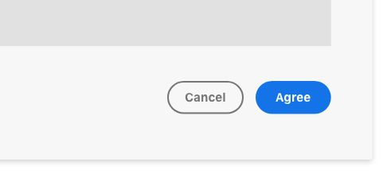

> Button labels should be clear about the intention of the action. Button text should be 1 to 2 words and consider the number of characters.

### Key commands
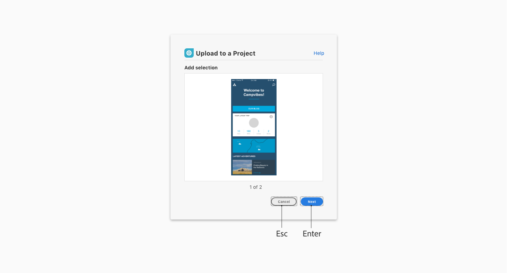

> **Esc key**
> Dismisses the dialog. This is equivalent to choosing “Cancel”.

> **Enter key**
> Executes the primary button action. 

## **Modal Dialog UI Examples**
### Step Process Example

The user has to complete multiple steps before executing the plugin action. Multi step dialogs are good for complex workflows but can be too many clicks for simple actions. 

