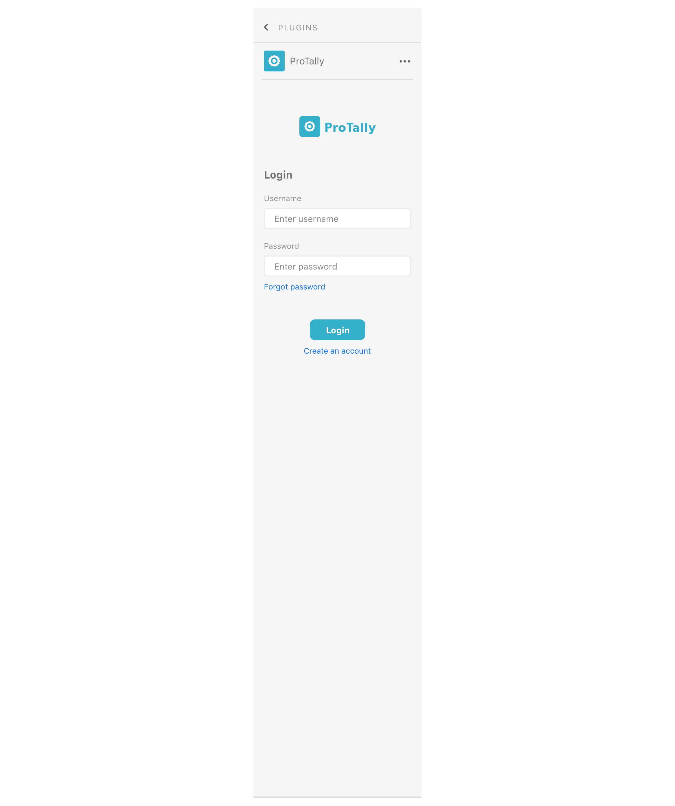
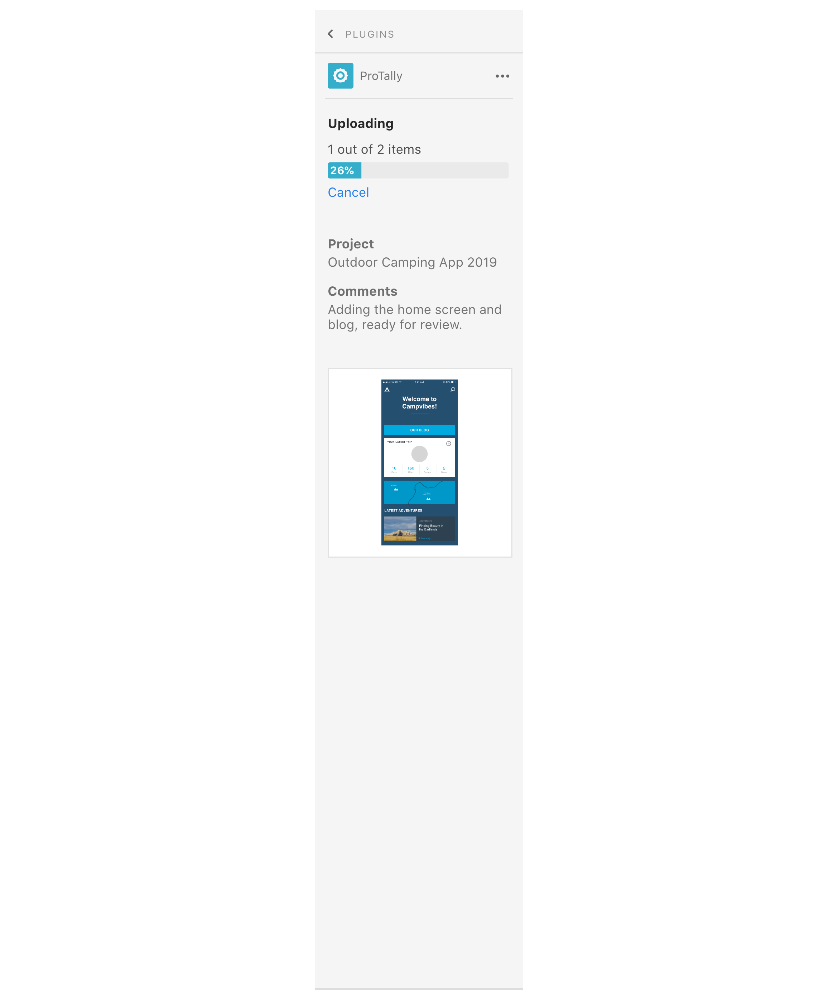
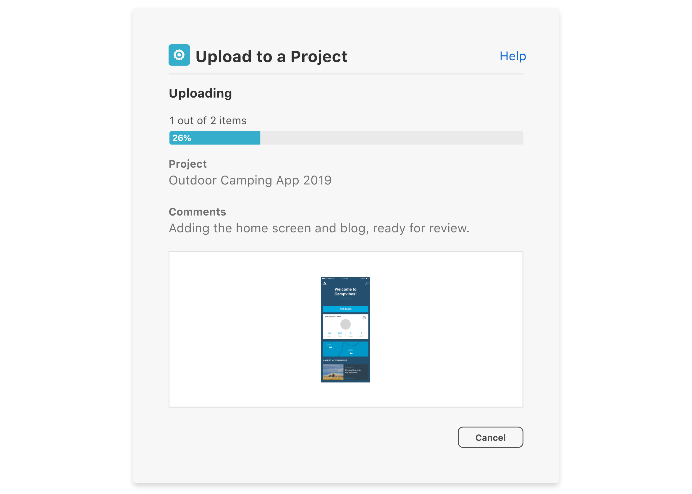

# Branding

To ensure users know they are interacting with your plugin, include branding throughout the plugin experience. Below are some examples. 

- Onboarding and branding
- Customized plugin UI

Provide users with feedback as they interact with your plugin, this can be alert and success messaging, permission dialogs or loaders and progress bars to let them know something is running in the background. Below is a guide to help determine where to render plugin messages.

----------
  

## Onboarding and branding

When the user is interacting with the plugin for the first time for example in the onboarding or login screen, including the plugin logo will help the user identify the plugin in the future. 

  

## Customized plugin UI

Customizing the UI to include brand colors, will help users distinguish your plugin from native UI in XD. 

