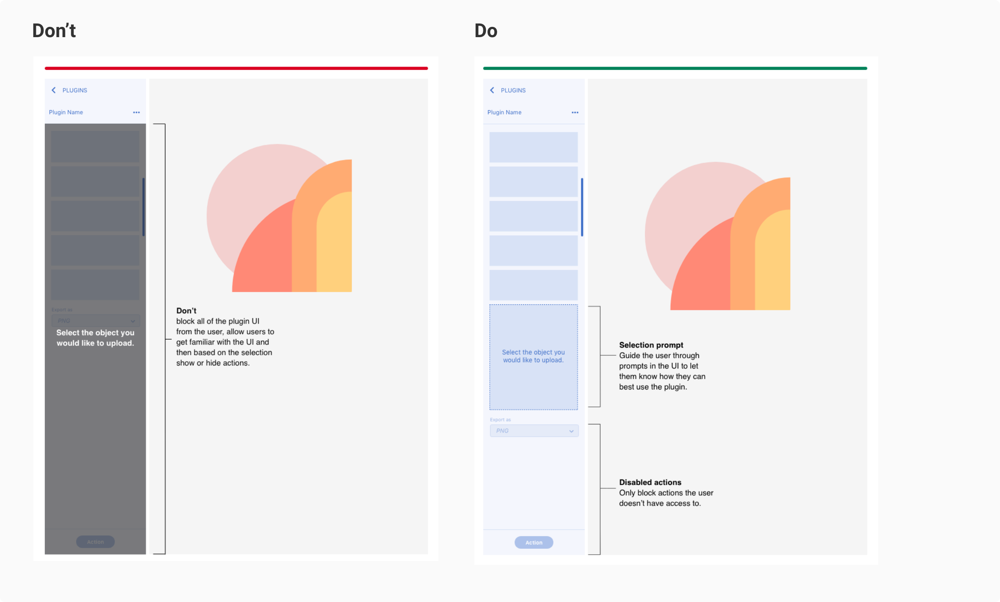

# UX Patterns

UX Patterns will include UX requirements and/or UX best practices these will ensure your plugin follows XD user experience patterns.

- [Panel UX](ux-patterns/panel-ux.md)
- [Modal UX](ux-patterns/modal-ux.md)
- [Onboarding](ux-patterns/onboarding.md)
- [Navigation](ux-patterns/navigation.md)
- [Messaging](ux-patterns/messaging.md)
- [Branding](ux-patterns/branding.md)

----------

  
 
# Documentation

### Specs and UX Requirements

Requirements highlights key XD patterns all plugins need to follow to get approved by Adobe. 

### Best practices

Best practices provides recommendations on plugin usability and behavior, user feedback, privacy and interface guidelines. 

