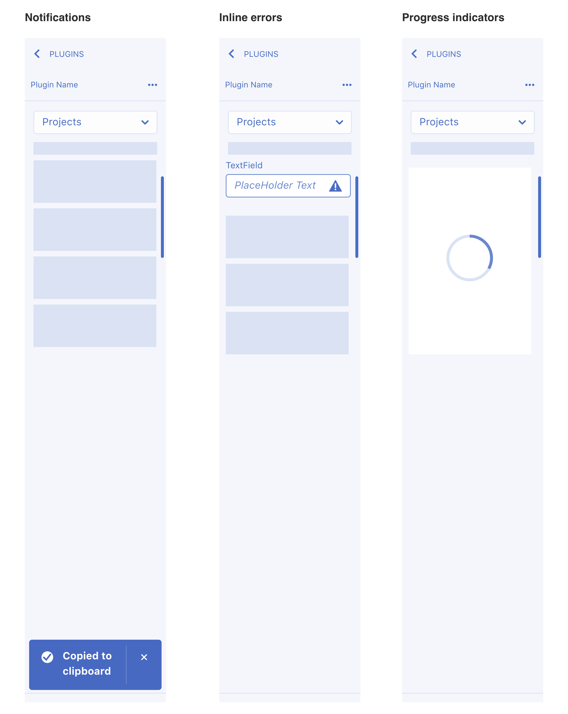

# Messaging

These are the guidelines and best practices on when and how to provide users with feedback as they interact with your plugin.

- Alerts
- Success
- Output
- Permission dialogs
- Loaders and Progress bars
- Examples

Provide users with feedback as they interact with your plugin, this can be alert and success messaging, permission dialogs or loaders and progress bars to let them know something is running in the background. Below is a guide to help determine where to render plugin messages.

----------
  

## Alerts

**Use case**  
Use alert messaging whenever the plugin cannot perform the intended task, dialogs are persistent until dismissed

#### UX Requirements

**Header**  
Have a clear header that describes the error

**Message**  
Explain what error was encountered and give a clear actionable solution. Also, avoid blaming the user or XD.

**Dialog buttons**  
Include at least one modal dismissal button to allow the user to dismiss/close the modal

#### Best practices

**Warning icon**  
To help communicate critical information for an error you can include a warning icon next to the header

**Help**  
If a plugin has a help page, consider adding it to the error modal dialog.

**Visual/tutorials**  
Provide image/GIF example as part of the dialog, to help users understand the actionable solution

**Messaging**  
In the alert messages use language that is easy to understand for the user.
 
  

## Success

**Use case**  
Use success messaging whenever the plugin successfully completes a task and has no visual output on the canvas.

#### UX Requirements

**Header**  
Have a clear header for the dialog.

**Message**   
Explain what the plugin successfully completed, if it is not visually apparent to the user.

**Dialog buttons**  
Include at least one modal dismissal button to allow the user to dismiss/close the modal.

  

## Output

**Use case**  
If a plugin generates output that the user needs to complete a workflow, then the plugin needs to provide that information to the user.

#### UX Requirements

**Plugin output**  
In use cases like these, the plugin output can be shown in the UI, copied onto the clipboard, populated on the document or generate a file.

**Example:**   
Copied onto the clipboard - the plugin can add copy to the clipboard and provides the user with instructions through the UI.

**Don’t**  
Require users to go into the developer console to complete an action.

  

## Permission dialogs

**Use case**  
Use permission dialogs when being destructive or making modifications.

#### UX Requirements

**Header**   
Have a clear header for the dialog.

**Message**  
Explain the destructive action or modification and ask for the user’s permission

**Dialog buttons**   
Include a modal dismissal button to allow the user to cancel/close the modal and a negative button (red) to highlight that action.

**Key Commands**   
Esc key or Enter key Dismisses the dialog when the “Cancel” button is in focus

  
  
## Loaders and Progress bars
Let the user know when something is happening in the background in the plugin UI. 

#### Best practices

**Determinate use case**  
Use case If the progress can be reflected on a loader. 

**Indeterminate use case**  
If the progress can’t be determined then provide a loader to let the user know something is loading.

## Examples

**Operation failed to complete**  
Error dialog - when a plugin can’t complete an operation, render an error dialog to let the user know the operation failed and why it failed.

**Network connectivity issue**  
Information dialog - if the plugin is unable to connect to the internet to complete an action, then use an information modal dialog to communicate that to the user.

**Unable to share**  
“An error occurred while sharing your project. Please verify the email. address and try again”.

**Network connectivity**  
“Please connect to WiFi to sync your tasks to your product management tool”.

#### Panel UI messaging

  

