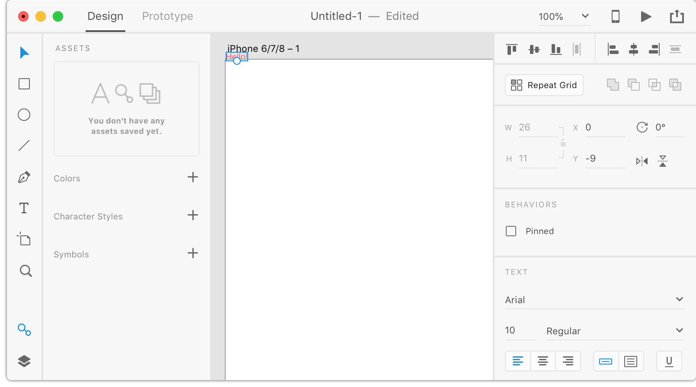

# Getting Started with XD Plugin Development

Let's walk through the process of how you can create an Adobe XD plugin. This plugin is pretty simple to start, but you should be able to follow the instructions to create just more complex plugins as well.

## Identify where your plugins are located

Adobe XD loads plugins from a `plugins` folder in specific storage location:

Platform | Path
---------|-----------
macOS    | `~/Library/Application Support/Adobe/Adobe XD CC (Prerelease)/`  (note: ~/Library, not /Library)
Windows  |  `C:\Users\%USERNAME%\AppData\Local\Packages\Adobe.CC.XD.Prerelease_adky2gkssdxte\LocalState\`

Navigate to the above path, and if there _isn't_ a folder that already exists with the name of `plugins`, go ahead and create it.

```bash
$ cd ~/Library/Application\ Support/Adobe/Adobe\ XD\ CC\ \(Prerelease\)/
$ mkdir plugins
```

## Create your plugin scaffold

Adobe XD only requires your plugin to have two files:

* `xdplugin.json` is your plugin's **manifest**. This file includes information about the plugin, such as its name, the menu item(s) it should use, and so on.
* `main.json` is your plugin's **code**. This file contains your JavaScript code that implements the logic for your plugin.

These two files (and any others you need) are stored within a folder. Each plugin gets its own folder, so the folder names need to be unique.

```bash
$ cd ~/Library/Application Support/Adobe/Adobe XD CC (Prerelease)/plugins
$ mkdir com.adobe.xd.hello-world
$ cd com.adobe.xd.hello-world
```

## Create your plugin's manifest

Adobe XD requires that your plugin have a manifest named `xdplugin.json`. Our example looks like this:

```json
{
    "id": "com.adobe.xd.helloWorld",
    "name": "Hello World sample plugin",
    "host": {
        "app": "XD",
        "minVersion": "8.0"
    },
    "uiEntryPoints": [
        {
            "type": "menu",
            "label": "Say hello",
            "commandId": "sayHello"
        }
    ]
}
```

For more about what each entry means, [see the manifest documentation](../reference/manifest.md).

## Create your plugin's code

Next, we need to create the code for our plugin. This lives in a file named `main.js`.

```js
const {Text, Color} = require("scenegraph"); // [1]

function sayHello(selection) { // [2]
    const el = new Text(); // [3]
    el.text = "Hello!";
    el.styleRanges = [
        {
            length: el.text.length,
            fill: new Color("#FF0000")
        }
    ];
    selection.insertionParent.addChild(el); // [4]
}

return { // [5]
    commands: {
        sayHello
    }
}
```

1. In this line, we get references to the `Text` and `Color` classes from XD's `scenegraph` module. There are several other classes that you can obtain as well, but remember to get a reference before using them anywhere else in your code.

2. Next we define our function. Notice here how it has the same name as when exported in #5.

3. In this line we create a new `Text` object. The following lines assign various properties and styles to the text.

4. Here we add the object to the scene graph. It should show up at the (0, 0) coordinates, so if you don't see it, try zooming out or panning until you do.

5. The final part of `main.js` is to export the commands that are valid. Notice here that the exported function's name matches the name in the `xdplugin.json` manifest.

## Invoke your plugin

Great -- we've written a plugin -- how do we invoke it? If you haven't already, go ahead and launch XD and open a new document. Then navigate to **Plugins | Say hello**.


Once you click the menu item, "Hello" should appear in your XD canvas.


Oh... wait. That didn't go exactly to plan. Where's "Hello" at? Is something wrong? Let's figure out how to debug, so we can see what's going on.

## Viewing Plugin Logs

Adobe XD will log errors from your plugin to a log file. Anything your plugin logs via `console.log` will also be written to the same log file. How you access the log file is dependent upon the platform.

### macOS

The easiest way to view the console output from your plugin is to open `Console.app`. You can then search for `Adobe XD` in the `Search` field. You can also search for anything else you might be logging.


### Windows

You'll need to open the log file at `C:\Users\%USERNAME%\AppData\Local\Packages\Adobe.CC.XD.Prerelease_adky2gkssdxte\LocalState\AdobeXD.log`. How you want to view the output is up to you, but it's suggested that you use `tail` if you use Git Bash, or you can use the [PowerShell equivalent](https://stackoverflow.com/questions/187587/a-windows-equivalent-of-the-unix-tail-command/188126#188126).

## Debugging our plugin

Knowing this, let's add a couple of `console.log` statements to our `sayHello` function. Modify it so that it looks like the following:

```js
function sayHello(selection) {
    console.log("com.adobe.xd.say-hello", "sayHello started");
    const el = new Text();
    el.text = "Hello!";
    el.styleRanges = [
        {
            length: el.text.length,
            fill: new Color("#FF0000")
        }
    ];
    selection.insertionParent.addChild(el);
    console.log("com.adobe.xd.say-hello", "sayHello ended");
}
```

Next, hit the `x` key. This will reload all the plugins in the document _and_ execute your last command. (Note: don't use any modifiers when pressing this key.)

Now you should see some more information in the log:


Clearly our plugin is executing -- otherwise we wouldn't see our logs in the output. Perhaps the plugin is executing, but the results aren't what we expected.

If we select everything in the document, we'll find that this is indeed the case:



At this point we know what happened -- the text is rendered outside of the artboard, and so it doesn't render. Let's instruct the text element to move inside the canvas by modifying our `sayHello` function one more time:


```js
function sayHello(selection) {
    const el = new Text();
    el.text = "Hello!";
    el.styleRanges = [
        {
            length: el.text.length,
            fill: new Color("#FF0000")
        }
    ];
    selection.insertionParent.addChild(el);
    el.moveInParentCoordinates(100, 100);
}
```

Next, press `x` again, and you should see the following:


## Iterating on your plugin

You've already seen that you can press `x` to reload your plugin code and execute the previous command. There are additional shortcuts that you may find useful:

* `q` &mdash; will quickly reload all the plugin code in the current window.
* `x` &mdash; will reload all the plugin code _and_ execute the last command again.
* `d` &mdash; will repeat your last command without reloading any plugin code.

Note that you will have to quit and relaunch Adobe XD in the following scenarios:

* If you add a new plugin, XD won't see it until next launch
* Manifests are read only at start, so changes to your manifest won't be reflected until the next launch

## Congratulations!

You've built your first plugin with Adobe XD!
