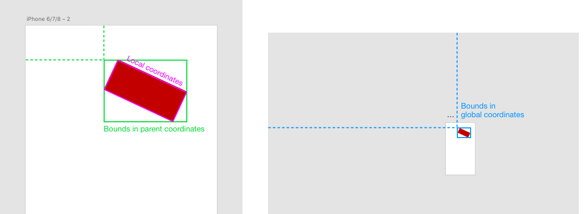
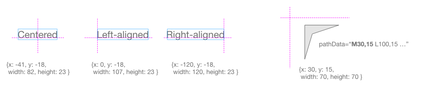
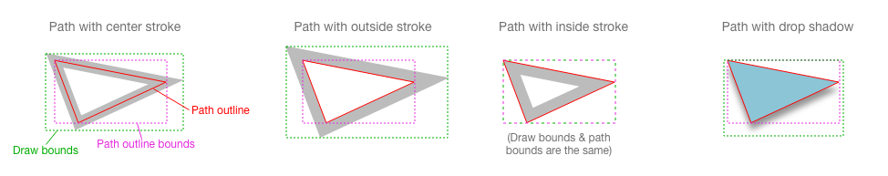

# Adobe XD Plugins API

Adobe XD plugins provide a way for developers to extend XD functionality. Plugins can manipulate objects on canvas and alter their properties.

*   **Change the properties of objects.** Plugins can change border, fill, opacity, and other object properties without direct user interaction.
*   **Add and remove items on canvas.** Your plugin can add rectangles, paths, text, and other shapes to the canvas. Using paths, almost any two-dimensional object can be created.
*   **Automate and extend user actions.** Plugins can automate repetitive actions and free users to focus on content.

**To begin, read the [Getting Started guide](./guides/getting-started.md).** Then return here for more information & detailed API documentation.

**To see what has changed, review [What Changed](./guides/what-changed.md).**

Plugins are written in JavaScript. You can use most JavaScript features supported by modern web browsers, including ES5 and ES2015 (aka ES6) language features.

Your plugins are not running inside a browser engine, however: instead your JavaScript code interacts with XD's [document model](#scenegraph) to
influence what is rendered on the design canvas (plugins cannot display any UI yet, but this will be possible soon).

- [Plugin Structure](#structure)
    - [JSON manifest](#manifest)
    - [Menu command handlers](#menu-item-handlers)
    - [Accessing APIs](#accessing-apis)
- [Available APIs](#apis)
- [Core Concepts](#concepts)
    - [Scenegraph](#scenegraph)
    - [Edit context rules](#edit-contexts)
    - [Coordinate spaces & units](#coordinate-spaces)
    - [Properties with object values](#object-value-properties)
    - [Asynchronous code](#async)
    - [Automatic cleanups](#cleanups)

<br>

<a name="structure"></a>
## Plugin Structure
An XD plugin consists of a folder containing the following files:

* `manifest.json` - Metadata describing the plugin and which menu items it exposes
* `main.js` - JavaScript source code (a plugin cannot be split into multiple JS files _yet_)
* Any data files you need to include with your plugin (you can read these files using [File APIs](./reference/file-IO.md))

Plugin folders are located in XD's platform-specific [plugins location](./reference/plugin-location.md).

<a name="manifest"></a>
#### JSON manifest

Among other metadata, the manifest specifies a list of _menu items_ to add to XD's Plugins menu. The manifest assigns
each item a _command ID_. Your plugin's main.js file will link each command ID to a _handler function_ that executes
when the menu command is invoked by the user.

The declaration for a single menu item looks like this:
```json
    {
        "type": "menu",
        "label": "Hello World",
        "commandId": "helloCommand"
    }
```

See [detailed manifest documentation](./reference/manifest.md) for more.

<a name="menu-item-handlers"></a>
#### Menu command handlers

Your `main.js` file returns a map linking each commandId (from the manifest) to a _handler function_:

```js
function sayHello(selection, documentRoot) {
    console.log("Hello, world!");
}

return {
    commands: {
        helloCommand: sayHello
    }
};
```

The command handler is passed two contextual arguments:
* The current [selection](./reference/selection.md) state
* The root node of the entire document content (see [scenegraph](./reference/scenegraph.md))

A command handler can either complete _synchronously_, as in the example above, or it can _return a Promise_ and finish its work _asynchronously_, like this example using [file IO](./reference/file-IO.md):

```js
function sayHello(selection, documentRoot) {
    return fs.getFileForSaving().then(file => {
        return file.write("Hello, world!");
    });
}
```

_**Important caveat:**_ In this build, when a plugin command runs asynchronously, _you should not interact with XD at all_ via mouse or keyboard until your
plugin code is completely done executing. Doing so could freeze XD, break Undo, or corrupt the document. In the future, XD will block the UI to ensure other
actions can't interfere with your plugin in mid-operation.

<a name="accessing-apis"></a>
#### Accessing APIs

See [Available APIs](#apis) below for a listing of different APIs and how to access them. Most APIs are loaded using `require()`,
but a few can be accessed directly as globals, and some key API objects are passed directly to your command handler function
([see above](#menu-item-handlers)).

Note: you cannot _yet_ use `require()` to load your own JS code that is provided by your plugin. It is currently used
only to access built-in XD APIs.


<a name="apis"></a>
## Available APIs

#### Principal API modules

* [selection](./reference/selection.md) - Indicates the selected nodes and related context
    * This object is passed as an argument to your command handler function (see above)
* [scenegraph](./reference/scenegraph.md) - APIs available on document nodes
    * Normally you can use these APIs by simply accessing the arguments passed to your command's handler function
      (`selection` and `documentRoot`).
    * To create _new_ nodes in the document, load this module explicitly to access the constructor functions:
      <br>`var Rectangle = require("scenegraph").Rectangle;`
      <br>`var node = new Rectangle();`
* [commands](./reference/commands.md) - Invoke commands to change the document structure and other complex operations.
    * Load this module explicitly: `var commands = require("commands");`
* [fs](./reference/file-IO.md) - Read and write files on disk
    * Load this module explicitly: `var fs = require("localFileSystem").localFileSystem;`
* [Network](./reference/network-IO.md) - Use browser-style `XMLHttpRequest`, `fetch()`, and `WebSocket` APIs to access the network.
    * These APIs are in the global namespace, so you can use them without any `require()` statements
* [clipboard](./reference/clipboard.md) - Copy text to the clipboard.
    * Load this module explicitly: `var clipboard = require("clipboard");`

#### Helper classes

* [SceneNodeList](./reference/SceneNodeList.md) - This is the type of the `children` property on scenenodes


<a name="concepts"></a>
## Core XD Concepts

<a name="scenegraph"></a>
##### Scenegraph

The XD document is represented as a hierarchical tree of nodes called the **scenegraph**. Some scenenodes may contain children (e.g. a
Group or Artboard), while others are leaf nodes (e.g. a Rectangle or Text node).


Typically, you access scenegraph nodes via the [`selection`](./reference/selection.md) argument that is passed to your plugin command.

You can modify properties on any scenenodes within the _current edit context_ (see below), and you can add leaf nodes to the edit
context, but you cannot make _structural_ changes directly to the scenegraph tree - e.g. reordering nodes or changing nesting. To do
this, instead use [commands](./reference/commands.md).

<a name="edit-contexts"></a>
##### Edit context rules

The **edit context** is the scope in which selection and edit operations must occur:
- If the user has drilled down into a container node, that container is the current edit context and only its immediate children
  are in scope for selection/editing.
- If the user hasn't drilled into any container nodes, then XD is in the _root edit context_, and its scope includes all immediate
  children of the pasteboard (including Artboards), *and* all immediate children of all those Artboards.

Like nearly all edit operations in XD, your plugin is limited to making changes inside the scope of the current edit context.


**Simple changes** can be made directly to the scenegraph nodes that are in scope:
- Change a property
- Delete a node
- Add a new _leaf node_ (basic shape node)

**Structural changes** _cannot_ be made directly, since their impact extends to nodes outside the edit context's scope. You can make
structural changes by scripting XD commands:
- Ungroup (or break apart other container types) - use the [`ungroup()` command](./reference/commands.md#module_commands.ungroup)
- Create new Groups (add a whole _tree_ of new nodes) - use the [`group()` command](./reference/commands.md#module_commands.group)
- Rearrange Z order - use commands such as [`bringToFront()`](./reference/commands.md#module_commands.bringToFront)

If a plugin breaks any of these rules, its entire edit operation will be reverted to protect the user's document from corruption.

<a name="coordinate-spaces"></a>
##### Coordinate spaces & units

Sizes and distances in XD are specified in DPI-independent pixels, equivalent to pixels on a 1x display. This is similar to the "CSS
pixels" used in web design.

Each layer of the scenegraph tree can apply a _transform_ (rotation and/or translation), creating a hierarchy of nested _coordinate
spaces_. Due to rotation, the X and Y axes of different coordinate spaces might point in different directions. Take the example of
a rotated rectangle that is inside an artboard:



The top-left corner of a node is not always located at (0,0) in its own local coordinate space. Use `localBounds` to get the true top-left
of a node. For example, the baseline of a [Point Text node](./reference/scenegraph.md#Text) is at Y=0 in its local coordinates, so its
upper-left corner is at a negative Y value. Similarly, centered or right-aligned text will start at a negative X value in local coordinates.

The top-left corner of a node is not always located at (0,0) in its own local coordinate space. Use [`localBounds`](./reference/scenegraph.md#SceneNode+localBounds)
to get the true top-left of a node. Here are some examples of nodes where the local origin is not the node's visual top-left corner:



Typically, when discussing the bounds of a node we are referring to the bounds of its _path outline_ &ndash; the hairline "spine" that its fill
fits within and that the thickness of its stroke is anchored to. Nodes may have visible pixels that extend _outside_ the path outline bounds.
For example, a center or outside stroke protrudes beyond the path outline, as does the dropshadow and parts of the "Object Blur" effect:



If you need a bounding box that encompasses _all_ visible pixels of an object, use [`globalDrawBounds`](./reference/scenegraph.md#SceneNode+globalDrawBounds).
The draw bounds are the bounds used when exporting a bitmap image, for example. However, in most other cases (including align/snapping), XD uses the
path outline bounds.

<a name="object-value-properties"></a>
##### Properties with object values

Some scenegraph properties have values that are not simple primitive types (e.g. numbers), but rather are objects with sub-properties of
their own. In order to update the document with changes, you must invoke the top-level setter on the _scenenode object_ itself &ndash;
changing properties on the object value "inline" will not result in an update.

For example:
```js
// Right:
var color = node.fill;
color.r = 0x80;
node.fill = color;  // update fill in the scenegraph by kicking the node's setter

// Wrong - document will not update:
node.color.r = 0x80;
```

**Known issue:** When modifying a _gradient fill_ object specifically, you must clone the gradient returned by the getter before modifying
it, to avoid issues with Undo history:

```js
var gradient = node.fill;
gradient = gradient.clone();  // important!
gradient.startX = 0.0;
gradient.startY = 1.0;
node.fill = gradient;
```

<a name="async"></a>
##### Asynchronous code

**Known issue:** All plugin code must execute synchronously for now. Please do not use Promises or the `async` keyword in any of your
code. Otherwise, XD will stop working correctly.

<a name="cleanups"></a>
##### Automatic cleanups

To make writing your plugin simpler, XD performs a number of automated cleanups after each plugin command finishes:

* **Artboard reparenting** - If a node is changed to overlap an Artboard, it will automatically become a child of the artboard when the command finishes,
  and vice versa if a node no longer overlaps an Artboard.
* **Selection** - Deleted nodes are removed from the selection when the command finishes.
* **Empty containers** - If deleting node(s) has caused the parent container to become empty, it is automatically deleted as well after the command finishes.
* **Symbol / Repeat Grid syncing** - Most changes you make inside a Symbol are automatically mirrored to all other copies of that Symbol, and most changes you
  make inside a Repat Grid cell are automatically mirrored to all its other cells. The only exceptions are certain properties such as text and images which XD
  permits to vary between Symbol instances or grid cells.