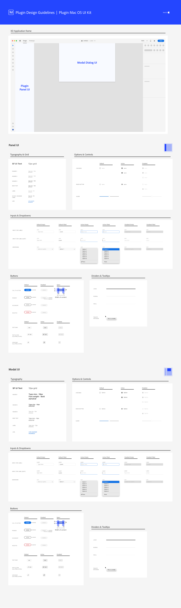
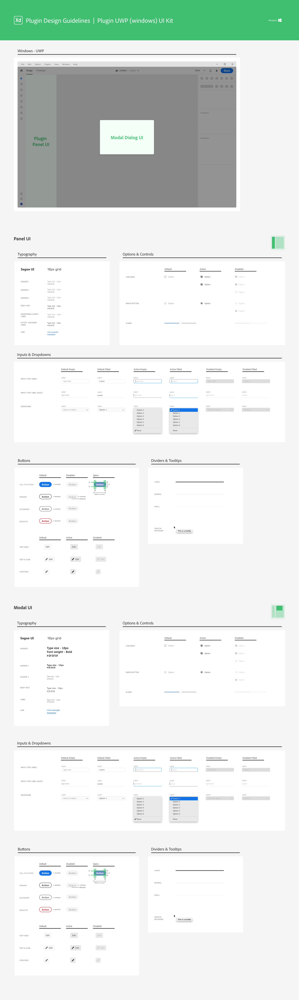

# Resources - Sticker Sheet
This sticker sheet will cover the different UI surfaces available to plugins. It also includes examples of UI elements and high level guidelines you can use to build your own plugin. Download the latest version from the Plugin Design Assets Github repository. 

### [Download from GitHub](https://github.com/AdobeXD/plugin-design-assets/blob/master/Sticker_sheet_XD_plugins.xd?raw=true "download from github repo")

---

**Plugin UI Kits - available in the sticker sheet**

