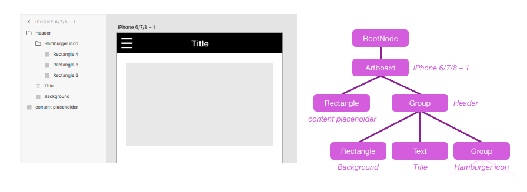

<a name="module_scenegraph"></a>

## scenegraph
The scenegraph is a node tree which represents the structure of the XD document. It closely matches the hierarchy seen in the Layers panel
inside XD. Some scenenodes may contain children (e.g., a Group or Artboard), while others are leaf nodes (e.g., a Rectangle or Text node).
The root of the scenegraph contains all Artboards that exist in the document, as well as all _pasteboard_ content (nodes that are not
contained by any artboard).



You can modify properties on any scenenodes within the current [_edit context_](/reference/core/edit-context.md), and add leaf nodes to the current
edit context, but you cannot make structural changes directly to the scenegraph tree. Instead, use [commands](commands.md).

Typically, you access scenegraph nodes via the [`selection`](selection.md) argument that is passed to your plugin command, or by
traversing the entire document tree using the [`documentRoot`](#RootNode) argument that is passed to your plugin command. These
objects are also accessible [on the scenegraph module](#other-module-members) for convenience.

**Example**
```js
function myCommand(selection) {
    let node = selection.items[0];

    console.log("The selected node is a: " + node.constructor.name);

    // Print out types of all child nodes (if any)
    node.children.forEach(function (childNode, i) {
        console.log("Child " + i + " is a " + childNode.constructor.name);
    });
}
```

To create new scenenodes, load this `scenegraph` module directly and use the node constructor functions:

**Example**
```js
let scenegraph = require("scenegraph");
function myCommand(selection) {
    let newShape = new scenegraph.Rectangle();
    newShape.width = 100;
    newShape.height = 50;
    newShape.fill = new Color("red");
    selection.insertionParent.addChild(newShape);
}
```


## Class hierarchy

> **Tip**
> Note: Additional subclasses may be added in the future. Always be sure to have a default case for unknown scenenode classes
> when traversing the scenegraph.

* [SceneNode](#SceneNode)
    * [GraphicNode](#GraphicNode)
        * [Artboard](#Artboard)
        * [Rectangle](#Rectangle)
        * [Ellipse](#Ellipse)
        * [Polygon](#Polygon)
        * [Line](#Line)
        * [Path](#Path)
        * [BooleanGroup](#BooleanGroup)
        * [Text](#Text)
    * [Group](#Group)
    * [SymbolInstance](#SymbolInstance)
    * [RepeatGrid](#RepeatGrid)
    * [LinkedGraphic](#LinkedGraphic)
    * [RootNode](#RootNode)


## Typedefs

<dl>
<dt><a name="Point"></a> Point : </dt><dd><code>!{x:number, y:number}</code></dd>

<dt><a name="Bounds"></a> Bounds : </dt><dd><code>!{x:number, y:number, width:number, height:number}</code></dd>

</dl>

## Related classes

These classes are not scenenode types, but are used extensively in the scenegraph API:

* [Color](Color.md) - Value object for `fill`, `stroke`, and other properties
* [ImageFill](ImageFill.md) - Value object for `fill` property
* [LinearGradientFill](LinearGradientFill.md) - Value object for `fill` property
* [Matrix](Matrix.md) - Value object for `transform` property
* [Shadow](Shadow.md) - Value object for `shadow` property
* [Blur](Blur.md) - Value object for `blur` property


## Other module members

* [selection](#module_scenegraph-selection) : \
* [root](#module_scenegraph-root) : \
* [getNodeByGUID(guid)](#module_scenegraph-getNodeByGUID) ⇒ `?SceneNode`


* * *

<a name="module_scenegraph-selection"></a>

### *scenegraph.selection : \*
Object representing the current selection state and [edit context](./core/edit-context.md). Also available as the first argument passed to your plugin command handler function.

**Kind**: static property of [<code>scenegraph</code>](#module_scenegraph)
**Read only**: true
**Since**: XD 14

* * *

<a name="module_scenegraph-root"></a>

### *scenegraph.root : \*
Root node of the current document's scenegraph. Also available as the second argument passed to your plugin command handler function.

**Kind**: static property of [<code>scenegraph</code>](#module_scenegraph)
**Read only**: true
**Since**: XD 14

* * *

<a name="module_scenegraph-getNodeByGUID"></a>

### *scenegraph.getNodeByGUID(guid)*
**Since**: XD 28

Returns the scenenode in this document that has the given [node GUID](#SceneNode-guid). Returns undefined if no such node exists connected
to the scenegraph tree (detached/orphan nodes will not be found). This provides a fast way of persistently remembering a node across plugin
operations and even across document open/closes.

**Kind**: static method of [<code>scenegraph</code>](#module_scenegraph)
**Returns**: `?SceneNode`

| Param   | Type    | Description   |
| ------- | ------- | ------------- |
| guid    | string  | SceneNode GUID -- must be all lowercase, as returned by the [`guid` getter](#SceneNode-guid). |

**Example**
```js
let node = scenegraph.selection.items[0];
let guid = node.guid;

// ...later on:
let sameNode = scenegraph.getNodeByGUID(guid);
if (sameNode) {
    // ^ Always check if node still exists - user may have deleted it
    console.log("Found node again!", sameNode);
}
```


* * *

<a name="SceneNode"></a>

## *SceneNode*
**Kind**: abstract class

Base class of all scenegraph nodes. Nodes will always be an instance of some _subclass_ of SceneNode.

* *[SceneNode](#SceneNode)*
    * *[.guid](#SceneNode-guid) : <code>string</code>*
    * *[.parent](#SceneNode-parent) : [<code>SceneNode</code>](#SceneNode)*
    * *[.children](#SceneNode-children) : <code>!SceneNodeList</code>*
    * *[.isInArtworkTree](#SceneNode-isInArtworkTree) : <code>boolean</code>*
    * *[.isContainer](#SceneNode-isContainer) : <code>boolean</code>*
    * *[.selected](#SceneNode-selected) : <code>boolean</code>*
    * *[.visible](#SceneNode-visible) : <code>boolean</code>*
    * *[.opacity](#SceneNode-opacity) : <code>number</code>*
    * *[.blendMode](#SceneNode-blendMode) : <code>string</code>*
    * *[.transform](#SceneNode-transform) : <code>!Matrix</code>*
    * *[.translation](#SceneNode-translation) : <code>!{x:number, y:number}</code>*
    * *[.rotation](#SceneNode-rotation) : <code>number</code>*
    * *[.globalBounds](#SceneNode-globalBounds) : \*
    * *[.localBounds](#SceneNode-localBounds) : \*
    * *[.boundsInParent](#SceneNode-boundsInParent) : \*
    * *[.topLeftInParent](#SceneNode-topLeftInParent) : \*
    * *[.localCenterPoint](#SceneNode-localCenterPoint) : \*
    * *[.globalDrawBounds](#SceneNode-globalDrawBounds) : \*
    * *[.name](#SceneNode-name) : <code>string</code>*
    * *[.hasDefaultName](#SceneNode-hasDefaultName) : <code>boolean</code>*
    * *[.locked](#SceneNode-locked) : <code>boolean</code>*
    * *[.markedForExport](#SceneNode-markedForExport) : <code>boolean</code>*
    * *[.fixedWhenScrolling](#SceneNode-fixedWhenScrolling) : <code>?boolean</code>*
    * *[.triggeredInteractions](#SceneNode-triggeredInteractions) : <code>!Arrray&lt;!Interaction&gt;</code>*
    * *[.horizontalConstraints](#SceneNode-horizontalConstraints) : <code>?{position:string, size:string}</code>*
    * *[.verticalConstraints](#SceneNode-verticalConstraints) : <code>?{position:string, size:string}</code>*
    * *[.hasCustomConstraints](#SceneNode-hasCustomConstraints) : <code>boolean</code>*
    * *[.resetToAutoConstraints()](#SceneNode-resetToAutoConstraints)*
    * *[.hasLinkedContent](#SceneNode-hasLinkedContent) : <code>boolean</code>*
    * *[.pluginData](#SceneNode-pluginData) : <code>&ast;</code>*
    * *[.sharedPluginData](#SceneNode-sharedPluginData) : <code>!PerPluginStorage</code>*
    * *[.removeFromParent()](#SceneNode-removeFromParent)*
    * *[.moveInParentCoordinates(deltaX, deltaY)](#SceneNode-moveInParentCoordinates)*
    * *[.placeInParentCoordinates(registrationPoint, parentPoint)](#SceneNode-placeInParentCoordinates)*
    * *[.rotateAround(deltaAngle, rotationCenter)](#SceneNode-rotateAround)*
    * *[.resize(width, height)](#SceneNode-resize)*


* * *

<a name="SceneNode-guid"></a>

### *sceneNode.guid : <code>string</code>*
Returns a unique identifier for this node that stays the same when the file is closed & reopened, or if the node is moved to a different part of the document. Cut-Paste will result in a new GUID, however.

The GUID is guaranteed unique _within_ the current document, but _other_ documents may contain the same GUID value. For example, if the user makes a copy of an XD file, both files will use the same GUIDs.

The GUID of the [root node](#module_scenegraph-root) changes if the document is duplicated via Save As. See [`application.activeDocument.guid`](./application.md#module_application-activeDocument) for details.

Node objects can be destroyed and recreated during operations such as Undo/Redo, so if you need to store a reference to a node even between operations in the _same_ session, it's best to store the GUID and then retrieve the node later via [`getNodeByGuid()`](#module_scenegraph-getNodeByGUID).

**Kind**: instance property of [<code>SceneNode</code>](#SceneNode)
**Read only**: true

* * *

<a name="SceneNode-parent"></a>

### *sceneNode.parent : [<code>SceneNode</code>](#SceneNode)*
Returns the parent node. Null if this is the root node, or a freshly constructed node which has not been added to a parent yet.

**Kind**: instance property of [<code>SceneNode</code>](#SceneNode)
**Read only**: true

* * *

<a name="SceneNode-children"></a>

### *sceneNode.children : <code>\</code>*
Returns a list of this node's children. List is length 0 if the node has no children. The first child is lowest in the z order.

This list is _**not an Array**_, so you must use `at(i)` instead of `[i]` to access children by index. It has a number of Array-like
methods such as `forEach()` for convenience and improved performance, however.

The list is immutable. Use [removeFromParent](#SceneNode-removeFromParent) and [addChild](#Group-addChild) to add/remove child nodes.

**Kind**: instance property of [<code>SceneNode</code>](#SceneNode)
**Read only**: true
**Example**
```js
let node = ...;
console.log("Node has " + node.children.length + " children");
console.log("First child: " + node.children.at(0));  // do not use `[0]` - it will not work!

node.children.forEach(function (childNode, i) {
    console.log("Child " + i + " is a " + childNode.constructor.name);
});
```

* * *

<a name="SceneNode-isInArtworkTree"></a>

### *sceneNode.isInArtworkTree : <code>boolean</code>*
True if the node's parent chain connects back to the document root node.

**Kind**: instance property of [<code>SceneNode</code>](#SceneNode)
**Read only**: true

* * *

<a name="SceneNode-isContainer"></a>

### *sceneNode.isContainer : <code>boolean</code>*
True if this node is a type that could have children (e.g. an Artboard, Group, Boolean Group, etc.).

**Kind**: instance property of [<code>SceneNode</code>](#SceneNode)
**Read only**: true

* * *

<a name="SceneNode-selected"></a>

### *sceneNode.selected : <code>boolean</code>*
True if this node is part of the current selection. To get a list of *all* selected nodes or change which nodes are selected, use [selection](selection.md).

**Kind**: instance property of [<code>SceneNode</code>](#SceneNode)
**Read only**: true
**See**: [selection](selection.md)

* * *

<a name="SceneNode-visible"></a>

### *sceneNode.visible : <code>boolean</code>*
False if this node has been hidden by the user (eyeball toggle in Layers panel). If true, the node may still be invisible for other reasons: a parent or grandparent has visible=false, the node has opacity=0%, the node is clipped by a mask, etc.

**Kind**: instance property of [<code>SceneNode</code>](#SceneNode)

* * *

<a name="SceneNode-opacity"></a>

### *sceneNode.opacity : <code>number</code>* (0.0 - 1.0)
Node's opacity setting. The overall visual opacity seen in the document is determined by combining this value with the opacities of the node's entire parent chain, as well as the opacity settings of its fill/stroke properties if this is a leaf node.

**Kind**: instance property of [<code>SceneNode</code>](#SceneNode)

* * *

<a name="SceneNode-blendMode"></a>

### *sceneNode.blendMode : <code>string</code>*
**Default**: `BLEND_MODE_PASSTHROUGH`
**Since**: XD 27

Blend mode determines how a node is composited onto the content below it.

One of: `SceneNode.BLEND_MODE_PASSTHROUGH`, `BLEND_MODE_NORMAL`, `BLEND_MODE_MULTIPLY`, `BLEND_MODE_DARKEN`, `BLEND_MODE_COLOR_BURN`, `BLEND_MODE_LIGHTEN`, `BLEND_MODE_SCREEN`, `BLEND_MODE_COLOR_DODGE`, `BLEND_MODE_OVERLAY`, `BLEND_MODE_SOFT_LIGHT`,
`BLEND_MODE_HARD_LIGHT`, `BLEND_MODE_DIFFERENCE`, `BLEND_MODE_EXCLUSION`, `BLEND_MODE_HUE`, `BLEND_MODE_SATURATION`, `BLEND_MODE_COLOR`, `BLEND_MODE_LUMINOSITY`.

_Note:_ for leaf nodes (GraphicNode), the XD UI may show leaf nodes as blend mode "Normal" even when the underlying value is `BLEND_MODE_PASSTHROUGH`. This is because "Pass Through" and "Normal" are essentially equivalent for leaf nodes -- they only differ
in appearance when a node has children.

**Example**
```js
node.blendMode = scenegraph.SceneNode.BLEND_MODE_LUMINOSITY;
```

**Kind**: instance property of [<code>SceneNode</code>](#SceneNode)

* * *

<a name="SceneNode-transform"></a>

### *sceneNode.transform : <code>\</code>*
Affine transform matrix that converts from the node's _local coordinate space_ to its parent's coordinate space. The matrix never has
skew or scale components, and if this node is an Artboard the matrix never has rotation either. Rather than reading the raw matrix values
directly, it may be easier to use the [translation](#SceneNode-translation) and [rotation](#SceneNode-rotation) properties.

To move or resize a node, use the [translation](#SceneNode-translation) property or APIs like [placeInParentCoordinates()](#SceneNode-placeInParentCoordinates) or [rotateAround()](#SceneNode-rotateAround).
Setting the entire transform matrix directly is not allowed. To resize a node, use [resize()](#SceneNode-resize).

For an overview of node transforms & coordinate systems, see [Coordinate spaces](/reference/core/coordinate-spaces-and-units.md).

This getter returns a fresh Matrix each time, so its fields can be mutated by the caller without interfering with the node's state.

**Kind**: instance property of [<code>SceneNode</code>](#SceneNode)
**Read only**: true
**See**

- [translation](#SceneNode-translation)
- [rotation](#SceneNode-rotation)
- [moveInParentCoordinates](#SceneNode-moveInParentCoordinates)
- [placeInParentCoordinates](#SceneNode-placeInParentCoordinates)
- [rotateAround](#SceneNode-rotateAround)
- [globalBounds](#SceneNode-globalBounds)
- [localBounds](#SceneNode-localBounds)
- [boundsInParent](#SceneNode-boundsInParent)
- [topLeftInParent](#SceneNode-topLeftInParent)


* * *

<a name="SceneNode-translation"></a>

### *sceneNode.translation : <code>!{x:number, y:number}</code>*
The translate component of this node's [transform](#SceneNode-transform). Since translation is applied after any rotation in
the transform Matrix, translation occurs along the parent's X/Y axes, not the node's own local X/Y axes. This is equivalent to
the `e` & `f` fields in the transform Matrix.

For an overview of node positioning & coordinate systems, see [Coordinate spaces](/reference/core/coordinate-spaces-and-units.md).

**Kind**: instance property of [<code>SceneNode</code>](#SceneNode)
**See**

- [moveInParentCoordinates](#SceneNode-moveInParentCoordinates)
- [placeInParentCoordinates](#SceneNode-placeInParentCoordinates)
- [topLeftInParent](#SceneNode-topLeftInParent)


* * *

<a name="SceneNode-rotation"></a>

### *sceneNode.rotation : <code>number</code>*
The rotation component of this node's [transform](#SceneNode-transform), in clockwise degrees.

For an overview of node transforms & coordinate systems, see [Coordinate spaces](/reference/core/coordinate-spaces-and-units.md).

**Kind**: instance property of [<code>SceneNode</code>](#SceneNode)
**Read only**: true
**See**: [rotateAround](#SceneNode-rotateAround)

* * *

<a name="SceneNode-globalBounds"></a>

### *sceneNode.globalBounds : \*
The node's _path bounds_ in document-global coordinate space (represented by a bounding box aligned with global X/Y axes). Path bounds match the selection outline seen in the XD, but exclude some visual parts of the node (outer stroke, drop shadow / blur, etc.).

For an overview of node bounding boxes & coordinate systems, see [Coordinate spaces](/reference/core/coordinate-spaces-and-units.md).

**Kind**: instance property of [<code>SceneNode</code>](#SceneNode)
**Read only**: true
**See**

- [globalDrawBounds](#SceneNode-globalDrawBounds)
- [localBounds](#SceneNode-localBounds)
- [boundsInParent](#SceneNode-boundsInParent)


* * *

<a name="SceneNode-localBounds"></a>

### *sceneNode.localBounds : \*
The node's _path bounds_ in its own local coordinate space. This coordinate space may be rotated and translated relative to the parent's coordinate space. Path bounds match the selection outline seen in XD, but exclude some visual parts of the node (outerstroke, drop shadow / blur, etc.).

The visual top-left of a node's path bounds is located at (localBounds.x, localBounds.y). This value is _not_ necessarily (0,0) in the local coordinate space: for example, a text node's baseline is at y=0 in local coordinates, so the top of the text has a negative y value.

For an overview of node bounding boxes & coordinate systems, see [Coordinate spaces](/reference/core/coordinate-spaces-and-units.md).

**Kind**: instance property of [<code>SceneNode</code>](#SceneNode)
**Read only**: true
**See**

- [globalBounds](#SceneNode-globalBounds)
- [boundsInParent](#SceneNode-boundsInParent)


* * *

<a name="SceneNode-boundsInParent"></a>

### *sceneNode.boundsInParent : \*
The node's _path bounds_ in its parent's coordinate space (represented by a bounding box aligned with the parent's X/Y axes - so if the node has rotation, the top-left of the node is not necessarily located at the top-left of boundsInParent). Path bounds match the selection outline seen in XD, but exclude some visual parts of the node (outer stroke, drop shadow / blur, etc.).

For an overview of node bounding boxes & coordinate systems, see [Coordinate spaces](/reference/core/coordinate-spaces-and-units.md).

**Kind**: instance property of [<code>SceneNode</code>](#SceneNode)
**Read only**: true
**See**

- [globalBounds](#SceneNode-globalBounds)
- [localBounds](#SceneNode-localBounds)
- [topLeftInParent](#SceneNode-topLeftInParent)


* * *

<a name="SceneNode-topLeftInParent"></a>

### *sceneNode.topLeftInParent : \*
The position of the node's upper-left corner (localBounds.x, localBounds.y) in its parent's coordinate space. If the node is
rotated, this is not the same as the top-left corner of boundsInParent.
This is a shortcut for `node.transform.transformPoint({x: node.localBounds.x, y: node.localBounds.y})`

For an overview of node bounding boxes & coordinate systems, see [Coordinate spaces](/reference/core/coordinate-spaces-and-units.md).

**Kind**: instance property of [<code>SceneNode</code>](#SceneNode)
**Read only**: true
**See**

- [boundsInParent](#SceneNode-boundsInParent)
- [localBounds](#SceneNode-localBounds)


* * *

<a name="SceneNode-localCenterPoint"></a>

### *sceneNode.localCenterPoint : \*
The position of the node's centerpoint in its own local coordinate space. Useful as an argument to [rotateAround](#SceneNode-rotateAround).
This is a shortcut for `{x: localBounds.x + localBounds.width/2, y: localBounds.y + localBounds.height/2})`

For an overview of node bounding boxes & coordinate systems, see [Coordinate spaces](/reference/core/coordinate-spaces-and-units.md).

**Kind**: instance property of [<code>SceneNode</code>](#SceneNode)
**Read only**: true
**See**: [localBounds](#SceneNode-localBounds)

* * *

<a name="SceneNode-globalDrawBounds"></a>

### *sceneNode.globalDrawBounds : \*
The node's _draw bounds_ in document-global coordinate space. Draw bounds are larger than the selection outline seen in XD, including outer stroke, drop shadow / blur, etc. - every visible pixel of the node is encompassed by these bounds. This matches the image dimensions if the node is exported as a PNG/JPEG bitmap.

For an overview of node bounding boxes & coordinate systems, see [Coordinate spaces](/reference/core/coordinate-spaces-and-units.md).

**Kind**: instance property of [<code>SceneNode</code>](#SceneNode)
**Read only**: true
**See**

- [globalBounds](#SceneNode-globalBounds)


* * *

<a name="SceneNode-name"></a>

### *sceneNode.name : <code>string</code>*
Node name as seen in the Layers panel. Also used as filename during Export.

Setting this property will cause [`hasDefaultName`](#SceneNode-hasDefaultName) to become false.

**Kind**: instance property of [<code>SceneNode</code>](#SceneNode)

* * *

<a name="SceneNode-hasDefaultName"></a>

### *sceneNode.hasDefaultName : <code>boolean</code>*
True if [name](#SceneNode-name) is a generic, auto-generated string (e.g. "Rectangle 5"). False if name has been explicitly set.

**Kind**: instance property of [<code>SceneNode</code>](#SceneNode)
**Read only**: true

* * *

<a name="SceneNode-locked"></a>

### *sceneNode.locked : <code>boolean</code>*
True if the node is locked, meaning it cannot normally be selected.

**Kind**: instance property of [<code>SceneNode</code>](#SceneNode)

* * *

<a name="SceneNode-markedForExport"></a>

### *sceneNode.markedForExport : <code>boolean</code>*
True if the node should be included in the output of _File > Export > Batch_ and other bulk-export workflows.

**Kind**: instance property of [<code>SceneNode</code>](#SceneNode)

* * *

<a name="SceneNode-fixedWhenScrolling"></a>

### *sceneNode.fixedWhenScrolling : <code>?boolean</code>*
**Since**: XD 19

True if the node stays in a fixed position while the Artboard's content is scrolling (when viewed in an interactive prototype).
_Only applicable for nodes whose immediate parent is an Artboard._

For other nodes, this property returns undefined and cannot be set. To determine whether those nodes scroll or remain
fixed, walk up the parent chain and check this property on the topmost ancestor in the Artboard.

**Kind**: instance property of [<code>SceneNode</code>](#SceneNode)
**See**: [Artboard.viewportHeight](#Artboard-viewportHeight)

* * *

<a name="SceneNode-triggeredInteractions"></a>

### *sceneNode.triggeredInteractions : <code>!Arrray&lt;\&gt;</code>*
**Since**: XD 19

Get all interactions that are triggered by this node in the document's interactive prototype. Each element in the array
is an [Interaction object](./interactions.md#Interaction) which describes a gesture/event plus the action it produces.

Note: If this node (or one of its ancestors) has `visible` = false, tap and drag interactions on it will not be triggered.

Currently, this API excludes some types of interactions: keypress/gamepad, scrolling, hover, component state transitions, or non-speech audio playback.

**Example**
```js
// Print all the interactions triggered by a node
node.triggeredInteractions.forEach(interaction => {
    console.log("Trigger: " + interaction.trigger.type + " -> Action: " + interaction.action.type);
});
```

**Kind**: instance property of [<code>SceneNode</code>](#SceneNode)
**Read only**: true
**See**: [interactions.allInteractions](./interactions.md#module_interactions-allInteractions)

* * *

<a name="SceneNode-horizontalConstraints"></a>

### *sceneNode.horizontalConstraints : <code>?{position:string, size:string}</code>*
**Since**: XD 29

Horizontal dynamic-layout settings used with the Responsive Resize feature. Setting this only determines how the node is updated when its parent is resized -- it does not change the node's current size or position.

| Property  | Type  | Description  |
| --------- | ----- | ------------ |
| horizontalConstraints.position | string | Horizontal position anchoring, one of `SceneNode.FIXED_LEFT`, `FIXED_RIGHT`, `FIXED_BOTH` or `POSITION_PROPORTIONAL`.<br><br>`FIXED_BOTH` sets fixed left & right offsets, so it always implies `size: SIZE_RESIZES` (similar to setting both `left` & `right` in CSS).<br><br>`POSITION_PROPORTIONAL` holds node position at a fixed percentage of the parent's width -- the same positioning behavior you'd get if Responsive Resize is turned off entirely. |
| horizontalConstraints.size     | string | Horizontal sizing behavior, either `SceneNode.SIZE_FIXED` or `SceneNode.SIZE_RESIZES`.<br><br>`SIZE_FIXED` cannot be used with `position: FIXED_BOTH`, since it is impossible to fix both left & right edges without resizing when the parent resizes.<br><br>`SIZE_RESIZES` can be used with any `position` setting. With `position: FIXED_BOTH`, the node's size always equals the parent's size minus the fixed left & right offsets. With other position settings, the node's size maintains a fixed percentage of the parent's size. |

Both fields *must* be provided together when setting this property.

Returns undefined if node's parent is a container where Responsive Resize is unavailable:
* Certain containers such as RepeatGrid and the pasteboard (scenegraph root) do not support Responsive Resize.
* Container may have Responsive Resize layout explicitly turned off (see [`dynamicLayout` flag](#Group-dynamicLayout)).

Attempting to set this property when Responsive Resize is unavailable results in an error.

Setting this property will cause [`hasCustomConstraints`](#SceneNode-hasCustomConstraints) to become true.

**Example**
```js
let node = selection.items[0];
node.horizontalConstraints = { position: scenegraph.SceneNode.FIXED_LEFT, size: scenegraph.SceneNode.SIZE_FIXED };
```

**Kind**: instance property of [<code>SceneNode</code>](#SceneNode)

* * *

<a name="SceneNode-verticalConstraints"></a>

### *sceneNode.verticalConstraints : <code>?{position:string, size:string}</code>*
**Since**: XD 29

Vertical dynamic-layout settings used with the Responsive Resize feature. Setting this only determines how the node is updated when its parent is resized -- it does not change the node's current size or position.

| Property  | Type  | Description  |
| --------- | ----- | ------------ |
| verticalConstraints.position | string | Vertical position anchoring, one of `SceneNode.FIXED_TOP`, `FIXED_BOTTOM`, `FIXED_BOTH` or `POSITION_PROPORTIONAL`.<br><br>For details, see [`horizontalConstraints`](#SceneNode-horizontalConstraints) above. |
| verticalConstraints.size     | string | Vertical sizing behavior, either `SceneNode.SIZE_FIXED` or `SceneNode.SIZE_RESIZES`.<br><br>For details, see [`horizontalConstraints`](#SceneNode-horizontalConstraints) above. |

Both fields *must* be provided together when setting this property.

See [`horizontalConstraints`](#SceneNode-horizontalConstraints) above for other important notes.

**Example**
```js
let node = selection.items[0];
node.verticalConstraints = { position: scenegraph.SceneNode.FIXED_TOP, size: scenegraph.SceneNode.SIZE_RESIZES };
```

**Kind**: instance property of [<code>SceneNode</code>](#SceneNode)

* * *

<a name="SceneNode-hasCustomConstraints"></a>

### *sceneNode.hasCustomConstraints : <code>boolean</code>*
**Since**: XD 29

True if this node's Responsive Resize layout settings, which are normally automatically inferred by XD, have been overridden with specific desired values. Constraints on a node are either all overridden, or all automatic -- never mixed.

If false, each time the parent resizes XD will automatically guess the best layout settings to used based on the current size & position of this node within its parent. You can use the [`horizontalConstraints`](#SceneNode-horizontalConstraints) and [`verticalConstraints`](#SceneNode-verticalConstraints) getters to check what computed settings XD would use based on the node's current size & position.

Automatically becomes true any time you set `horizontalConstraints` or `verticalConstraints`. To reset to false, call [`resetToAutoConstraints()`](#SceneNode-resetToAutoConstraints).

**Kind**: instance property of [<code>SceneNode</code>](#SceneNode)
**Read only**: true _(but is modified indirectly; see above)_

* * *

<a name="SceneNode-resetToAutoConstraints"></a>

### *sceneNode.resetToAutoConstraints()*
**Since**: XD 29

Erase any overridden Responsive Resize layout settings, restoring the default behavior where XD will automatically guess the best layout settings for this node the next time its parent is resized. This function does not change the node's *current* size & position, however.

Calling this will cause [`hasCustomConstraints`](#SceneNode-hasCustomConstraints) to become false.

**Kind**: instance method of [<code>SceneNode</code>](#SceneNode)

* * *

<a name="SceneNode-hasLinkedContent"></a>

### *sceneNode.hasLinkedContent : <code>boolean</code>*
True if the node's appearance comes from a link to an external resource, such as Creative Cloud Libraries or a
separate XD document (in the case of a Linked Component instance).

**Kind**: instance property of [<code>SceneNode</code>](#SceneNode)
**Read only**: true

* * *

<a name="SceneNode-pluginData"></a>

### *sceneNode.pluginData : <code>&ast;</code>*
**Since**: XD 14

Metadata specific to your plugin. Must be a value which can be converted to a JSON string, or undefined to clear the
stored metadata on this node.

Metadata is persisted with the document when it is saved. Duplicating a node (including across documents, via copy-paste)
will duplicate the metadata with it. If the node lies within a Component or Repeat Grid, all instances of the node will have
identical metadata (changes in one copy will automatically be synced to the other copy).

To store general metadata for the document overall, set pluginData on the [root](#module_scenegraph-root) node of the scenegraph. Metadata on
the root node can be changed from _any_ edit context.

Metadata stored in pluginData cannot be accessed by other plugins -- each plugin has its own isolated storage. To share metadata
with other plugins, use [`sharedPluginData`](#SceneNode-sharedPluginData).

**Kind**: instance property of [<code>SceneNode</code>](#SceneNode)

* * *

<a name="SceneNode-sharedPluginData"></a>

### *sceneNode.sharedPluginData : \*
**Since**: XD 29

Metadata storage accessible by other plugins, separated into silos by plugin ID. Your plugin can read & write the storage for its own plugin ID,
but storage for other plugin IDs is *read-only*. This property returns a [PerPluginStorage API object](PerPluginStorage.md).

*Each* scenenode has its own metadata storage. To store general metadata that is not specific to one scenenode, use `sharedPluginData` on the
[document's scenegraph root](scenegraph.md#module_scenegraph-root).

Metadata is persisted with the document when it is saved. See [`pluginMetadata`](#SceneNode-pluginData) for info on how metadata is duplicated when nodes are
copied or synced.

**Kind**: instance property of [<code>SceneNode</code>](#SceneNode)

* * *

<a name="SceneNode-removeFromParent"></a>

### *sceneNode.removeFromParent()*
Remove this node from its parent, effectively deleting it from the document.

**Kind**: instance method of [<code>SceneNode</code>](#SceneNode)

* * *

<a name="SceneNode-moveInParentCoordinates"></a>

### *sceneNode.moveInParentCoordinates(deltaX, deltaY)*
Move the node by the given number of pixels along the parent's X/Y axes (if this node has no rotation, this is identical to
moving the node along its own local X/Y axes). This is equivalent to modifying the value returned by 'translation' and then
setting it back.

For an overview of node positioning & coordinate systems, see [Coordinate spaces](/reference/core/coordinate-spaces-and-units.md).

**Kind**: instance method of [<code>SceneNode</code>](#SceneNode)
**See**

- [placeInParentCoordinates](#SceneNode-placeInParentCoordinates)
- [translation](#SceneNode-translation)


| Param | Type |
| --- | --- |
| deltaX | <code>number</code> |
| deltaY | <code>number</code> |


* * *

<a name="SceneNode-placeInParentCoordinates"></a>

### *sceneNode.placeInParentCoordinates(registrationPoint, parentPoint)*
Move the node so the given point in its local coordinates is placed at the given point in its parent's coordinates (taking into account
any rotation on this node, etc.).

For an overview of node positioning & coordinate systems, see [Coordinate spaces](/reference/core/coordinate-spaces-and-units.md).

**Kind**: instance method of [<code>SceneNode</code>](#SceneNode)

| Param | Type | Description |
| --- | --- | --- |
| registrationPoint | \ | Point in this node's local coordinate space to align with parentPoint |
| parentPoint | \ | Point in this node's parent's coordinate space to move registrationPoint to |

**Example**
```js
// Place this node's top-left corner at the centerpoint of its parent
let parentCenter = node.parent.localCenterPoint;  // parent's center in parent's coordinates
let nodeBounds = node.localBounds;  // node's bounds in its own local coordinates
let nodeTopLeft = {x: nodeBounds.x, y: nodeBounds.y};  // node's top left corner in its own local coordinates
node.placeInParentCoordinates(nodeTopLeft, parentCenter);
```

* * *

<a name="SceneNode-rotateAround"></a>

### *sceneNode.rotateAround(deltaAngle, rotationCenter)*
Rotate the node clockwise by the given number of degrees around the given point in the plugin's local coordinate space. If this node
already has nonzero rotation, this operation _adds_ to its existing angle.

For an overview of node transforms & coordinate systems, see [Coordinate spaces](/reference/core/coordinate-spaces-and-units.md).

**Kind**: instance method of [<code>SceneNode</code>](#SceneNode)
**See**: [rotation](#SceneNode-rotation)

| Param | Type | Description |
| --- | --- | --- |
| deltaAngle | <code>number</code> | In degrees. |
| rotationCenter | [<code>Point</code>](#Point) | Point to rotate around, in node's local coordinates. |

**Example**
```js
// Rotate the node 45 degrees clockwise around its centerpoint
node.rotateAround(45, node.localCenterPoint);

// Ignoring the node's previous angle, set its rotation to exactly 180 degrees
let rotationDelta = 180 - node.rotation;
node.rotateAround(rotationDelta, node.localCenterPoint);
```

* * *

<a name="SceneNode-resize"></a>

### *sceneNode.resize(width, height)*
Attempts to change `localBounds.width` & `height` to match the specified sizes. The result is not guaranteed to
match your requested size, since some nodes have limits on their ability to resize.

Note that _resizing_ is different from simply _rescaling_ the content:
* Styles like stroke weight and corner radius stay the same size, so the ratio of their size relative to the
  resized shape will change.
* If this node is a Group, resizing may invoke XD's Responsive Resize feature, which rearranges items using a
  fluid layout and may change only the _position_ (not size) of some children.
* Some content cannot be resized at all, or cannot stretch to change its aspect ratio.

Rescaling, by contrast, is the effect seen when you zoom in on the view in XD, or when you export a node at
a higher DPI multiplier.

_Note:_ Currenty this function does not respect the "aspect ratio lock" setting in XD's Properties panel. This
may be changed/fixed later.

**Kind**: instance method of [<code>SceneNode</code>](#SceneNode)

| Param | Type |
| --- | --- |
| width | <code>number</code> |
| height | <code>number</code> |

**Example**
```js
// Double the width of this node
let originalBounds = node.localBounds;
node.resize(originalBounds.width * 2, originalBounds.height);
```


* * *

<a name="RootNode"></a>

## RootNode
**Kind**: class
**Extends**: [<code>SceneNode</code>](#SceneNode)

Class representing the root node of the document. All Artboards are children of this node, as well as any pasteboard content that
does not lie within an Artboard. Artboards must be grouped contiguously at the bottom of this node's z order. The root node has no
visual appearance of its own.

* [RootNode](#RootNode)
    * [.addChild(node, index)](#Group-addChild)
    * [.addChildAfter(node, relativeTo)](#Group-addChildAfter)
    * [.addChildBefore(node, relativeTo)](#Group-addChildBefore)
    * [.removeAllChildren()](#Group-removeAllChildren)


* * *

<a name="Group"></a>

## Group
**Kind**: class
**Extends**: [<code>SceneNode</code>](#SceneNode)

Group nodes represent two types of simple containers in XD:
- Plain Groups, created by the _Object > Group_ command
- Masked Groups, created by the _Object > Mask With Shape_ command
You can determine whether a group is masked by checking the `mask` property.

Groups and other containers cannot be created directly using scenenode constructors, since you can't add a populated Group to the
scenegraph (you can't add subtrees all at once) nor can you add an empty Group and then add children to it (can't add nodes outside
the scope of the current _edit context_). Instead, to create Groups and other nested structures, use [commands](commands.md).

In a Mask Group, the mask shape is included in the group's `children` list, at the top of the z order. It is not visible - only its
path outline is used, for clipping the group.

**Example**
```js
let commands = require("commands");

// Newly created shape nodes
let shape1 = ...,
    shape2 = ...;

// Add both nodes to the current edit context first
selection.insertionParent.addChild(shape1);
selection.insertionParent.addChild(shape2);

// Select both shapes, then run the Group command
selection.items = [shape1, shape2];
commands.group();
let group = selection.items[0];  // selection has been set to the new Group node afterward
```

* [Group](#Group)
    * [.addChild(node, index)](#Group-addChild)
    * [.addChildAfter(node, relativeTo)](#Group-addChildAfter)
    * [.addChildBefore(node, relativeTo)](#Group-addChildBefore)
    * [.removeAllChildren()](#Group-removeAllChildren)
    * [.dynamicLayout](#Group-dynamicLayout) : ?boolean
    * [.mask](#Group-mask) : ?[<code>SceneNode</code>](#SceneNode)

* * *

<a name="Group-addChild"></a>

#### group.addChild(node, index)
Adds a child node to this container node. You can only add leaf nodes this way; to create structured subtrees of content,
use [commands](commands.md).

**Kind**: instance method of [<code>Group</code>](#Group) and other container nodes

| Param | Type | Description |
| --- | --- | --- |
| node | <code>!SceneNode</code> | Child to add |
| index | <code>?number</code> | Optional: index to insert child at. Child is appended to end of children list (top of z order) otherwise. |


* * *

<a name="Group-addChildAfter"></a>

#### group.addChildAfter(node, relativeTo)
Inserts a child node after the given reference node.

**Kind**: instance method of [<code>Group</code>](#Group) and other container nodes

| Param | Type | Description |
| --- | --- | --- |
| node | <code>!SceneNode</code> | Child to add |
| relativeTo | <code>!SceneNode</code> | New child is added immediately after this existing child |


* * *

<a name="Group-addChildBefore"></a>

#### group.addChildBefore(node, relativeTo)
Inserts a child node before the given reference node.

**Kind**: instance method of [<code>Group</code>](#Group) and other container nodes

| Param | Type | Description |
| --- | --- | --- |
| node | <code>!SceneNode</code> | Child to add |
| relativeTo | <code>!SceneNode</code> | New child is added immediately before this existing child |


* * *

<a name="Group-removeAllChildren"></a>

#### group.removeAllChildren()
Removes all children from this node. Equivalent to calling removeFromParent() on each child in turn, but faster.

**Kind**: instance method of [<code>Group</code>](#Group) and other container nodes


* * *

<a name="Group-dynamicLayout"></a>

### group.dynamicLayout : ?boolean
**Since:** XD 29

If true, Responsive Resize is enabled, and this node's children will use an intelligent layout algorithm whenever this node is resized.

Returns undefined on node types that do not support Responsive Resize (such as RepeatGrid; see [`horizontalConstraints`](#SceneNode-horizontalConstraints) docs for a
complete list). Attempting to set this property on such node types results in an error.

**Kind**: instance property of [<code>Group</code>](#Group)

**See**:
* [horizontalConstraints](#SceneNode-horizontalConstraints)
* [verticalConstraints](#SceneNode-verticalConstraints)

* * *

<a name="Group-mask"></a>

### group.mask : ?[<code>SceneNode</code>](#SceneNode)
The mask shape applied to this group, if any. This object is also present in the group's `children` list. Though it has no direct visual appearance of its own, the mask affects the entire group's appearance by clipping all its other content.

**Kind**: instance property of [<code>Group</code>](#Group)
**Read only**: true

**Example**
```js
let group = ...;
console.log("Type of group is: " + (group.mask ? "Masked Group" : "Plain Group"));
```

To create a Masked Group, use [commands.createMaskGroup](commands.md#module_commands-createMaskGroup) instead of [commands.group](commands.md#module_commands-group).

* * *

<a name="GraphicNode"></a>

## *GraphicNode*
**Kind**: abstract class
**Extends**: [<code>SceneNode</code>](#SceneNode)

Base class for nodes that have a stroke and/or fill. This includes leaf nodes such as Rectangle, as well as BooleanGroup
which is a container node. If you create a shape node, it will not be visible unless you explicitly give it either a stroke
or a fill.

* *[GraphicNode](#GraphicNode)*
    * *[.fill](#GraphicNode-fill) : ?<code>Color</code> \| <code>LinearGradientFill</code> \| <code>RadialGradientFill</code> \| <code>ImageFill</code>*
    * *[.fillEnabled](#GraphicNode-fillEnabled) : <code>boolean</code>*
    * *[.stroke](#GraphicNode-stroke) : <code>?Color</code>*
    * *[.strokeEnabled](#GraphicNode-strokeEnabled) : <code>boolean</code>*
    * *[.strokeWidth](#GraphicNode-strokeWidth) : <code>number</code>*
    * *[.strokePosition](#GraphicNode-strokePosition) : <code>string</code>*
    * *[.strokeEndCaps](#GraphicNode-strokeEndCaps) : <code>string</code>*
    * *[.strokeJoins](#GraphicNode-strokeJoins) : <code>string</code>*
    * *[.strokeMiterLimit](#GraphicNode-strokeMiterLimit) : <code>number</code>*
    * *[.strokeDashArray](#GraphicNode-strokeDashArray) : <code>!Array&lt;number&gt;</code>*
    * *[.strokeDashOffset](#GraphicNode-strokeDashOffset) : <code>number</code>*
    * *[.shadow](#GraphicNode-shadow) : <code>?Shadow</code>*
    * *[.blur](#GraphicNode-blur) : <code>?Blur</code>*
    * *[.pathData](#GraphicNode-pathData) : <code>string</code>*
    * *[.hasLinkedGraphicFill](#GraphicNode-hasLinkedGraphicFill) : <code>boolean</code>*


* * *

<a name="GraphicNode-fill"></a>

### *graphicNode.fill : <code>?[Color](Color.md)</code> \| <code>[LinearGradientFill](LinearGradientFill.md)</code> \| <code>RadialGradientFill</code> \| <code>[ImageFill](ImageFill.md)</code>*
**Default**: `null`

The fill applied to this shape, if any. If this property is null _or_ `fillEnabled` is false, no fill is drawn.
Freshly created nodes have no fill by default.

For Line nodes, fill is ignored. For Text nodes, _only_ solid Color fill values are allowed. For Artboard nodes, image fill values
are not allowed.

**Kind**: instance property of [<code>GraphicNode</code>](#GraphicNode)
**Example**
```js
ellipse.fill = new Color("red");
```

To modify an existing fill, always be sure to re-invoke the `fill` setter rather than just changing the fill object's properties inline.
See ["Properties with object values"](/reference/core/properties-with-object-values.md).

> **Danger**
> The RadialGradientFill type is not documented and its API may change. Plugins currently cannot modify or otherwise work with radial gradients.

* * *

<a name="GraphicNode-fillEnabled"></a>

### *graphicNode.fillEnabled : <code>boolean</code>*
**Default**: `true`

If false, the `fill` is not rendered. The user can toggle this via a checkbox in the Properties panel.

**Kind**: instance property of [<code>GraphicNode</code>](#GraphicNode)

* * *

<a name="GraphicNode-stroke"></a>

### *graphicNode.stroke : <code>?[Color](Color.md)</code>*
**Default**: `null`

The stroke color applied to this shape, if any. If this property is null _or_ `strokeEnabled` is false, no stroke is drawn.
Freshly created nodes have no stroke by default. Artboard objects ignore stroke settings.

Depending on the [`strokeWidth`](#GraphicNode-strokeWidth) and [`strokePosition`](#GraphicNode-strokePosition), the path outline
of a node may need to be positioned on fractional pixels in order for the stroke itself to be crisply aligned to the pixel grid.
For example, if a horizontal line uses a 1px center stroke, the line's y should end in .5 to keep the stroke on-pixel.

**Kind**: instance property of [<code>GraphicNode</code>](#GraphicNode)
**Example**
```js
ellipse.stroke = new Color("red");
```

To modify an existing stroke, always be sure to re-invoke the `stroke` setter rather than just changing the Color object's properties inline.
See ["Properties with object values"](/reference/core/properties-with-object-values.md).

* * *

<a name="GraphicNode-strokeEnabled"></a>

### *graphicNode.strokeEnabled : <code>boolean</code>*
**Default**: `false`

If false, the `stroke` is not rendered. The user can toggle this via a checkbox in the Properties panel.

**Kind**: instance property of [<code>GraphicNode</code>](#GraphicNode)

* * *

<a name="GraphicNode-strokeWidth"></a>

### *graphicNode.strokeWidth : <code>number</code>* &gt;= 0
**Default**: `1.0`

Thickness in pixels of the stroke.

**Kind**: instance property of [<code>GraphicNode</code>](#GraphicNode)

* * *

<a name="GraphicNode-strokePosition"></a>

### *graphicNode.strokePosition : <code>string</code>*
**Default**: `CENTER_STROKE` for most shapes, `INNER_STROKE` for Rectangle, Ellipse & Polygon

Position of the stroke relative to the shape's path outline: GraphicNode.INNER_STROKE, OUTER_STROKE, or CENTER_STROKE. Ignored by Text and Line, which always render using CENTER_STROKE.

**Kind**: instance property of [<code>GraphicNode</code>](#GraphicNode)

* * *

<a name="GraphicNode-strokeEndCaps"></a>

### *graphicNode.strokeEndCaps : <code>string</code>*
**Default**: `STROKE_CAP_SQUARE`

For Lines and non-closed Paths, how the dangling ends of the stroke are rendered: GraphicNode.STROKE_CAP_NONE, STROKE_CAP_SQUARE, or STROKE_CAP_ROUND.

**Kind**: instance property of [<code>GraphicNode</code>](#GraphicNode)

* * *

<a name="GraphicNode-strokeJoins"></a>

### *graphicNode.strokeJoins : <code>string</code>*
**Default**: `STROKE_JOIN_MITER`

How sharp corners in the shape are rendered: GraphicNode.STROKE_JOIN_BEVEL, STROKE_JOIN_ROUND, or STROKE_JOIN_MITER.

**Kind**: instance property of [<code>GraphicNode</code>](#GraphicNode)

* * *

<a name="GraphicNode-strokeMiterLimit"></a>

### *graphicNode.strokeMiterLimit : <code>number</code>* &gt;= 0
**Default**: `4`

Expressed as a multiple of stroke width. Only used when [`strokeJoins`](#GraphicNode-strokeJoins) = STROKE_JOIN_MITER.

**Kind**: instance property of [<code>GraphicNode</code>](#GraphicNode)

* * *

<a name="GraphicNode-strokeDashArray"></a>

### *graphicNode.strokeDashArray : <code>!Array&lt;number&gt;</code>*
**Default**: `[]`

Empty array indicates a solid stroke. If non-empty, values represent the lengths of rendered and blank segments of the
stroke's dash pattern, repeated along the length of the stroke. The first value is the length of the first solid segment.
If the array is odd length, the items are copied to double the array length. For example, `[3]` produces the same effect
as `[3, 3]`.

The appearance of each segment's start/end follows the [strokeEndCaps](#GraphicNode#strokeEndCaps) setting.

**Kind**: instance property of [<code>GraphicNode</code>](#GraphicNode)

* * *

<a name="GraphicNode-strokeDashOffset"></a>

### *graphicNode.strokeDashOffset : <code>number</code>*
**Default**: `0`

Ignored unless `strokeDashArray` is non-empty. Shifts the "phase" of the repeating dash pattern along the length of the stroke.

**Kind**: instance property of [<code>GraphicNode</code>](#GraphicNode)

* * *

<a name="GraphicNode-shadow"></a>

### *graphicNode.shadow : <code>?[Shadow](Shadow.md)</code>*
**Default**: `null`

The node's drop shadow, if any. If there is no shadow applied, this property may be null _or_ `shadow.visible` may be false.

To modify an existing shadow, always be sure to re-invoke the `shadow` setter rather than just changing the Shadow object's properties inline.
See ["Properties with object values"](/reference/core/properties-with-object-values.md).

**Kind**: instance property of [<code>GraphicNode</code>](#GraphicNode)

* * *

<a name="GraphicNode-blur"></a>

### *graphicNode.blur : <code>?[Blur](Blur.md)</code>*
**Default**: `null`

The node's object blur or background blur settings, if applicable (a node may not have both types of blur at once). If there is no blur
effect applied, this property may be null _or_ `blur.visible` may be false.

To modify an existing blur, always be sure to re-invoke the `blur` setter rather than just changing the Blur object's properties inline.
See ["Properties with object values"](/reference/core/properties-with-object-values.md).

**Kind**: instance property of [<code>GraphicNode</code>](#GraphicNode)

* * *

<a name="GraphicNode-pathData"></a>

### *graphicNode.pathData : <code>string</code>*
Returns a representation of the node's outline in SVG `<path>` syntax. Note that only nodes with [strokePosition](#GraphicNode#strokePosition) ==
`GraphicNode.CENTER_STROKE` can be faithfully rendered in actual SVG using the exact pathData shown here.

**Kind**: instance property of [<code>GraphicNode</code>](#GraphicNode)
**Read only**: true

* * *

<a name="GraphicNode-hasLinkedGraphicFill"></a>

### *graphicNode.hasLinkedGraphicFill : <code>boolean</code>*
True if the node has an image fill that comes from a link to an external resource, such as Creative Cloud Libraries. Equivalent to the expression: <code>node.fill &&
node.fill.linked</code>.

**Kind**: instance property of [<code>GraphicNode</code>](#GraphicNode)
**Read only**: true

* * *

<a name="Rectangle"></a>

## Rectangle
**Kind**: class
**Extends**: [<code>GraphicNode</code>](#GraphicNode)

Rectangle leaf node shape, with or without rounded corners. Like all shape nodes, has no fill or stroke by default unless you set one.

**Example**
```js
let rect = new Rectangle();
rect.width = 100;
rect.height = 25;
rect.fill = new Color("red");
selection.insertionParent.addChild(rect);
selection.items = [rect];
```

* [Rectangle](#Rectangle)
    * [.width](#Rectangle-width) : <code>number</code>
    * [.height](#Rectangle-height) : <code>number</code>
    * [.cornerRadii](#Rectangle-cornerRadii) : <code>!{topLeft:number, topRight:number, bottomRight:number, bottomLeft:number}</code>
    * [.hasRoundedCorners](#Rectangle-hasRoundedCorners) : <code>boolean</code>
    * [.setAllCornerRadii(radius)](#Rectangle-setAllCornerRadii)
    * [.effectiveCornerRadii](#Rectangle-effectiveCornerRadii) : <code>!{topLeft:number, topRight:number, bottomRight:number, bottomLeft:number}</code>


* * *

<a name="Rectangle-width"></a>

### rectangle.width : <code>number</code> &gt; 0
**Kind**: instance property of [<code>Rectangle</code>](#Rectangle)

* * *

<a name="Rectangle-height"></a>

### rectangle.height : <code>number</code> &gt; 0
**Kind**: instance property of [<code>Rectangle</code>](#Rectangle)

* * *

<a name="Rectangle-cornerRadii"></a>

### rectangle.cornerRadii : <code>!{topLeft:number, topRight:number, bottomRight:number, bottomLeft:number}</code> (all numbers >= 0)
**Default**: `{topLeft:0, topRight:0, bottomRight:0, bottomLeft:0}`

The actual corner radius that is rendered is capped based on the size of the rectangle even if the radius value set here is higher (see
[<code>effectiveCornerRadii</code>](#Rectangle-effectiveCornerRadii).

To set all corners to the same value, use [<code>setAllCornerRadii</code>](#Rectangle-setAllCornerRadii).

**Kind**: instance property of [<code>Rectangle</code>](#Rectangle)

* * *

<a name="Rectangle-hasRoundedCorners"></a>

### rectangle.hasRoundedCorners : <code>boolean</code>
True if any of the Rectangle's four corners is rounded (corner radius > 0).

**Kind**: instance property of [<code>Rectangle</code>](#Rectangle)
**Read only**: true

* * *

<a name="Rectangle-setAllCornerRadii"></a>

### rectangle.setAllCornerRadii(radius)
Set the rounding radius of all four corners of the Rectangle to the same value. The actual corner radius that is rendered is capped based on
the size of the rectangle even if the radius value set here is higher (see [<code>effectiveCornerRadii</code>](#Rectangle-effectiveCornerRadii).

To set the corners to different radius values, use [<code>cornerRadii</code>](#Rectangle-cornerRadii).

**Kind**: instance method of [<code>Rectangle</code>](#Rectangle)

| Param | Type |
| --- | --- |
| radius | <code>number</code> |

* * *

<a name="Rectangle-effectiveCornerRadii"></a>

### rectangle.effectiveCornerRadii : <code>!{topLeft:number, topRight:number, bottomRight:number, bottomLeft:number}</code>
The actual corner radius that is rendered may be capped by the size of the rectangle. Returns the actual radii that
are currently in effect, which may be smaller than the `cornerRadii` values as a result.

**Kind**: instance property of [<code>Rectangle</code>](#Rectangle)


* * *

<a name="Artboard"></a>

## Artboard
**Kind**: class
**Extends**: [<code>GraphicNode</code>](#GraphicNode)

Artboard container node. All Artboards must be children of the root node (they cannot be nested), and they must be placed _below_ all
pasteboard content in the z order.

Artboards can have a background fill, but the stroke, shadow, and blur settings are all ignored. Artboards cannot be locked or hidden,
or have opacity < 100%.

Generally, all nodes that overlap an Artboard are children of that artboard, and nodes that don't overlap any Artboard are children
of the root (pasteboard). XD ensures this automatically: if a node is modified in any way that changes whether it overlaps an
Artboard, its parent will automatically be changed accordingly after the edit operation finishes.

* [Artboard](#Artboard)
    * [.width](#Artboard-width) : <code>number</code>
    * [.height](#Artboard-height) : <code>number</code>
    * [.viewportHeight](#Artboard-viewportHeight) : <code>?number</code>
    * [.incomingInteractions](#Artboard-incomingInteractions) : <code>!Array&lt;!{ triggerNode: !SceneNode, interactions: !Array&lt;!Interaction&gt; }&gt;</code>
    * [.isHomeArtboard](#Artboard-isHomeArtboard) : <code>boolean</code>
    * [.addChild(node, index)](#Group-addChild)
    * [.addChildAfter(node, relativeTo)](#Group-addChildAfter)
    * [.addChildBefore(node, relativeTo)](#Group-addChildBefore)
    * [.removeAllChildren()](#Group-removeAllChildren)
    * [.dynamicLayout](#Group-dynamicLayout) : ?boolean


* * *

<a name="Artboard-width"></a>

### artboard.width : <code>number</code> &gt; 0
**Kind**: instance property of [<code>Artboard</code>](#Artboard)

* * *

<a name="Artboard-height"></a>

### artboard.height : <code>number</code> &gt; 0
For scrollable Artboards, this is the total height encompassing all content - not just the viewport size (i.e. screen height).

**Kind**: instance property of [<code>Artboard</code>](#Artboard)
**See**: [viewportHeight](#Artboard-viewportHeight)

* * *

<a name="Artboard-viewportHeight"></a>

### artboard.viewportHeight : <code>?number</code>
If Artboard is scrollable, this is the height of the viewport (e.g. mobile device screen size). Null if Artboard isn't scrollable.

**Kind**: instance property of [<code>Artboard</code>](#Artboard)
**See**: [height](#Artboard-height)

* * *

<a name="Artboard-incomingInteractions"></a>

### artboard.incomingInteractions : <code>!Array&lt;!{ triggerNode: !SceneNode, interactions: !Array&lt;!Interaction&gt; }&gt;</code>
**Since**: XD 19

Get all interactions whose destination is this artboard (either navigating the entire view, i.e. a `"goToArtboard"` action, or
showing this artboard as an overlay, i.e. an `"overlay"` action). Each element in the array is an [Interaction object](./interactions.md#Interaction)
which describes a gesture/event plus the action it produces.

May include interactions that are impossible to trigger because the trigger node (or one of its ancestors) has `visible` = false.

Note: currently, this API excludes any applicable keyboard/gamepad interactions.

**Kind**: instance property of [<code>Artboard</code>](#Artboard)
**Read only**: true
**See**: [SceneNode.triggeredInteractions](#SceneNode-triggeredInteractions)
**See**: [interactions.allInteractions](./interactions.md#module_interactions-allInteractions)

* * *

<a name="Artboard-isHomeArtboard"></a>

### artboard.isHomeArtboard : <code>boolean</code>
**Since**: XD 19

True if this is the starting Artboard seen when the interactive prototype is launched.

**Kind**: instance property of [<code>Artboard</code>](#Artboard)
**Read only**: true
**See**: [interactions.homeArtboard](./interactions.md#module_interactions-homeArtboard)

* * *

<a name="Ellipse"></a>

## Ellipse
**Kind**: class
**Extends**: [<code>GraphicNode</code>](#GraphicNode)

Ellipse leaf node shape.

* [Ellipse](#Ellipse)
    * [.radiusX](#Ellipse-radiusX) : <code>number</code>
    * [.radiusY](#Ellipse-radiusY) : <code>number</code>
    * [.isCircle](#Ellipse-isCircle) : <code>boolean</code>


* * *

<a name="Ellipse-radiusX"></a>

### ellipse.radiusX : <code>number</code>
**Kind**: instance property of [<code>Ellipse</code>](#Ellipse)

* * *

<a name="Ellipse-radiusY"></a>

### ellipse.radiusY : <code>number</code>
**Kind**: instance property of [<code>Ellipse</code>](#Ellipse)

* * *

<a name="Ellipse-isCircle"></a>

### ellipse.isCircle : <code>boolean</code>
True if the Ellipse is a circle (i.e., has a 1:1 aspect ratio).

**Kind**: instance property of [<code>Ellipse</code>](#Ellipse)
**Read only**: true


* * *

<a name="Polygon"></a>

## Polygon
**Since**: XD 19
**Kind**: class
**Extends**: [<code>GraphicNode</code>](#GraphicNode)

Leaf node shape that is either a convex polygon _or_ a star shape. May have rounded corners. The sides are not necessarily all equal in length:
this is true only when the Polygon's width and height matches the aspect ratio of a regular (equilateral) polygon with the given number of
sides.

When unrotated, a non-star Polygon always has its bottommost side as a perfectly horizontal line - with the exception of the 4-sided Polygon, which
is a diamond shape instead.

Like all shape nodes, has no size, fill, or stroke by default unless you set one.

**Example**
```js
// Add a red triangle to the document
var polygon = new Polygon();
polygon.cornerCount = 3;
polygon.width = 50;
polygon.height = 100;
polygon.fill = new Color("red");
selection.insertionParent.addChild(polygon);

// Add a blue 5-pointed star with rounded corners
var polygon = new Polygon();
polygon.cornerCount = 5;
polygon.starRatio = 55;
polygon.setAllCornerRadii(4);
polygon.width = 100;
polygon.height = 95;
polygon.fill = new Color("blue");
selection.insertionParent.addChild(polygon);
```

* [Polygon](#Polygon)
    * [.width](#Polygon-width) : <code>number</code>
    * [.height](#Polygon-height) : <code>number</code>
    * [.cornerCount](#Polygon-cornerCount) : <code>number</code>
    * [.cornerRadii](#Polygon-cornerRadii) : <code>!Array&lt;number&gt;</code>
    * [.hasRoundedCorners](#Polygon-hasRoundedCorners) : <code>boolean</code>
    * [.setAllCornerRadii(radius)](#Polygon-setAllCornerRadii)
    * [.starRatio](#Polygon-starRatio) : <code>number</code>


* * *

<a name="Polygon-width"></a>

### polygon.width : <code>number</code> &gt; 0
**Kind**: instance property of [<code>Polygon</code>](#Polygon)

* * *

<a name="Polygon-height"></a>

### polygon.height : <code>number</code> &gt; 0
**Kind**: instance property of [<code>Polygon</code>](#Polygon)

* * *

<a name="Polygon-cornerCount"></a>

### polygon.cornerCount : <code>number</code> (integer &gt;= 3)
**Default**: 3

For a non-star shape, defines the number of corners (vertices), and also therefore number of sides. For a star shape, defines the
number of star points -- there will be twice as many corners in total (the tips of the points _plus_ all the inside corners
between the points).

Setting `cornerCount` on an existing Polygon behaves in one of two different ways:
* If the shape's aspect ratio gives it equilateral sides, the sides remain equilateral while the size and aspect ratio of the
  shape are automatically changed as needed.
* Otherwise, the size and aspect ratio of the shape remain unchanged.

This matches how changing the corner count in XD's UI behaves.

To change corner count while guaranteeing the shape will not change size, save its original size first, set `cornerCount`, and
then set size back to the saved values.

**Kind**: instance property of [<code>Polygon</code>](#Polygon)

* * *

<a name="Polygon-cornerRadii"></a>

### polygon.cornerRadii : <code>!Array&lt;number&gt;</code>
List of corner radius for each corner of the polygon. To set corner radius, use [<code>setAllCornerRadii()</code>](#Polygon-setAllCornerRadii).

**Kind**: instance property of [<code>Polygon</code>](#Polygon)
**Read only**: true

* * *

<a name="Polygon-hasRoundedCorners"></a>

### polygon.hasRoundedCorners : <code>boolean</code>
True if any of the Polygon's corners is rounded (corner radius > 0).

**Kind**: instance property of [<code>Polygon</code>](#Polygon)
**Read only**: true

* * *

<a name="Polygon-setAllCornerRadii"></a>

### polygon.setAllCornerRadii(radius)
Set the corner radius of all corners of the Polygon to the same value.

**Kind**: instance method of [<code>Polygon</code>](#Polygon)

| Param | Type |
| --- | --- |
| radius | <code>number</code> |

* * *

<a name="Polygon-starRatio"></a>

### polygon.starRatio : <code>number</code> (1.0 to 100.0)
**Default**: `100`
**Since**: XD 26

Determines how prominent the shape's star points are. The default value of 100 is a normal convex polygon (not a star at all).
For a star shape, consider that the outer vertices at the tips of the points all lie on a circle and the inner vertices
between the points all lie on a second, smaller circle. The `starRatio` is the ratio of the smaller circle's diameter to the
outer circle's diameter, expressed as a percentage.

**Kind**: instance property of [<code>Polygon</code>](#Polygon)

* * *


<a name="Line"></a>

## Line
**Kind**: class
**Extends**: [<code>GraphicNode</code>](#GraphicNode)

Line leaf node shape. Lines have a stroke but no fill.

* [Line](#Line)
    * [.start](#Line-start) : \
    * [.end](#Line-end) : \
    * [.setStartEnd(startX, startY, endX, endY)](#Line-setStartEnd)


* * *

<a name="Line-start"></a>

### line.start : \
Start point of the Line in local coordinate space. To change the start point, use [setStartEnd](#Line-setStartEnd).

**Kind**: instance property of [<code>Line</code>](#Line)
**Read only**: true

* * *

<a name="Line-end"></a>

### line.end : \
Endpoint of the Line in local coordinate space. To change the endpoint, use [setStartEnd](#Line-setStartEnd).

**Kind**: instance property of [<code>Line</code>](#Line)
**Read only**: true

* * *

<a name="Line-setStartEnd"></a>

### line.setStartEnd(startX, startY, endX, endY)
Set the start and end points of the Line in local coordinate space. The values may be normalized by this setter, shifting the node's
translation and counter-shifting the start/end points. So the start/end getters may return values different from the values you
passed this setter, even though the line's visual bounds and appearance are the same.

**Kind**: instance method of [<code>Line</code>](#Line)

| Param | Type |
| --- | --- |
| startX | <code>number</code> |
| startY | <code>number</code> |
| endX | <code>number</code> |
| endY | <code>number</code> |


* * *

<a name="Path"></a>

## Path
**Kind**: class
**Extends**: [<code>GraphicNode</code>](#GraphicNode)

Arbitrary vector Path leaf node shape. Paths can be open or closed, and a Path may include multiple disjoint sections (aka a "compound
path"). Even open Paths may have a fill - the fill is drawn as if the Path were closed with a final "Z" segment.

The path may not start at (0,0) in local coordinates, for example if it starts with a move ("M") segment.

* [Path](#Path)
    * [.pathData](#Path-pathData) : <code>string</code>


* * *

<a name="Path-pathData"></a>

### path.pathData : <code>string</code>
Representation of the path outline in SVG `<path>` syntax. Unlike other node types, pathData is writable here. Syntax is
automatically normalized, so the getter may return a slightly different string than what you passed to the setter.

**Kind**: instance property of [<code>Path</code>](#Path)


* * *

<a name="BooleanGroup"></a>

## BooleanGroup
**Kind**: class
**Extends**: [<code>GraphicNode</code>](#GraphicNode)

BooleanGroup container node - although it has fill/stroke/etc. properties like a leaf shape node, it is a container
with children. Its visual appearance is determined by generating a path via a nondestructive boolean operation on all
its children's paths.

It is not currently possible for plugins to *create* a new BooleanGroup node, aside from using [commands.duplicate](commands.md#module_commands-duplicate)
to clone existing BooleanGroups.

* [BooleanGroup](#BooleanGroup)
    * [.pathOp](#BooleanGroup-pathOp) : <code>string</code>
    * [.addChild(node, index)](#Group-addChild)
    * [.addChildAfter(node, relativeTo)](#Group-addChildAfter)
    * [.addChildBefore(node, relativeTo)](#Group-addChildBefore)
    * [.removeAllChildren()](#Group-removeAllChildren)


* * *

<a name="BooleanGroup-pathOp"></a>

### booleanGroup.pathOp : <code>string</code>
Which boolean operation is used to generate the path: BooleanGroup.PATH_OP_ADD, PATH_OP_SUBTRACT, PATH_OP_INTERSECT, or PATH_OP_EXCLUDE_OVERLAP.

**Kind**: instance property of [<code>BooleanGroup</code>](#BooleanGroup)
**Read only**: true

* * *

<a name="Text"></a>

## Text
**Kind**: class
**Extends**: [<code>GraphicNode</code>](#GraphicNode)

Text leaf node shape. Text can have a fill and/or stroke, but only a solid-color fill is allowed (gradient or image
fill will be rejected).

There are two types of Text nodes:
- **Point Text** - Expands to fit the full width of the text content. Only uses multiple lines if the text content contains hard line
  breaks ("\n").
- **Area Text** - Fixed width and height. Text is automatically wrapped (soft line wrapping) to fit the width. If it does not fit the
  height, any remaining text is clipped.

Check whether [<code>areaBox</code>](#Text-areaBox) is null to determine the type of a Text node.

Text bounds and layout work differently depending on the type of text:
- Point Text - The baseline is at y=0 in the node's local coordinate system. Horizontally, local x=0 is the _anchor point_ that the
  text grows from / shrinks toward when edited. This anchor depends on the justification: for example, if the text is centered, x=0 is
  the horizontal centerpoint of the text. The bounding box leaves enough space for descenders, uppercase letters, and accent marks,
  even if the current string does not contain any of those characters. This makes aligning text based on its bounds behave more
  consistently.
- Area Text - The baseline is at a positive y value in local coordinates, and its local (0, 0) is the top left of the areaBox. Text
  always flows to the right and down from this local origin regardless of justification.

&nbsp;<!-- prevent the bullet list above from running into this one -->
* [Text](#Text)
    * [.text](#Text-text) : <code>string</code>
    * [.styleRanges](#Text-styleRanges) : <code>!Array&lt;!{length:number, fontFamily:string, fontStyle:string, fontSize:number, fill:!Color, charSpacing:number, underline:boolean, strikethrough:boolean, textTransform:string, textScript:string}&gt;</code>
    * [.fontFamily](#Text-fontFamily) : <code>string</code>
    * [.fontStyle](#Text-fontStyle) : <code>string</code>
    * [.fontSize](#Text-fontSize) : <code>number</code>
    * [.fill](#Text-fill) : <code>Color</code>
    * [.charSpacing](#Text-charSpacing) : <code>number</code>
    * [.underline](#Text-underline) : <code>boolean</code>
    * [.strikethrough](#Text-strikethrough) : <code>boolean</code>
    * [.textTransform](#Text-textTransform) : <code>string</code>
    * [.textScript](#Text-textScript) : <code>string</code>
    * [.flipY](#Text-flipY) : <code>boolean</code>
    * [.textAlign](#Text-textAlign) : <code>string</code>
    * [.lineSpacing](#Text-lineSpacing) : <code>number</code>
    * [.paragraphSpacing](#Text-paragraphSpacing) : <code>number</code>
    * [.areaBox](#Text-areaBox) : <code>?{width:number, height:number}</code>
    * [.clippedByArea](#Text-clippedByArea) : <code>boolean</code>


* * *

<a name="Text-text"></a>

### text.text : <code>string</code>
**Default**: `" "` (a single space character)

The plaintext content of the node, including any hard line breaks but excluding soft line wrap breaks.

Setting text does not change styleRanges, so styles aligned with the old text's string indices will continue to be applied to
the new string's indices unless you explicitly change styleRanges as well.

**Kind**: instance property of [<code>Text</code>](#Text)

* * *

<a name="Text-styleRanges"></a>

### text.styleRanges : <code>!Array&lt;!{length:number, fontFamily:string, fontStyle:string, fontSize:number, fill:\, charSpacing:number, underline:boolean, strikethrough:boolean, textTransform:string, textScript:string}&gt;</code>
Array of text ranges and their character style settings. Each range covers a set number of characters in the text content. Ranges
are contiguous, with each one starting immediately after the previous one. Any characters past the end of the last range use the
same style as the last range.

When _setting_ styleRanges, any fields missing from a given range default to the existing values from the *last* range in the old
value of styleRanges. The styleRanges _getter_ always returns fully realized range objects with all fields specified.

**Kind**: instance property of [<code>Text</code>](#Text)

* * *

<a name="Text-fontFamily"></a>

### text.fontFamily : <code>string</code>
**Since**: XD 14

Set the font family across all style ranges, or get the font family of the last style range (font family of all the text
if one range covers all the text). Plugins should not assume any particular default value for fontFamily.

**Kind**: instance property of [<code>Text</code>](#Text)

* * *

<a name="Text-fontStyle"></a>

### text.fontStyle : <code>string</code>
**Default**: non-italic normal weight style
**Since**: XD 14

Set the font style across all style ranges, or get the font style of the last style range (font style of all the text
if one range covers all the text).

**Kind**: instance property of [<code>Text</code>](#Text)

* * *

<a name="Text-fontSize"></a>

### text.fontSize : <code>number</code> &gt; 0
**Since**: XD 14

Font size in document pixels. Set the font size across all style ranges, or get the font size of the last style range
(font size of all the text if one range covers all the text). Plugins should not assume any particular default value for
fontSize.

**Kind**: instance property of [<code>Text</code>](#Text)

* * *

<a name="Text-fill"></a>

### text.fill : <code>?[Color](Color.md)</code>
**Default**: `null`

Set the text color across all style ranges, or get the color of the last style range (color of all the text if one range
covers all the text). Unlike most other nodes, text only allows a solid color fill - gradients and image fills are not
supported.

**Kind**: instance property of [<code>Text</code>](#Text)

* * *

<a name="Text-charSpacing"></a>

### text.charSpacing : <code>number</code>
**Default**: `0`
**Since**: XD 14

Character spacing in increments of 1/1000th of the fontSize, in addition to the font's default character kerning. May be
negative.

Set the character spacing across all style ranges, or get the character spacing of the last style range (character
spacing of all the text if one range covers all the text).

**Kind**: instance property of [<code>Text</code>](#Text)

* * *

<a name="Text-underline"></a>

### text.underline : <code>boolean</code>
**Default**: `false`
**Since**: XD 14

Set underline across all style ranges, or get the underline of the last style range (underline of all the text if one
range covers all the text).

**Kind**: instance property of [<code>Text</code>](#Text)

* * *

<a name="Text-strikethrough"></a>

### text.strikethrough : <code>boolean</code>
**Default**: `false`
**Since**: XD 19

Set strikethrough across all style ranges, or get the strikethrough of the last style range (strikethrough of all the text if one
range covers all the text).

**Kind**: instance property of [<code>Text</code>](#Text)

* * *

<a name="Text-textTransform"></a>

### text.textTransform : <code>string</code>
**Default**: `"none"`
**Since**: XD 19

Set textTransform ("none", "uppercase", "lowercase", or "titlecase") across all style ranges, or get the textTransform of the last style range.

**Kind**: instance property of [<code>Text</code>](#Text)

* * *

<a name="Text-textScript"></a>

### text.textScript : <code>string</code>
**Default**: `"none"`
**Since**: XD 20

Set textScript ("none" or "superscript" or "subscript") across all style ranges, or get the textScript of the last style range.

**Kind**: instance property of [<code>Text</code>](#Text)

* * *

<a name="Text-flipY"></a>

### text.flipY : <code>boolean</code>
If true, the text is drawn upside down.

**Kind**: instance property of [<code>Text</code>](#Text)

* * *

<a name="Text-textAlign"></a>

### text.textAlign : <code>string</code>
**Default**: `ALIGN_LEFT`

Horizontal alignment: Text.ALIGN_LEFT, ALIGN_CENTER, or ALIGN_RIGHT. This setting affects the layout of multiline text, and for point
text it also affects how the text is positioned relative to its anchor point (x=0 in local coordinates) and what direction the text
grows when edited by the user.

Changing textAlign on existing point text will cause it to shift horizontally. To change textAlign while keeping the text in a fixed
position, shift the text horizontally (moving its anchor point) to compensate:

**Example**
```js
let originalBounds = textNode.localBounds;
textNode.textAlign = newAlignValue;
let newBounds = textNode.localBounds;
textNode.moveInParentCoordinates(originalBounds.x - newBounds.x, 0);
```

**Kind**: instance property of [<code>Text</code>](#Text)

* * *

<a name="Text-lineSpacing"></a>

### text.lineSpacing : <code>number</code> &gt; 0, or 0 for default spacing
**Default**: `0`

Distance between baselines in multiline text, in document pixels. The special value 0 causes XD to use the default line spacing
defined by the font given the current font size & style.

This property is not automatically adjusted when fontSize changes, if line spacing is not set to 0, the line spacing will stay
fixed while the font size changes, shifting the spacing's proportional relationship to font size. If the value is 0, then the
rendered line spacing will change to match the new font size, since 0 means the spacing is dynamically calculated from the current
font settings.

**Kind**: instance property of [<code>Text</code>](#Text)

* * *

<a name="Text-paragraphSpacing"></a>

### text.paragraphSpacing : <code>number</code> &gt;= 0
**Default**: `0`
**Since**: XD 14

Additional distance between paragraphs, in document pixels, added to the lineSpacing amount (soft line breaks in area text are
separated only by lineSpacing, while hard line breaks are separated by lineSpacing + paragraphSpacing). Unlike lineSpacing, 0
is not a special value; it just means no added spacing.

Similar to lineSpacing, this property is not automatically adjusted when fontSize changes. The paragraph spacing amount will stay
fixed while the font size changes, shifting the spacing's proportional relationship to font size.

**Kind**: instance property of [<code>Text</code>](#Text)

* * *

<a name="Text-areaBox"></a>

### text.areaBox : <code>?{width:number, height:number}</code>
Null for point text. For area text, specifies the size of the rectangle within which text is wrapped and clipped.

Changing point text to area text or vice versa will change the origin / anchor point of the text, thus changing its localBounds,
but it will also automatically change the node's transform so its globalBounds and boundsInParent origins remain unchanged.

Changing area text to point text will also automatically insert hard line breaks ("\n") into the text to match the previous line
wrapping's appearance exactly.

**Kind**: instance property of [<code>Text</code>](#Text)

* * *

<a name="Text-clippedByArea"></a>

### text.clippedByArea : <code>boolean</code>
Always false for point text. For area text, true if the text does not fit in the content box and its bottom is being clipped.

**Kind**: instance property of [<code>Text</code>](#Text)
**Read only**: true

* * *


<a name="SymbolInstance"></a>

## SymbolInstance
**Kind**: class
**Extends**: [<code>SceneNode</code>](#SceneNode)

Container node representing one instance of a Component (previously known as "Symbols" in XD's UI). Changes made to the contents of a
SymbolInstance are treated in one of two ways:

* If [`isMaster`](#SymbolInstance-isMaster) is **false**: The changes affect _only_ this one instance. This creates an "override":
  changes made to the corresponding part of the master later will no longer get synced to this particular instance.
* If [`isMaster`](#SymbolInstance-isMaster) is **true**: The changes are automatically synced to all other other instances of the
  component - _except_ for instances where the affected nodes have instance-specific overrides. As a result, your plugin's batch
  of edits **may not be applied atomically** in some instances.

To elaborate: if your plugin command makes edits to more than one property or more than one node as part of a single gesture, and the
user invokes your plugin while editing a component master, other instances of the component may receive only a _partial application_
of your plugin's changes. In many cases this will feel like a natural consequence of the overrides the user has created, but if this
partial application of your plugin's intended changes feels too confusing in your use case, you may opt to warn users or disable some
of your plugin's functionality when `selection.editContext` is (or is inside of) a component with `isMaster` true.

Note that overrides vary somewhat in granularity. In some but not all cases, overriding one property may also prevent other properties
on the same node from receiving future updates from the master instance.

It is not currently possible for plugins to *create* a new component definition or a new SymbolInstance node, aside from using
[commands.duplicate](commands.md#module_commands-duplicate) to clone existing SymbolInstances.

* [SymbolInstance](#SymbolInstance)
    * [.symbolId](#SymbolInstance-symbolId) : <code>string</code>
    * [.isMaster](#SymbolInstance-isMaster) : <code>boolean</code>
    * [.addChild(node, index)](#Group-addChild)
    * [.addChildAfter(node, relativeTo)](#Group-addChildAfter)
    * [.addChildBefore(node, relativeTo)](#Group-addChildBefore)
    * [.removeAllChildren()](#Group-removeAllChildren)
    * [.dynamicLayout](#Group-dynamicLayout) : ?boolean


* * *

<a name="SymbolInstance-symbolId"></a>

### symbolInstance.symbolId : <code>string</code>
An identifier unique within this document that is shared by all instances of the same component.

**Kind**: instance property of [<code>SymbolInstance</code>](#SymbolInstance)
**Read only**: true

* * *

<a name="SymbolInstance-isMaster"></a>

### symbolInstance.isMaster : <code>boolean</code>
True if this is the "master" instance of the component, which forms the template for all new instances. When the user edits the master,
those changes are synced to all other instances of the component (unless blocked by "overrides" -- [see discussion above](#SymbolInstance)).

**Kind**: instance property of [<code>SymbolInstance</code>](#SymbolInstance)
**Read only**: true

* * *


<a name="RepeatGrid"></a>

## RepeatGrid
**Kind**: class
**Extends**: [<code>SceneNode</code>](#SceneNode)

Repeat Grid container node containing multiple grid cells, each one a child Group. Changes within one cell are automatically synced
to all the other cells - with certain exceptions, called "overrides." A Repeat Grid also defines a rectangular clipping mask which
determines how may cells are visible (new cells are automatically generated as needed if the Repeat Grid is resized larger).

Each grid cell is a Group that is an immediate child of the RepeatGrid. These groups are automatically created and destroyed as
needed when the RepeatGrid is resized.

It is not currently possible for plugins to *create* a new RepeatGrid node, aside from using [commands.duplicate](commands.md#module_commands-duplicate)
to clone existing RepeatGrids.

* [RepeatGrid](#RepeatGrid)
    * [.width](#RepeatGrid-width) : <code>number</code>
    * [.height](#RepeatGrid-height) : <code>number</code>
    * [.numColumns](#RepeatGrid-numColumns) : <code>number</code>
    * [.numRows](#RepeatGrid-numRows) : <code>number</code>
    * [.paddingX](#RepeatGrid-paddingX) : <code>number</code>
    * [.paddingY](#RepeatGrid-paddingY) : <code>number</code>
    * [.cellSize](#RepeatGrid-cellSize) : <code>!{width: number, height: number}</code>
    * [.attachTextDataSeries(textNode, textValues)](#RepeatGrid-attachTextDataSeries)
    * [.attachImageDataSeries(shapeNode, images)](#RepeatGrid-attachImageDataSeries)
    * [.addChild(node, index)](#Group-addChild)
    * [.addChildAfter(node, relativeTo)](#Group-addChildAfter)
    * [.addChildBefore(node, relativeTo)](#Group-addChildBefore)
    * [.removeAllChildren()](#Group-removeAllChildren)


* * *

<a name="RepeatGrid-width"></a>

### repeatGrid.width : <code>number</code>
Defines size of the RepeatGrid. Cells are created and destroyed as necessary to fill the current size. Cells that only partially fit will be clipped.

**Kind**: instance property of [<code>RepeatGrid</code>](#RepeatGrid)

* * *

<a name="RepeatGrid-height"></a>

### repeatGrid.height : <code>number</code>
Defines size of the RepeatGrid. Cells are created and destroyed as necessary to fill the current size. Cells that only partially fit will be clipped.

**Kind**: instance property of [<code>RepeatGrid</code>](#RepeatGrid)

* * *

<a name="RepeatGrid-numColumns"></a>

### repeatGrid.numColumns : <code>number</code>
Number of grid columns

**Kind**: instance property of [<code>RepeatGrid</code>](#RepeatGrid)

* * *

<a name="RepeatGrid-numRows"></a>

### repeatGrid.numRows : <code>number</code>
Number of grid rows

**Kind**: instance property of [<code>RepeatGrid</code>](#RepeatGrid)

* * *

<a name="RepeatGrid-paddingX"></a>

### repeatGrid.paddingX : <code>number</code>
Horizontal spacing between grid cells/columns

**Kind**: instance property of [<code>RepeatGrid</code>](#RepeatGrid)

* * *

<a name="RepeatGrid-paddingY"></a>

### repeatGrid.paddingY : <code>number</code>
Vertical spacing between grid cells/rows

**Kind**: instance property of [<code>RepeatGrid</code>](#RepeatGrid)

* * *

<a name="RepeatGrid-cellSize"></a>

### repeatGrid.cellSize : <code>!{width: number, height: number}</code>
The size of each grid cell. The size of each cell's content can vary slightly due to text overrides; the cell size is always set to the width of the widest cell content and the height of the tallest cell content.

**Kind**: instance property of [<code>RepeatGrid</code>](#RepeatGrid)

* * *

<a name="RepeatGrid-attachTextDataSeries"></a>

### repeatGrid.attachTextDataSeries(textNode, textValues)
Attach a sequence of text values to the instances of a given text node across all the cells of a Repeat Grid. The sequence is
repeated as necessary to cover all the grid cells. This is a persistent data binding, so if the Repeat Grid is resized _later_
to increase the number of grid cells, items from this sequence will be used to fill the text values of the new cells.

You can call this API from either of _two different edit contexts_:
- Edit context where the RepeatGrid node is in scope (where properties of the RepeatGrid node itself could be edited) - e.g.
  when the RepeatGrid is selected
- Edit context where textNode is in scope (where properties of the textNode could be edited) - e.g. when textNode is selected
  or when the user has otherwise drilled down into the grid cell containing it.

**Kind**: instance method of [<code>RepeatGrid</code>](#RepeatGrid)

| Param | Type | Description |
| --- | --- | --- |
| textNode | <code>!Text</code> | A Text node exemplar that would be in scope for editing if the current edit context was one of this RepeatGrid's cells. The data series will be bound to this text node and all corresponding copies of it in the other grid cells. |
| textValues | <code>!Array&lt;string&gt;</code> | Array of one or more strings. Empty strings are ignored. |

* * *

<a name="RepeatGrid-attachImageDataSeries"></a>

### repeatGrid.attachImageDataSeries(shapeNode, images)
Attach a sequence of image fills to the instances of a given shape node across all the cells of a Repeat Grid. The sequence is
repeated as necessary to cover all the grid cells. This is a persistent data binding, so if the Repeat Grid is resized _later_
to increase the number of grid cells, items from this sequence will be used to set the image fill in the new cells.

You can call this API from either of _two different edit contexts_:
- Edit context where the RepeatGrid node is in scope (where properties of the RepeatGrid node itself could be edited) - e.g.
  when the RepeatGrid is selected
- Edit context where shapeNode is in scope (where properties of the shapeNode could be edited) - e.g. when shapeNode is selected
  or when the user has otherwise drilled down into the grid cell containing it.

**Kind**: instance method of [<code>RepeatGrid</code>](#RepeatGrid)

| Param | Type | Description |
| --- | --- | --- |
| shapeNode | <code>!GraphicNode</code> | A shape node exemplar that would be in scope for editing if the current edit context was one of this RepeatGrid's cells. The image series will be bound to this node and all corresponding copies of it in the other grid cells. Must be a node type that supports image fills (e.g. Rectangle, but not Text or Line). |
| images | <code>!Array&lt;!ImageFill&gt;</code> | Array of one or more ImageFills. |

* * *

<a name="LinkedGraphic"></a>

## LinkedGraphic
**Kind**: class
**Extends**: [<code>SceneNode</code>](#SceneNode)

Container node whose content is linked to an external resource, such as Creative Cloud Libraries. It cannot be edited except by first
ungrouping it, breaking this link.
