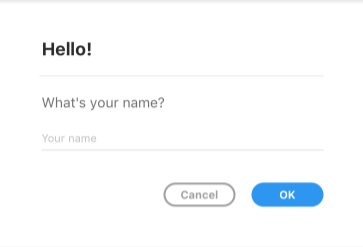

# Dialogs

XD Plugins can display user interface in the form of **modal dialogs**.

Uses for modal dialogs include the following:

* Notice to the user that the operation is complete.
* In indication to the user that the plugin failed in some way (perhaps a failure to download a network resource).
* Request for more information from the user before continuing.
* Complex configuration prior to executing the remainder of the plugin.

When it comes to building the user interface, XD exposes an API surface that looks and feels a lot like what you would get in a web browser, namely:

* HTML5 DOM (Document Object Model) API
* CSS
* JavaScript

These APIs and standards can be used to create compelling user interfaces, even inside modal dialogs.

## Modal Dialog Structure

The above example is a typical modal dialog. Modal dialogs consist of:

* A heading (`<h1>`), which may also display the plugin's icon
* A horizontal rule (`
`)
* Some body content
* A footer (`<footer>`) with one or more buttons (`<button>`)

The margins and padding that surround the structure are provided automatically. There is generally _no need_ to specify or override these margins in your own user interface, unless you want to do so.

## Building Modal Dialogs

You can build modal dialogs using any method that creates an HTML5 DOM structure. This means you can use `document.createElement`, `innerHTML`, jQuery, React, and other frameworks.

* [DOM Structure](./dialogs/dom-structure.md)
* [Building a Dialog with HTML](./dialogs/building-dialog-with-html.md)
* [Building a Dialog with React](./dialogs/building-dialog-with-react.md)
* [Helpers](./dialogs/helpers.md)

Once a dialog is built, you will need to manage its lifecycle:

* [Showing a Modal Dialog](./dialogs/showing.md)
* [Dismissing a Modal Dialog](./dialogs.dismissal.md)
