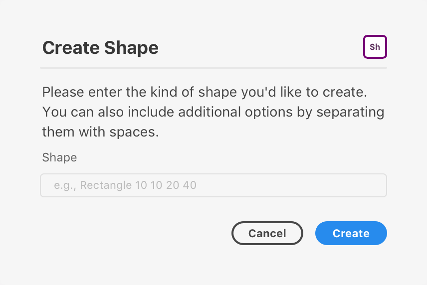
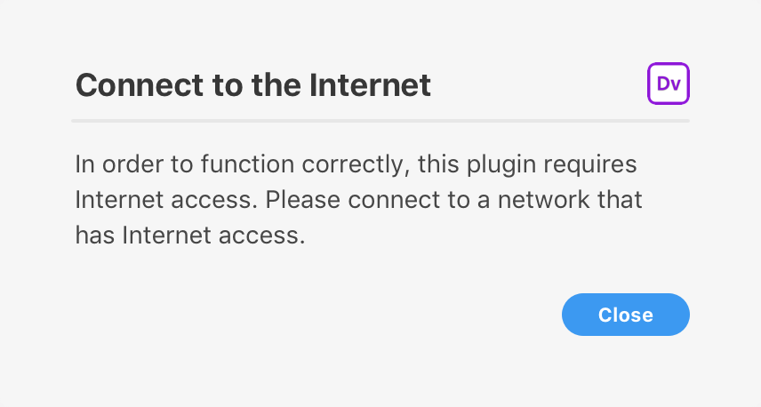

# Dialogs

A modal dialog is used to display important information and ask for user input. XD Plugins can display user interface in the form of **modal dialogs**.



Dialogs appear over the XD document, and prevent further interaction with the underlying document. Dialogs are dismissed in any one of the following manners:

* The user presses the ESC key
* The user presses ENTER (assuming the plugin supplies an `onsubmit` handler)
* The user clicks or touches a button designed to dismiss the dialog.

Dialogs are highly intrusive, and should only be used when absolutely necessary.

## Anatomy














## Usage

When it comes to building the user interface, XD exposes an API surface that looks and feels a lot like what you would get in a web browser, namely:

* HTML5 DOM (Document Object Model) API
* CSS
* JavaScript

These APIs and standards can be used to create compelling user interfaces, even inside modal dialogs.

The above example is a typical modal dialog. Modal dialogs consist of:

* A dialog element (`<dialog>`) that is added to the DOM and contains everything that follows
* A form element (`<form>`) that wraps around the content of the dialog
* A heading (`<h1>`), which may also display the plugin's icon
* A horizontal rule (`<hr />`)
* Some body content
* A footer (`<footer>`) with one or more buttons (`<button>`)

The margins and padding that surround the structure are provided automatically. There is generally _no need_ to specify or override these margins in your own user interface, unless you want to do so.

## Building Modal Dialogs

You can build modal dialogs using any method that creates an HTML5 DOM structure. This means you can use `document.createElement`, `innerHTML`, jQuery, React, and other frameworks.

Let's examine a simple dialog and how we might create it.








```html
<style>
    #dialog form {
        width: 360px;
    }
    .h1 {
        align-items: center;
        justify-content: space-between;
        display: flex;
        flex-direction: row;
    }
    .icon {
        border-radius: 4px;
        width: 24px;
        height: 24px;
        overflow: hidden;
    }
</style>
<dialog id="dialog">
    <form method="dialog">
        <h1 class="h1">
            <span>Create Shape</span>
            
        </h1>
        <hr />
        <p>Please enter the kind of shape you'd like to create. You can also include additional options by separating them with spaces.</p>
        <label>
            <span>Shape</span>
            <input type="text" placeholder="e.g., Rectangle 10 10 20 40" />
        </label>
        <footer>
            <button uxp-variant="primary">Cancel</button>
            <button type="submit" uxp-variant="cta">Create</button>
        </footer>
    </form>
</dialog>
```



```js
let ourDialog;
function showOurDialog() {
    if (!ourDialog) {
        ourDialog = document.createElement("dialog");
        ourDialog.innerHTML = `
<style>
    form {
        width: 360px;
    }
    .h1 {
        align-items: center;
        justify-content: space-between;
        display: flex;
        flex-direction: row;
    }
    .icon {
        border-radius: 4px;
        width: 24px;
        height: 24px;
        overflow: hidden;
    }
</style>
<form method="dialog">
    <h1 class="h1">
        <span>Create Shape</span>
        
    </h1>
    <hr />
    <p>Please enter the kind of shape you'd like to create. You can also include additional options by separating them with spaces.</p>
    <label>
        <span>Shape</span>
        <input type="text" placeholder="e.g., Rectangle 10 10 20 40" />
    </label>
    <footer>
        <button uxp-variant="primary">Cancel</button>
        <button type="submit" uxp-variant="cta">Create</button>
    </footer>
</form>
        `;
    }
    return ourDialog.showModal();
}
```



```js
const React = require("react");
const ReactDOM = require("react-dom");

function Form() {
    const styles = {
        form: {
            width: 360;
        },
        h1: {
            alignItems: "center";
            justifyContent: "space-between";
            display: "flex";
            flexDirection: "row";
        },
        icon: {
            borderRadius: 4;
            width: 24;
            height: 24;
            overflow: "hidden";
        }
    };

    return (
        <form styles={styles.form} method="dialog">
            <h1 styles={styles.h1}>
                <span>Create Shape</span>
                
            </h1>
            <hr />
            <p>Please enter the kind of shape you'd like to create. You can also include additional options by separating them with spaces.</p>
            <label>
                <span>Shape</span>
                <input type="text" placeholder="e.g., Rectangle 10 10 20 40" />
            </label>
            <footer>
                <button uxp-variant="primary">Cancel</button>
                <button type="submit" uxp-variant="cta">Create</button>
            </footer>
        </form>
    );
}

let ourDialog;
function showOurDialog() {
    if (!ourDialog) {
        ourDialog = document.createElement("dialog");
    }
    ReactDOM.render(<Form />, ourDialog);
    return ourDialog.showModal();
}
function render() {
    return (
        <button>Click Me</button>
    );
}
```



Once a dialog is built, you will need to manage its lifecycle:

* [Showing a Modal Dialog](./showing.md)
* [Dismissing a Modal Dialog](./dismissal.md)

## Variations

### Alert

A simple "alert" can be used to display a message along with a **Close** button. You can customize the content of the title and message, but you cannot customize the button itself.



E## Error

An error "alert" (with a red heading). These are useful for rendering error messages. Just like regular alerts, you cannot customize the button itself.


### Confirmation

Confirmation dialogs display a message and _two_ buttons. The user is free to pick which of the buttons they wish to invoke.


> **Danger**
>
> Do not use confirmation dialogs for destructive actions.

### Warning

Warning dialogs display a message and _two_ buttons, one of which is destructive. Pressing **ENTER** in this case should _not_ invoke the destructive action. Otherwise it is the same as a confirmation dialog.


### Prompt

Prompts display a single line text field in addition to a message and two buttons.


## Guidelines

You should always strive to provide a good user experience with a modal dialog. That means providing easy access to dismissive buttons, avoiding dark patterns, and ensuring that your dialog doesn't block the user from forward progress in their work.

You should definitely read up on the [experience guidelines](../../../xdpegs/5-ui.md) to learn more about what to do and what not to do.

##### When to Use Dialogs

Dialogs are very intrusive to the user's workflow. As such, you should consider their use very carefully.

* **Don't** display a "success" dialog when the result of the plugin is obvious to the user.
* **Do** display a "success" dialog when the result of the plugin is **not** obvious to the user (such as data being sent to a remote endpoint.)
* **Don't** fail silently &mdash; let the user know what went wrong and how they can fix it by showing a modal dialog.

##### No Nested Dialogs

You should avoid nesting dialogs within other dialogs. The only exception to this guideline is when displaying file or folder pickers.

##### Three Buttons

In general, try to strive to avoid dialogs with lots of buttons in the footer. You should try to use up to three buttons in the footer.

##### Dismissive Buttons

Dismissive dialog buttons live within a `footer` element. Within the `footer`, you can have any number of buttons, but you should follow these guidelines when defining variants (which you can use to indicate if a button is the default or is destructive):

* `uxp-variant="cta"` indicates that the button is a "call to action". This is typically used for the default action. You should only have one of these buttons in a dialog.
* `uxp-variant="primary"` indicates the button is a "primary" button. This is the _default_ if `uxp-variant` is not specified.
* `uxp-variant="secondary"` indicates the button is a "secondary" button. It receives a lighter color than primary buttons.
* `uxp-variant="warning"` indicates that the button will trigger a destructive action. This button should not be the default action.

> **Tip**
>
> Dismissive buttons should always be visible on screen without scrolling. If a dismissive button isn't visible, the user may think they are trapped in the dialog.

##### Dismissal by other means

You should avoid dismissing a dialog using other means, including action buttons, checkboxes, etc.

## Keyboard Interaction

Key       | Action
----------|----------------------------
ENTER     | Submits the dialog's form
ESC       | Cancels the dialog
TAB       | Moves to the next focusable element.
SHIFT+TAB | Moves to the previous focusable element.

## Known Issues

- Large dialogs on small screens (or in small windows) do not scroll automatically and will clip. You should apply a fixed height to your dialogs.
- Dialogs are neither movable nor resizable.
- It is not possible to show multiple dialogs at once, *except* for file and folder pickers.
- It is not possible to intercept the **ESC** gesture when dismissing a dialog. Dialogs are always dismissible using **ESC**.
- When **TAB**ing in Windows 10, the focus border may appear incorrectly on some elements.
- On Windows 10, the tab order in a dialog's footer may be reversed.
- The `<dialog>` background color is different on Windows and macOS. On macOS, it is `#F5F5F5`, and on Windows it is `#FFFFFF`.