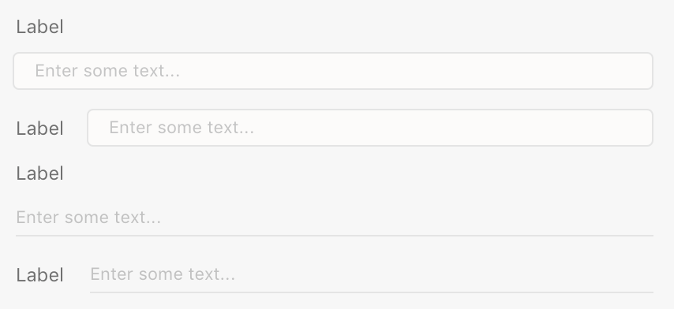
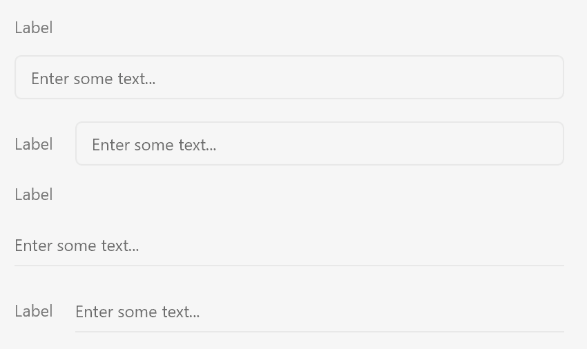

# Text Fields

Text fields allow user input for custom values. Text fields can be single or multi-line input fields, and come in various degrees of loudness.


## Anatomy
















```html
<input type="text" />
```



## Usage

You can render a typical single-line textfield using the following:





```html
<label>
    <span>Layer Name</span>
    <input type="text" placeholder="Enter a layer name"/>
</label>
```



```js
const labelWrapper = document.createElement("label");

const label = document.createElement("span");
label.textContent = "Layer Name";

const textfield = document.createElement("input");
textfield.setAttribute("type", "text");
textfield.setAttribute("placeholder", "Enter a layer name");

labelWrapper.appendChild(label);
labelWrapper.appendChild(textfield);
```



```js
function render() {
    return (
        <label>
            <span>Layer Name</span>
            <input type="text" placeholder="Enter a layer name"/>
        </label>
    );
}
```



## Variations and Loudness

Text fields have a standard rendition (with borders) and a quiet rendition (with a border at the bottom of the control). This is controlled with the `uxp-quiet` attribute.

* If `uxp-quiet` is omitted, the text field will draw with a border around the entire control.
* If `uxp-quiet` is `true`, the text field will draw with only a border at the bottom of the control.

Single line text fields are created using the `input type="text"` tag. Multiline text fields are created using the `textarea` tag, like so:

```html
<textarea>
Default text value here
</textarea>
```

> **Info**
>
> HTML5 allows you to specify the width and height of a `textarea` element using the `rows` and `cols` attributes. XD only uses the `width` and `height` styles.

<!--
<style>
    .top { align-items: flex-start; }
    textarea { height: 64px; }
</style>
<label>
    <span>Text</span>
    <textarea>Hello</textarea>
</label>
<label class="row top">
    <span>Text</span>
    <textarea>Hello</textarea>
</label>
<label>
    <span>Text</span>
    <textarea uxp-quiet="true">Hello</textarea>
</label>
<label class="row top">
    <span>Text</span>
    <textarea uxp-quiet="true">Hello</textarea>
</label>

-->

## Guidelines

##### Include a Label

Text fields should always have labels, otherwise it is difficult for the user to discern what the field expects.

##### Label Position

Typically, labels should be above the text field and positioned to the left. You can also position labels directly to the left if you need.



```html
<style>
    .field {
        align-items: center;
    }
</style>
<label class="row field">
    <span>Layer Name</span>
    <input type="text" />
</label>
```



##### Minimum Width

Text fields should not be sized so much smaller than the typically expected value. Narrow text fields require a lot of user scrolling, and can lead to user confusion because the entire value may not be visible.

##### Capitalization

The text field labels should be in title case. Placeholder text should be in sentence case.

## Keyboard

Key        | Action
-----------|--------------
ENTER      | Submits the active form
TAB        | Navigates to the next focusable control
SHIFT+TAB  | Navigates to the previous focusable control

## Styling

Text fields accept a limited amount of styling. You cannot change the following styles:

* Color of the border or the background color
* The font family, weight, or size
* The padding within the text area

## Attributes

### Supported Attributes

* `autofocus`: `autofocus`
* `disabled`: `disabled`
* `readonly`: `readonly`
* `value`

### Unsupported Attributes

* `autocomplete`
* `form`
* `formaction`
* `formenctype`
* `formmethod`
* `formnovalidate`
* `formtarget`
* `name`
* `defaultValue`
* `minlength`
* `maxlength`
* `capture`
* `inputmode`
* `list`
* `min`
* `max`
* `multiple`
* `pattern`
* `required`
* `size`
* `spellcheck`
* `step`
* `tabindex`
* `usemap`

## Supported Events

* `change`

## Known Issues

* Text fields do not receive pointer events.
* Validation is not currently supported.
* The following `input` `type` values are not supported, and will render as a regular text field: `button`, `color`,
  `date*`, `email`, `file`, `hidden`, `month`, `number`, `password`, `radio`, `reset`, `search`, `submit`, `tel`,
  `time`, `url`, `week`