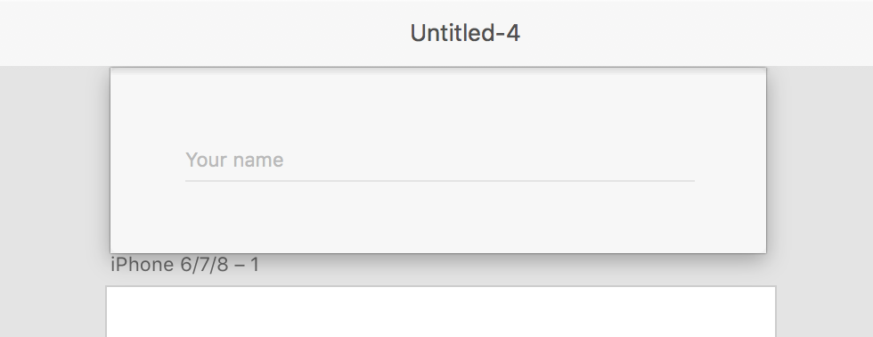
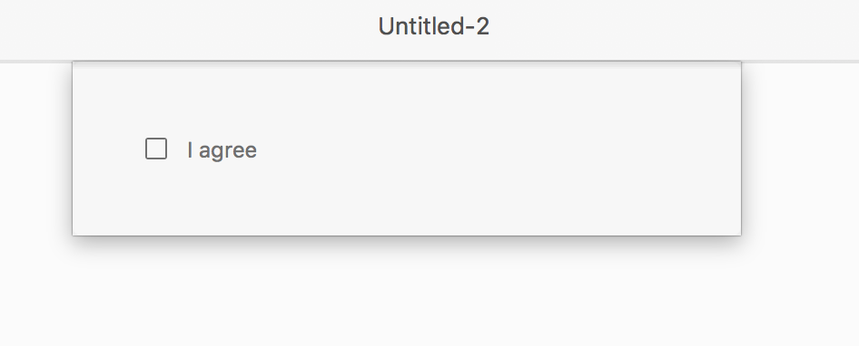
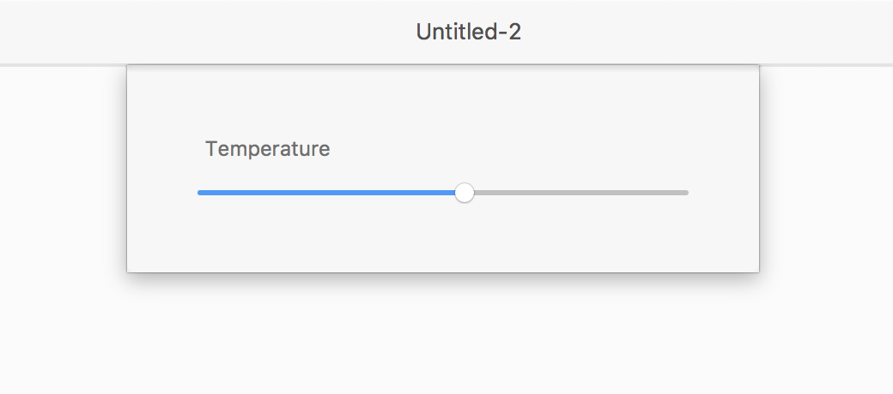
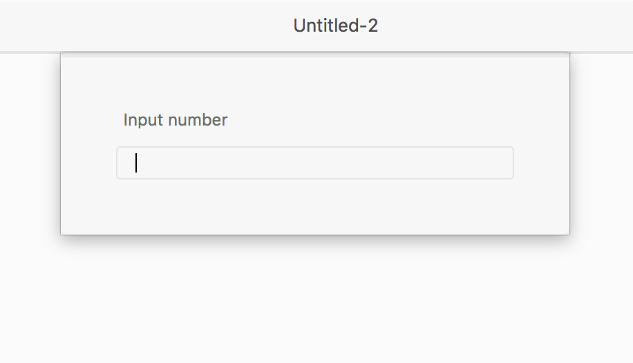

# Input

`<input>` type supportes different values for its attribute "type". Depending upon the value, it supports different attributes.

## Type = text

### Syntax
The code below generates the following UI
```html
   <input type="text" uxp-quiet="true" id="name" placeholder="Your name"/>
```


### Supported attributes 
* id	
```html
        <input type="text" id="name" />
```
* title	
```html
        <input type="text" id="name" title="Hello World"/>
```

* place holder
```html
        <input type="text" id="name" placeholder="Your name"/>
```

* disabled
```html
        <input type="text" id="name" disabled = "true"/>
```

* value
```html
        <input type="text" id="name" value="Your name"/>
```	

* title
```html
        <input type="text" id="name" title="Your title"/>
```	

* readonly
```html
        <input type="text" id="name" readonly="true"/>
```	

* uxp-quiet
```html
   		 <input uxp-quiet="true" type="text" id="name" placeholder="Your name"/>
```

## Type = checkbox

### Syntax
The code below generates the following UI
```html
        <label class = "row">
            <input type="checkbox" id="name" placeholder="Your name"/>
            <span>I agree  </span>
        </label>
```



### Supported attributes
* id	
```html
        <input type="checkbox" id="name" />
```

* title	
```html
        <input type="checkbox" id="name" />
```

* value
```html
        <input type="checkbox" id="name" value="someValue"/>
```	

* checked	
```html
        <input type="checkbox" id="name" value="someValue" checked/>
```

* disabled	
```html
        <input type="checkbox" id="name" value="someValue" disabled/>
```

* indeterminate	
```html
        <input type="checkbox" id="name" />
```

This value for this attribute can only be set in javascript like this:

	```
		var input = document.getElementById("name");
		 input.indeterminate = true;
	```


## Type = range

### Syntax
The code below generates the following UI
```html
        <label>
            <span> Temperature </span>
            <input type="range" id="name" min="1" max="100" value="55"/>
        </label>
```



### Supported attributes

* id	
```html
        <input type="range" id="name" />
```

* title	
```html
        <input type="range" id="name" title="someTitle" />
```

* disabled
```html
         <input type="range" id="name" disabled />
```	

* min	
```html
        <input type="range" id="name" min="10" />
```

* max	
```html
         <input type="range" id="name" max="20" />
```

* step	
```html
       <input type="range" id="name" step="2" />
```

* value	
```html
      <input type="range" value="90" />
```


## Type = number

### Syntax
The code below generates the following UI
```html
        <label>
            <span> Input number </span>
            <input type="number" id="name"/>
        </label>
```



### Supported attributes

* id	
```html
        <input type="number" id="name" />
```
* title	
```html
        <input type="number" id="name" title="Hello World"/>
```

* place holder
```html
        <input type="number" id="name" placeholder="Your name"/>
```

* disabled
```html
        <input type="number" id="name" disabled = "true"/>
```

* value
```html
        <input type="number" id="name" value="Your name"/>
```	

* title
```html
        <input type="number" id="name" title="Your title"/>
```	

* readonly
```html
        <input type="number" id="name" readonly="true"/>
```	

* uxp-quiet
```html
   		 <input uxp-quiet="true" type="number" id="name" placeholder="Your name"/>
```