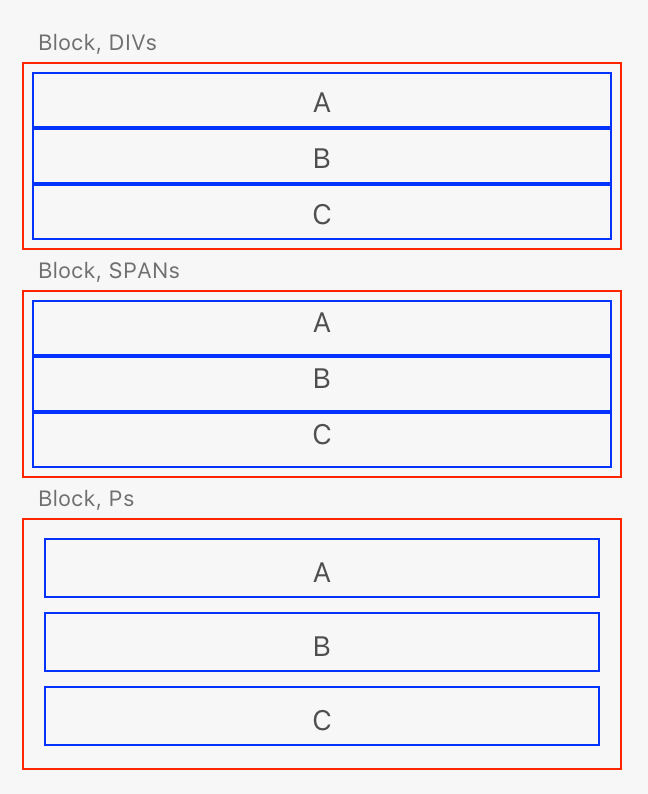

# Block Layout

The default layout system used by the XD User Interface API is `block` layout. This just means that elements are stacked vertically on top of each other, just like a stack of blocks. Each element will also stretch to fill up the available width in its container.

Where the layout may surprise you is when dealing with elements that would typically receive `inline` layout semantics. This layout is essentially textual layout; that is, `inline` elements are laid out as if they were text on a page, flowing and wrapping along.

In XD, _all_ elements use `block` layout by default. This includes text-based elements like `span`, `a`, `button`, and all others. This can be a little surprising at first, but if the `inline` element is desired, one can use the [Flexbox layout](./flex.md) system to simulate some `inline` aspects.

Let's consider the following HTML:

```html
<style>
     .border {
         border: 1px solid red;
         padding: 4px;
         width: 300px;
     }
     .border * {
         border: 1px solid blue;
         padding: 4px;
         text-align: center;
     }
</style>
<h3>Block, DIVs</h3>
<div class="border">
    <div>A</div><div>B</div><div>C</div>
</div>
<h3>Block, SPANs</h3>
<div class="border">
    <span>A</span><span>B</span><span>C</span>
</div>
<h3>Block, Ps</h3>
<div class="border">
    <p>A</p><p>B</p><p>C</p>
</div>
```

If you were thinking like a web browser, the first and third `div` containers would render their contents vertically, but the middle `div` would render its contents horizontally, essentially treating each `span` as a letter.

XD, however, will render as follows:



The middle block is rendered _vertically_ as well, even though `span` elements are `inline` elements. This is _definitely_ not how a typical web browser would work, but then again, XD isn't a web browser!