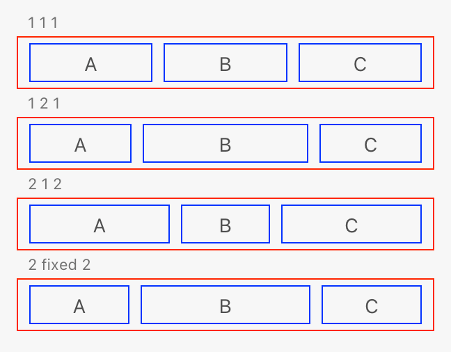
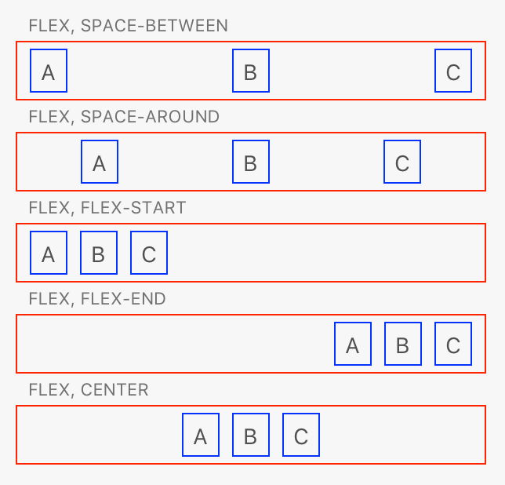

# Flexbox Layout

The flexible box layout module is a layout system provided in CSS, which is significantly more flexible than using block layout. The layout module provides the ability for elements to shrink and grow based on available space, and also provides methods for specifying how much space to provide around elements.

The flexible box module specification is quite large, and covering the entire specification is out-of-scope for this reference. If you want _all_ the details, please refer to the following documentation:

* [A Complete Guide to Flexbox](https://css-tricks.com/snippets/css/a-guide-to-flexbox/)
* [Basic concepts of flexbox](https://developer.mozilla.org/en-US/docs/Web/CSS/CSS_Flexible_Box_Layout/Basic_Concepts_of_Flexbox)
* [CSS Flexible Box Layout](https://developer.mozilla.org/en-US/docs/Web/CSS/CSS_Flexible_Box_Layout)
* [CSS Flexible Box Layout Module Level 1 (W3C Specification)](https://www.w3.org/TR/css-flexbox-1/)

## Enabling flexible layout

There are two types of elements when using flexible layout. First, there is the _containing_ element &mdash; this is called the "flex container". Then there is the element that is being positioned within the flex container which are called "flex items".

To turn an element into a flex container, one applies `display: flex` to the element. The orientation of the element defaults to the horizontal or `row` orientation, but can be overridden by specifying `flex-direction: row | column | row-reverse | column-reverse`. Whether or not wrapping should be allowed is controlled with `flex-wrap` (which defaults to `nowrap`, but can be set to `wrap` and `wrap-reverse`).

All direct descendants within a flex container are flex items automatically. The spacing and positioning of these elements is controlled using the following styles:

* `justify-content`: indicates the rules to apply to spacing on the main axis; defaults to `flex-start`
* `align-content`: indicates the rules to apply to spacing on the cross axis; defaults to `stretch`
* `align-items`: defaults to `stretch`
* `align-self`: defaults to `auto`

_How_ items stretch and position themselves is determined by the item's `flex` properties:

* `flex-basis`: indicates the size of the flex item (defaults to `auto`)
* `flex-grow`: indicates the growth factor of the flex item (in comparison to other flex items; defaults to `0`)
* `flex-shrink`: indicates the shrink factor of the flex item (in comparison to other flex items; defaults to `1`)

It might help to visualize the above with some diagrams. First, let's look at the `flex` properties. In the following image, each box is being given a `flex: 1 1 auto` (or `flex: 2 2 auto`, depending on the number).



As you can see, the items that received `flex: 2 2 auto` are larger than the `flex: 1 1 auto` counterparts. And the last item has a fixed `flex-basis` supplied, which override the default size calculation.

Now, consider the following HTML and styles:

```html
<style>
     .border {
         border: 1px solid red;
         padding: 4px;
         width: 300px;
     }
     .flex {
         display: flex;
         flex-direction: row;
     }
     .between { justify-content: space-between; }
     .around  { justify-content: space-around; }
     .start   { justify-content: flex-start; }
     .end     { justify-content: flex-end; }
     .center  { justify-content: center; }
     .border * {
         border: 1px solid blue;
         padding: 4px;
         margin: 0 4px;
     }
</style>
<h3>FLEX, SPACE-BETWEEN</h3>
<div class="border flex between">
    <div>A</div><div>B</div><div>C</div>
</div>
<h3>FLEX, SPACE-AROUND</h3>
<div class="border flex around">
    <div>A</div><div>B</div><div>C</div>
</div>
<h3>FLEX, FLEX-START</h3>
<div class="border flex start">
    <div>A</div><div>B</div><div>C</div>
</div>
<h3>FLEX, FLEX-END</h3>
<div class="border flex end">
    <div>A</div><div>B</div><div>C</div>
</div>
<h3>FLEX, CENTER</h3>
<div class="border flex center">
    <div>A</div><div>B</div><div>C</div>
</div>
```

Given the above, XD will generate the following rendition:



As you can see, the _spacing_ between flex items can also be controlled.

Combined, the flexible size and spacing of items can enable very complex layout with only a little CSS. That said, it's important _not_ to overuse flexbox layout. The calculations are significantly more complex than both `block` layout and `relative` or `absolute` positioning, and if you have a lot of elements rendered, performance may suffer.

> **Tip**
>
> If you know the size of the flex item, you can speed up the calculations by using a non-auto value for `flex-basis`

## Unsupported styles and values

The following values are unsupported for each style:

Style Rule           | Unsupported Values
---------------------|--------------------
`justify-content`    | `start`
                     | `end`
                     | `left`
                     | `right`
                     | `space-evenly`
                     | `safe`
                     | `unsafe`
                     | `normal`
                     | `stretch`
`align-content`      | `start`
                     | `end`
                     | `space-evenly`
                     | `safe`
                     | `unsafe`
                     | `normal`
                     | `baseline`
                     | `first`
                     | `last`
`align-items`        | `start`
                     | `end`
                     | `self-start`
                     | `self-end`
                     | `safe`
                     | `unsafe`
                     | `normal`
                     | `baseline` (*)
                     | `first`
                     | `last`
`align-self`         | `start`
                     | `end`
                     | `self-start`
                     | `self-end`
                     | `safe`
                     | `unsafe`
                     | `normal`
                     | `baseline` (*)
                     | `first`
                     | `last`
`place-content`      | No support
`gap`                | No support
`column-gap`         | No support
`row-gap`            | No support
`flex-flow` shorthand| No support; use `flex-direction` and `flex-wrap`
