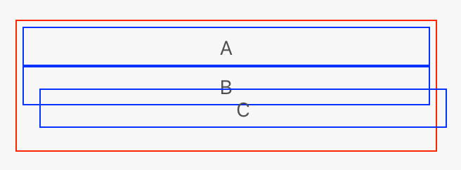
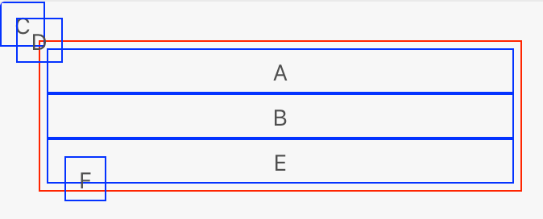

> **warning**
> Please refrain from using `position: fixed` if you are building a [panel](/reference/ui/panels/index.md) plugin. Currently, there is a bug that allows panels to put elements outside the panel boundaries. This will break your panel plugin in a future release when the bug is fixed.

# Relative and Absolute Positioning

You can use relative and absolute positioning to indicate _exactly_ where elements are to be positioned. Relative positioning allows you to shift an element from its originally calculated position whereas absolute positioning takes the element out of the layout flow entirely, and allows you to position the element anywhere.

## Relative Positioning

Relative positioning is enabled by specifying the `position: relative` style on an element. On its own, nothing much will happen (although it does have impacts on other positioned elements as we'll see). When combined with `top`, `right`, `bottom` and `left` styles, you can shift an element around.

For example:

```html
<style>
     .border {
         border: 1px solid red;
         padding: 4px;
         width: 300px;
     }
     .border * {
         border: 1px solid blue;
         padding: 4px;
         text-align: center;
     }
     .relative {
         position: relative;
     }
     .move {
         top: -12px;
         left: 12px;
     }
</style>
<div class="border">
    <div>A</div>
    <div class="relative">B</div>
    <div class="relative move">C</div>
</div>
```

The following will be rendered:



Element **A** is positioned normally. By default this is `static` positioning, meaning that it follows the regular layout rules. Element **B** is positioned relatively, but notice that it's in the same place you'd expect it to be in. This is because no offset has been applied.

Element **C**, on the other hand, is positioned relatively _and_ shifted up and left by twelve pixels. As you can see, **C** is free to overlap **B**. Also of import is the fact that the layout flow is otherwise undisturbed &mdash; the same amount of space will be reserved for **C** regardless of how much it is shifted out of its original position.

## Absolute Positioning

Positioning an element absolutely with `position: absolute` immediately takes the element out of the regular layout flow. The layout will act as if the element simply doesn't exist. Instead, the element will be positioned relatively to its nearest positioned ancestor, and can be moved around using `top`, `right`, `bottom`, and `left`.

> **Tip**
>
> If "nearest positioned ancestor" doesn't immediately make sense, that's OK. All it means it that an absolutely positioned element's (0, 0) coordinate is based on whichever element in its ancestry (parent, grandparent, etc.) is also positioned. If no elements are positioned, then (0, 0) is the upper left corner of the viewport.

Absolute positioning is one of the fastest positioning methods, but is also the least flexible.

Let's take a look at absolute positioning in action:

```html
<style>
     .border {
         border: 1px solid red;
         padding: 4px;
         width: 300px;
     }
     .border * {
         border: 1px solid blue;
         padding: 4px;
         text-align: center;
     }
     .relative {
         position: relative;
     }
     .absolute {
         position: absolute;
         top: 0;
         left: 0;
     }
     .pos {
         top: 10px;
         left: 10px;
     }
</style>
<div class="border">
    <div>A</div>
    <div class="relative">B</div>
    <div class="absolute">C</div>
    <div class="absolute pos">D</div>
    <div class="relative">E<div class="absolute pos">F</div></div>
</div>
```

This will render as so:



Notice that both **A** and **B** are still where we'd expect. But look at **C** and **D** &mdash; they're off in the upper left corner! That's because they have no positioned ancestors and so (0,0) refers to the top left corner.

**E** is another relatively positioned element, so it makes sense that it would be below **B**, but notice: there's no extra space between **B** and **E** to account for **C** and **D**. As mentioned above, this is because absolutely positioned elements are taken out of the normal layout flow.

Lastly, let's look at **F** -- it's sitting at (10,10), but _relative_ to **E**. This is what is meant by an element being positioned relative to its nearest positioned ancestor. In this case **E** is positioned (relatively), and so **F**'s (0, 0) point is the top left corner of **E**.
