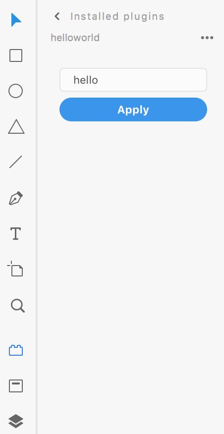
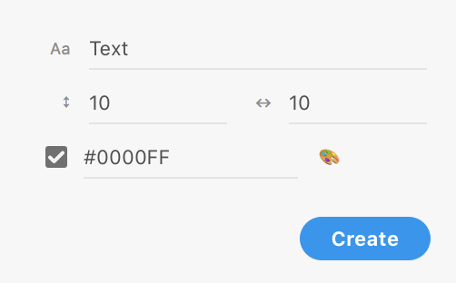
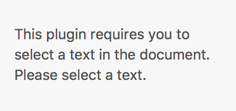

# Panel

A panel is used to display information and options that are persistent and can be shown without blocking user interactions with the active document.



Panels appear on the left-hand side of the app when user clicks on the Plugins icon at the bottom-left side. Panels do not prevent user interaction with the underlying document and can listen for the user's selection changes. Panels are dismissed in any one of the following manners:

- The user clicks on the "back arrow" button at the top of XD's Plugins panel
- The user clicks on one of the other options for the left hand side of the app, such as the Layers panel or Assets panel
- The user runs a different plugin from the _Plugins_ menu

## Usage

Building the user interface for panels is very similar to modals. Refer to [Modal dialog usage](/reference/ui/dialogs/#usage).

## Building Panels

You can build panels using any method that creates an HTML5 DOM structure. This means you can use `document.createElement`, `innerHTML`, jQuery, React, and other frameworks.

Let's examine a simple panel and how we might create it:









```html
<style>
  .break {
    flex-wrap: wrap;
  }
  label.row > * {
    margin: 3px 0;
  }
  label.row > span {
    color: #8e8e8e;
    width: 20px;
    text-align: right;
    font-size: 9px;
  }
  label.row input {
    flex: 1 1 auto;
  }
  label.row input[type="number"] {
    flex-basis: 32px;
  }
  div input[type="checkbox"] {
    flex: 0 0 20px;
  }
  form footer > * {
    position: relative;
    left: 8px;
  }
</style>
<form method="dialog" id="main">
  <label class="row" id="fldButtonText">
    <span>Aa</span>
    <input
      type="text"
      id="txtButtonText"
      value="Text"
      placeholder="Text"
      uxp-quiet="true"
    />
  </label>
  <div class="row break">
    <label class="row">
      <span>↕︎</span>
      <input
        type="number"
        uxp-quiet="true"
        id="txtV"
        value="10"
        placeholder="Vertical padding"
      />
    </label>
    <label class="row">
      <span>↔︎</span>
      <input
        type="number"
        uxp-quiet="true"
        id="txtH"
        value="10"
        placeholder="Horizontal padding"
      />
    </label>
    <div class="row">
      <input type="checkbox" checked id="chkColor" />
      <label class="row" id="fldColor">
        <input
          type="text"
          uxp-quiet="true"
          id="txtColor"
          value="#0000FF"
          placeholder="CSS Color"
        />
        <span>🎨</span>
      </label>
    </div>
  </div>
  <footer>
    <button id="ok" type="submit" uxp-variant="cta">Apply</button>
  </footer>
</form>
```



```js
let panel;

function create() {
  const HTML = `<style>
            .break {
                flex-wrap: wrap;
            }
            label.row > * {
                margin: 3px 0;
            }
            label.row > span {
                color: #8E8E8E;
                width: 20px;
                text-align: right;
                font-size: 9px;
            }
            label.row input {
                flex: 1 1 auto;
            }
            label.row input[type=number] {
                flex-basis: 32px;
            }
            div input[type=checkbox] {
                flex: 0 0 20px;
            }
            form footer > * {
                position: relative;
                left: 8px;
            }
        </style>
        <form method="dialog" id="main">
        <label class="row" id="fldButtonText">
            <span>Aa</span>
            <input type="text" id="txtButtonText" value="Text" placeholder="Text" uxp-quiet="true"/>
        </label>
        <div class="row break">
            <label class="row">
            <span>↕︎</span>
            <input type="number" uxp-quiet="true" id="txtV" value="10" placeholder="Vertical padding" />
            </label>
            <label class="row">
            <span>↔︎</span>
            <input type="number" uxp-quiet="true" id="txtH" value="10" placeholder="Horizontal padding" />
            </label>
            <div class="row">
            <input type="checkbox" checked id="chkColor" />
            <label class="row" id="fldColor">
                <input type="text" uxp-quiet="true" id="txtColor" value="#0000FF" placeholder="CSS Color" />
                <span>🎨</span>
            </label>
            </div>
        </div>
        <footer><button id="ok" type="submit" uxp-variant="cta">Apply</button></footer>
        </form>
        `;

  panel = document.createElement("div");
  panel.innerHTML = HTML;

  return panel;
}

function show(event) {
  // create panel the first time it's shown
  if (!panel) {
    panel = create();
    event.node.appendChild(panel);
  }
}

function hide(event) {
  // in this example, we don't need to do anything when XD hides our panel
}

function update(selection, root) {
  console.log(selection.items);
}

module.exports = {
  panels: {
    example: {
      show,
      hide,
      update
    }
  }
};
```



Note: you can either reuse your panel's UI nodes, or destroy and recreate the panel each time it's closed. For examples of both approaches, see the [detailed documentation on the `show()` method](./show.md).

## Handling Selection Change

As you can see in the example above, every time the user's `selection` changes, your (optional) lifecycle method `update` will trigger. You will have access to both `selection` and `root` as parameters in the function. This means that your panel can display dynamic content based on what user has selected in the document.









```html
<style>
  .break {
    flex-wrap: wrap;
  }
  label.row > * {
    margin: 3px 0;
  }
  label.row > span {
    color: #8e8e8e;
    width: 20px;
    text-align: right;
    font-size: 9px;
  }
  label.row input {
    flex: 1 1 auto;
  }
  label.row input[type="number"] {
    flex-basis: 32px;
  }
  div input[type="checkbox"] {
    flex: 0 0 20px;
  }
  form footer > * {
    position: relative;
    left: 8px;
  }
</style>
<form method="dialog" id="main">
  <label class="row" id="fldButtonText">
    <span>Aa</span>
    <input
      type="text"
      id="txtButtonText"
      value="Text"
      placeholder="Text"
      uxp-quiet="true"
    />
  </label>
  <div class="row break">
    <label class="row">
      <span>↕︎</span>
      <input
        type="number"
        uxp-quiet="true"
        id="txtV"
        value="10"
        placeholder="Vertical padding"
      />
    </label>
    <label class="row">
      <span>↔︎</span>
      <input
        type="number"
        uxp-quiet="true"
        id="txtH"
        value="10"
        placeholder="Horizontal padding"
      />
    </label>
    <div class="row">
      <input type="checkbox" checked id="chkColor" />
      <label class="row" id="fldColor">
        <input
          type="text"
          uxp-quiet="true"
          id="txtColor"
          value="#0000FF"
          placeholder="CSS Color"
        />
        <span>🎨</span>
      </label>
    </div>
  </div>
  <footer>
    <button id="ok" type="submit" uxp-variant="cta">Apply</button>
  </footer>
</form>
```



```js
let panel;

function create() {
  const HTML = `<style>
            .break {
                flex-wrap: wrap;
            }
            label.row > * {
                margin: 3px 0;
            }
            label.row > span {
                color: #8E8E8E;
                width: 20px;
                text-align: right;
                font-size: 9px;
            }
            label.row input {
                flex: 1 1 auto;
            }
            label.row input[type=number] {
                flex-basis: 32px;
            }
            div input[type=checkbox] {
                flex: 0 0 20px;
            }
            form footer > * {
                position: relative;
                left: 8px;
            }

        </style>
        <form method="dialog" id="main">
            <label class="row" id="fldButtonText">
                <span>Aa</span>
                <input type="text" id="txtButtonText" value="Text" placeholder="Text" uxp-quiet="true"/>
            </label>
            <div class="row break">
                <label class="row">
                    <span>↕︎</span>
                    <input type="number" uxp-quiet="true" id="txtV" value="10" placeholder="Vertical padding" />
                </label>
                <label class="row">
                    <span>↔︎</span>
                    <input type="number" uxp-quiet="true" id="txtH" value="10" placeholder="Horizontal padding" />
                </label>
                <div class="row">
                    <input type="checkbox" checked id="chkColor" />
                    <label class="row" id="fldColor">
                        <input type="text" uxp-quiet="true" id="txtColor" value="#0000FF" placeholder="CSS Color" />
                        <span>🎨</span>
                    </label>
                </div>
            </div>
            <footer><button id="ok" type="submit" uxp-variant="cta">Apply</button></footer>
        </form>
        `;

  panel = document.createElement("div");
  panel.innerHTML = HTML;

  return panel;
}

function show(event) {
  // create panel the first time it's shown
  if (!panel) {
    panel = create();
    event.node.appendChild(panel);
  }
}

function hide(event) {
  // in this example, we don't need to do anything when XD hides our panel
}

function update(selection, root) {
  const { Text } = require("scenegraph");
  if (!(selection.items[0] instanceof Text)) {
    panel.innerHTML = `<p>Please select a text object.</p>`;
  }
}

module.exports = {
  panels: {
    example: {
      show,
      hide,
      update
    }
  }
};
```



## Further Reading

Refer to the panel lifecycle method documentation to learn more about these methods:

- [Show](./show.md)
- [Hide](./hide.md)
- [Update](./update.md)
