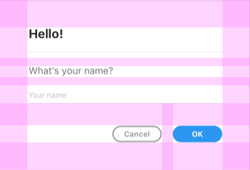
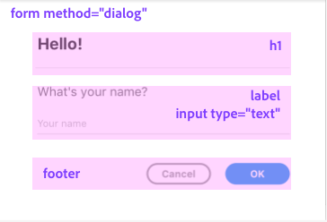

# User Interface Concepts

XD Plugins can display user interface in the form of **modal dialogs**.


Uses for modal dialogs include the following:

* Notice to the user that the operation is complete.
* In indication to the user that the plugin failed in some way (perhaps a failure to download a network resource).
* Request for more information from the user before continuing.
* Complex configuration prior to executing the remainder of the plugin.

When it comes to building the user interface, XD exposes an API surface that looks and feels a lot like what you would get in a web browser, namely:

* HTML5 DOM (Document Object Model) API
* CSS
* JavaScript

These APIs and standards can be used to create compelling user interfaces, even inside modal dialogs.

## Modal Dialog Structure

As you can see from the example above, modal dialogs have a typical look and feel. Modal dialogs have margins around the content, and then various margins between widgets as well.



In most cases, _you do not need to specify these margins in your code_ as long as you follow the typical structure. You are, of course, free to override these styles, but by using the defaults, your dialogs will look like they fit in with the rest of XD and the plugin ecosystem.

The visual structure can be translated to HTML5 DOM elements. Consider the following image:



Modal Dialogs are constructed using the following HTML5 DOM elements:

* `dialog` (wraps the entire modal dialog)
    * `form method="dialog"` (wraps the dialog _contents_ and _buttons_)
        * `h1` (the heading)
        * `p` (the content)
        * `footer` (the footer, which contains the buttons)

If you were to inspect the structure in a browser, you'd see something that looks like this:

```html
<dialog id="myDialog">
    <form method="dialog">
        <h1>Hello!</h1>
        <label>
            <span>What's your name?</span>
            <input uxp-quiet="true" type="text" id="name" placeholder="Your name"/>
        </label>
        <footer>
            <button id="cancel">Cancel</button>
            <button id="ok" uxp-variant="cta">OK</button>
        </footer>
    </form>
</dialog>
```

You can use any number of libraries or frameworks to create the above structure, but at the lowest level you can create a dialog using the following code:

```js
function show() {
    const dialog = document.createElement("dialog");

    const form = document.createElement("form");
    form.setAttribute("method", "dialog");

    const h1 = document.createElement("h1");
    h1.textContent = "Hello!";
    form.appendChild(h1);

    /* etc. */

    const footer = document.createElement("footer");

    const cancel = document.createElement("button");
    cancel.textContent = "Cancel";
    footer.appendChild(cancel);

    /* etc. */

    dialog.appendChild(form);
    document.appendChild(dialog);

    return dialog.showModal();
}
```

## Dialog Buttons

Dialog buttons live within a `footer` element. Within the `footer`, you can have any number of buttons, but you should follow these guidelines when defining variants (which you can use to indicate if a button is the default or is destructive):

* `uxp-variant="cta"` indicates that the button is a "call to action". This is typically used for the default action. You should only have one of these buttons in a dialog.
* `uxp-variant="primary"` indicates the button is a "primary" button. This is the _default_ if `uxp-variant` is not specified.
* `uxp-variant="secondary"` indicates the button is a "secondary" button. It receives a lighter color than primary buttons.
* `uxp-variant="warning"` indicates that the button will trigger a destructive action. This button should not be the default action.

## Showing a Dialog

Dialogs are shown using the [`HTMLDialogElement#showModal`](../uxp/class/HTMLDialogElement.md#htmldialogelement-showmodal) method. This method will render the dialog. The method will return a `Promise`, which you can use to easily wait for the dialog to be dismissed.

```js
dialog.showModal()
    .then(result => {
        // handle dialog result
    });
```

> **Important:**
>
> The dialog element _must_ be present in the DOM before showing it. If it isn't, the method will throw an exception.

It's important to note that you can only show one dialog at once. You should always close or dismiss a dialog first before showing another one.

## Dismissing a Dialog

Dialogs can be dismissed in the following ways:

* Manually, by the user pressing the ESC key
* Programmatically, by calling [`HTMLDialogElement#close`](../uxp/class/HTMLDialogElement#htmldialogelement-close) with an optional return value.

You can listen for the _default_ gesture (typically [ENTER]) by registering for the `submit` event on the `form`:

```js
form.addEventListener("submit", () => {
    dialog.close("ENTER");
});
```

You can listen for the dialog's dismissal using the `close` event on the dialog:

```js
dialog.addEventListener("close", () => {
    // dialog is closed at this point
});
```
