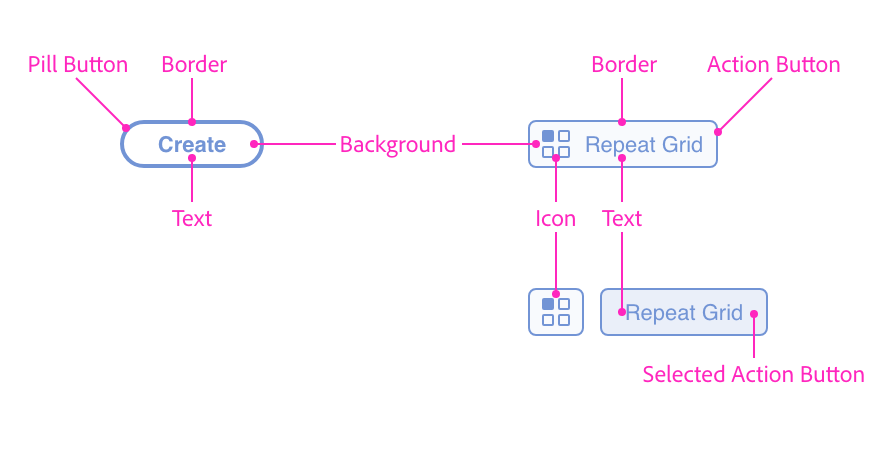
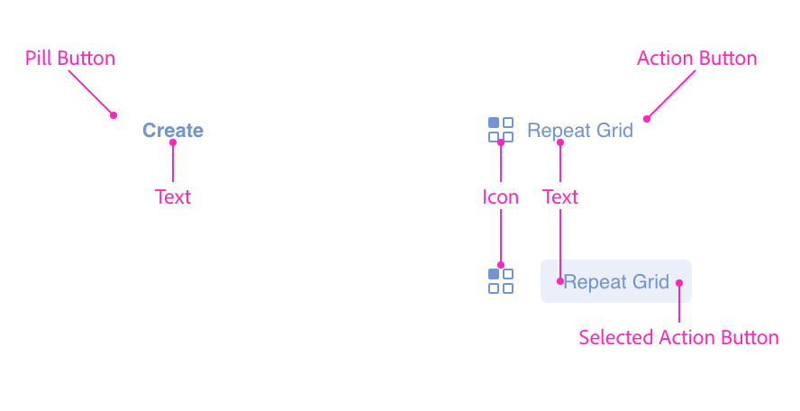
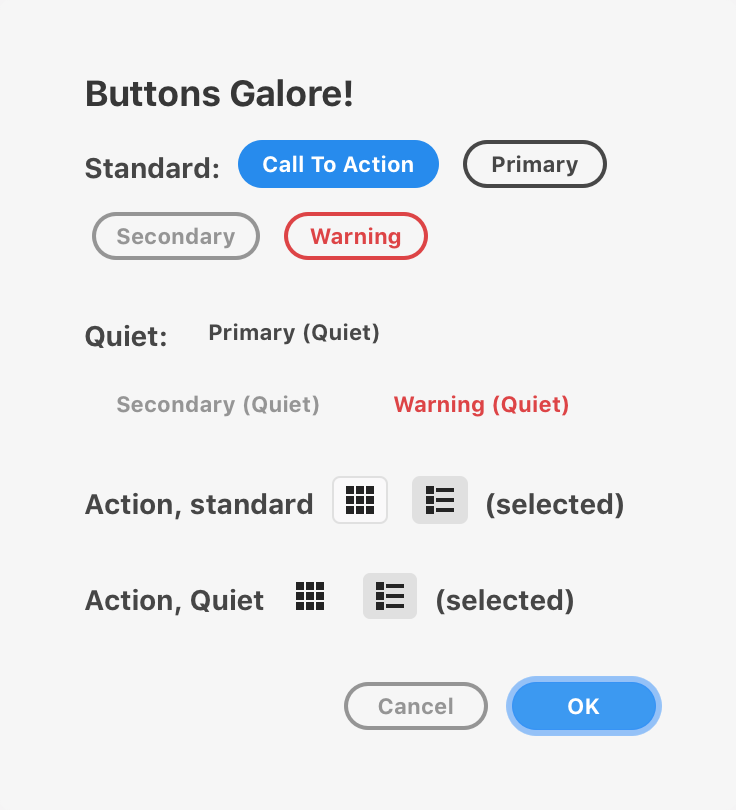
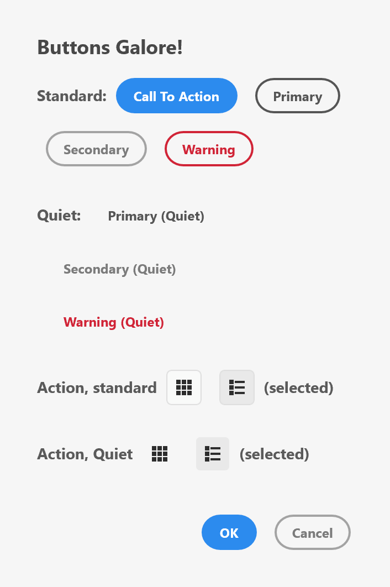
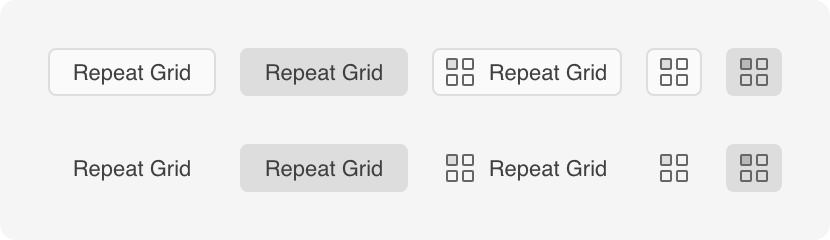
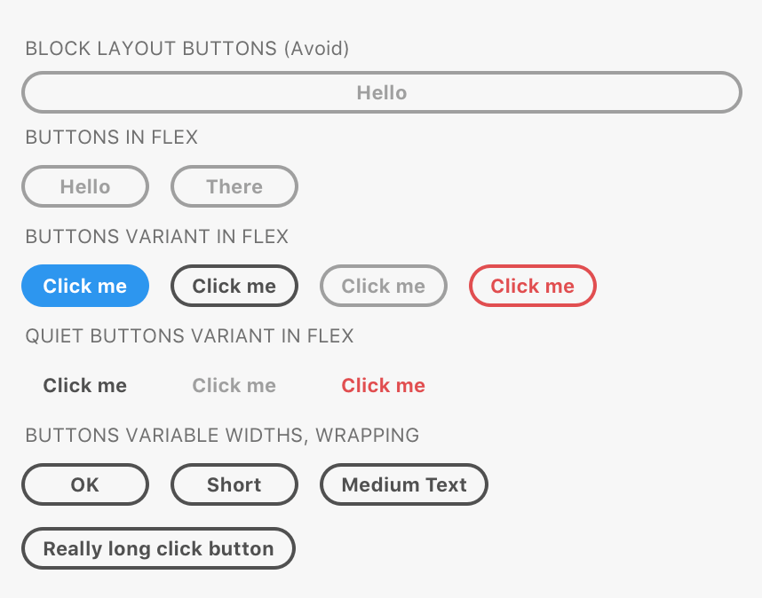
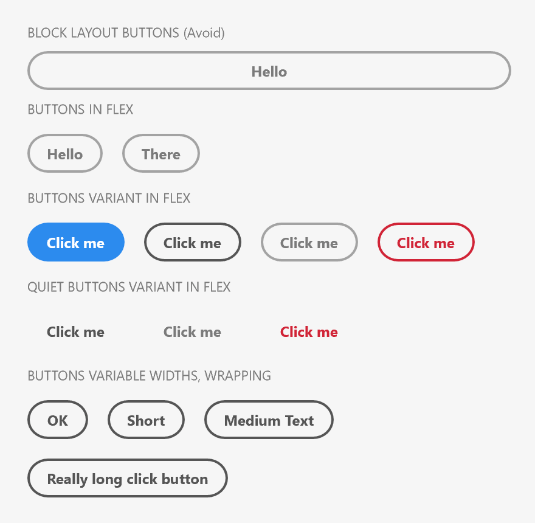

# Buttons

Buttons can be clicked or tapped in order to initiate an action, trigger a command, or disclose previously hidden parts of the user interface. Buttons come in two flavors: pill buttons and action buttons. The pill buttons contain text, whereas the action buttons are typically used for icons and cases where you need to indicate the selected state of an icon.

Buttons have multiple degrees of **loudness** (depending on your button's need for attention in the context of your user interface) and several variants for various uses (such as warnings or calls to action).

## Anatomy





















## Usage

You can render a button using the following:





```html
<button>Click Me</button>
```



```js
const button = document.createElement("button");
button.textContent = "Click Me";
```



```js
function render() {
    return (
        <button>Click Me</button>
    );
}
```



## Variants

There are several variants that you can specify by setting the `uxp-variant` attribute.






The "call to action" variant is intended to call out the action in the dialog that the user is encouraged to take. There should only ever be _one_ of these in a dialog.

> **Tip**
>
> There is no quiet variant of this button, since the intent of a call-to-action is to be obvious and draw the user's attention.

```html
<button uxp-variant="cta">Yes</button>
```




A primary button is used in place of a call-to-action button when the action itself is less prominent, or if there are multiple buttons with the same level of importance within the dialog. This variant supports a quieter (borderless) version.

```html
<button uxp-variant="primary">Create</button>
<button uxp-variant="primary" uxp-quiet="true">Create</button>
```




A secondary button is used in conjunction with other button variants to make other less prominent actions visible to the user. This variant supports a quieter (borderless) version.

```html
<button uxp-variant="secondary">Cancel</button>
<button uxp-variant="secondary" uxp-quiet="true">Cancel</button>
```




Warning buttons are used when the action is considered destructive. This variant supports a quiet (borderless) version.

> **Warning**
>
> Warning buttons should _never_ be the default buttons on a form (that is, the action that is invoked when the user presses ENTER to dismiss a dialog).

```html
<button uxp-variant="warning">Cancel</button>
<button uxp-variant="warning" uxp-quiet="true">Cancel</button>
```





Action buttons can be used to trigger actions within the dialog. These come in different variations and can include icons. Quiet (borderless) options are also available. Action buttons can also be "selected" when clicked. When used as a group, this ability to be selected can be used to indicate grid and list views, for example.

> **Info**
>
> Action buttons are often used to render icons. You should ideally have your icon as a 28x28 PNG file (for high DPI displays; use 14x14 for lower density displays). If you use a different size, Action buttons will resize, but the results may not be desirable. Note that XD will attempt to automatically use any available high DPI variants of an icon (i.e., it will automatically use `@2x` and `@3x` files automatically).

```html
<button uxp-variant="action">Repeat Grid</button>
<button uxp-variant="action" uxp-quiet="true">Repeat Grid</button>
<button uxp-variant="action">
    
</button>
<button uxp-variant="action">
    
    Repeat Grid
</button>
<button uxp-variant="action" uxp-selected="true">
    
</button>
```



## Layout

_How_ buttons are rendered will depend upon the layout of their container. Consider the following HTML and resulting rendering.





```html
<style>
    .wrap { flex-wrap: wrap; }
</style>
<h3>BLOCK LAYOUT BUTTONS (Avoid)</h3>
<button>Hello</button>
<h3>BUTTONS IN FLEX</h3>
<div class="row"><button>Hello</button><button>There</button></div>
<h3>BUTTONS VARIANT IN FLEX</h3>
<div class="row">
    <button uxp-variant="cta">Click me</button>
    <button uxp-variant="primary">Click me</button>
    <button uxp-variant="secondary">Click me</button>
    <button uxp-variant="warning">Click me</button>
</div>
<h3>QUIET BUTTONS VARIANT IN FLEX</h3>
<div class="row">
    <button uxp-variant="primary" uxp-quiet="true">Click me</button>
    <button uxp-variant="secondary" uxp-quiet="true">Click me</button>
    <button uxp-variant="warning" uxp-quiet="true">Click me</button>
</div>
<h3>BUTTONS VARIABLE WIDTHS, WRAPPING</h3>
<div class="row wrap">
    <button uxp-variant="primary">OK</button>
    <button uxp-variant="primary">Short</button>
    <button uxp-variant="primary">Medium Text</button>
    <button uxp-variant="primary">Really long click button</button>
</div>
```











As you can see, buttons are, by default rendered in _block_ layout. This results in very wide buttons, which aren't ideal.

The remainder of the buttons are rendered in flex containers (see [Flexbox layout](../layout/flex.md)). When rendered within flex containers, buttons will respect the stretching and positioning, but by default buttons will shrink to fit their textual content.

If you need a specific width, you can assign a `width` style, but it is important to be aware that widgets render with different metrics on macOS and Windows.

## Guidelines

When using buttons, you should consider your user's experience and utilize the variants and loudness options to ensure your user knows what to expect when they click or tap on a button.

### Pill Button Guidelines

##### Which Button Variant Should I Use?

Avoid combining more than two different variants within a single dialog. The primary button should be a "call to action" button (`uxp-variant="cta"`), a primary button (`uxp-variant="primary"`), or a warning button (`uxp-variant="warning"`). Other, lower promiment actions should use buttons of a similar lower variation (so, "secondary" or a quiet version).

> **Tip**
>
> If there are multiple buttons within a dialog, there should be only _one_ "call to action" button. This button is intended to attract the user's attention, and as such, it should be used for the primary action.

* **Don't** choose button types randomly; apply some thought to the user's experience when they use your dialog.
* **Do** give prominence to the main action by using a "call to action" button.
* **Don't** use more than two button variations in a group.

##### Button Order

You should prefer the button order that the platform your plugin is running on utilizes. macOS and Windows utilize different button orders. macOS, for example, will place the primary action in the lower right corner of a dialog, whereas on Windows, the same location is typically reserved for a cancel button.

On XD, button order is determined _automatically_ when placed within a `<footer>` element. The element _assumes_ that your button order is in the macOS order, and will reverse the order when the plugin is running on Windows. This works well when there are only one or two buttons in a dialog footer, but doesn't work for all situations. In that case, you'll need to override the button order.



```js
import React from "react";
const platform = require("os").platform();
const isWindows = platform.toLowerCase().substr(0,3) === "win";

function render() {
    return (
        <footer style={{flexDirection: "row"}}>
            {
                isWindows ? (
                    <button uxp-variant="cta">Save</button>
                    <button uxp-variant="primary">Don't Save</button>
                    <button uxp-variant="primary">Cancel</button>
                ) : (
                    <button uxp-variant="primary">Don't Save</button>
                    <button uxp-variant="primary">Cancel</button>
                    <button uxp-variant="cta">Save</button>
                )
            }
        </footer>
    );
}
```



##### Follow Capitalization Rules

Button text should be in title case.

* **Don't** use all capital letters to call attention to a button. (e.g., "EXPORT ARTBOARD")
* **Don't** use all lowercase letters. (e.g., "export artboard")
* **Don't** use sentence case. (e.g., "Export artboard")
* **Do** use title case. (e.g., "Export Artboard")

##### Be Concise

Your users should be able to infer the button's intent quickly. Button text should usually be one or two words long, and no more than four words. Don't use punctuation.

* **Don't** use punctuation in your buttons. (e.g., "Export Artboard Now!")
* **Don't** use long text. (e.g., "Export Artboard To Your Storage Device")
* **Do** keep the text short. (e.g., "Export Artboard")

##### Use Clear Text

Don't make your user guess as to what the button will do when they tap or click it. Avoid ambiguous phrasing like "Yes", "Ok", etc.

* **Don't** use ambiguous wording such as "Yes", "No", "Ok", etc.
* **Do** use clear, concise wording such as "Save", "Don't Save", "Create", etc.

##### Button Width

Buttons should be only slightly wider than the text within them (unless the text is extremely short). Don't fill a dialog with a button that stretches across the dialog.

* **Don't** stretch or apply width to a button.

##### Button Icons

Pill buttons don't support icons.

##### In-Dialog Button Alignment

Buttons should be aligned to the lower right corner of dialogs.

* **Don't** center or left-align your buttons in a dialog.
* **Do** align your buttons to the lower right corner in a dialog.

##### Buttons with Context Menus (Popovers)

Buttons that display a popover (context) menu should be the beginning of an action phrase. For example, if a button can create multiple types of shapes, the button itself could be named "Create" and the items in the popover could be "Rectangle", "Circle", etc.

### Action Button Guidelines

##### Icon-only Action Buttons

When only icons are used in an action button, the user can be left guessing as to what the button actually does. Consider using a tooltip to allow the user some insight into what the button will do before the user commits to clicking it.



```html
<button uxp-variant="action" title="Grid View">
    
</button>
```



##### Isolated Action Buttons

If you have an icon-only or text-only action button that is isolated from other buttons in your dialog, consider using the standard (non-quiet) version so that it's obvious that the control is indeed a button.

## Keyboard Interaction

Key       | Action
----------|----------------------------
SPACE     | Clicks the button.
ENTER     | Clicks the button.
TAB       | Moves to the next focusable element.
SHIFT+TAB | Moves to the previous focusable element.

## Event Handling

When clicked, buttons will fire the `click` event. You can listen to this in a couple of ways:

* Assign a handler to the `onclick` property.
* Call `HTMLButtonElement#addEventListener` to register a handler for the `click` event.





```js
const button = document.createElement("button");
button.textContent = "Click Me";
button.addEventListener("click", evt => {
    // handle the button click here
    console.log("Clicked!");
    // if you need to cancel the default action, call evt.preventDefault()
});
```



```js
const React = require("react");

function clickHandler(evt) {
    // handle the button click
    console.log("Clicked!");
    // if you need to cancel the default action, call evt.preventDefault()
}

render() {
    return (
        <button onClick={clickHandler}>Click Me</button>
    );
}
```



> **Tip**
>
> When a button of `type="submit"` or `uxp-variant="cta"` is present in a `form`, its `click` handler will be called if the user presses ENTER when not already focused on a button.

## Styling

Buttons accept a limited amount of styling. You cannot change the following styles:

* Height
* Font family, weight, or text color
* Padding of text
* Color of the border around the button, or the color of the icon inside

## Attributes

### Supported Attributes

* `disabled`
* `type`: `submit`, `reset`, `button`
* `uxp-variant`: `action`, `cta`, `primary`, `secondary`, `warning`
* `uxp-quiet`: `true`
* `uxp-selected`: `true`
* `autofocus`: `autofocus`

### Unsupported Attributes

* `autocomplete`
* `form`
* `formaction`
* `formenctype`
* `formmethod`
* `formnovalidate`
* `formtarget`
* `name`
* `value`

## Known Issues

* At this point, XD does not support rendering buttons as `input` tags. All of the following are **unsupported**, and will render as regular text input fields:

    * `<input type="button" />`
    * `<input type="reset" />`
    * `<input type="submit" />`

* Buttons do not receive keyboard or pointer events.
