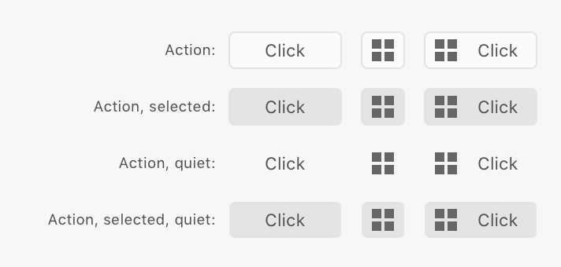
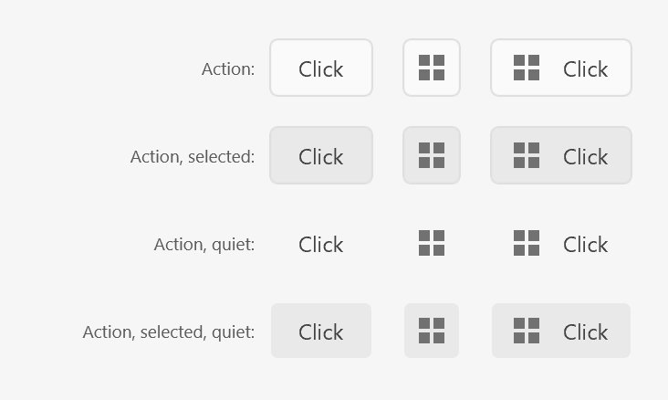

# Buttons

Buttons come in two flavors: pill buttons and action buttons. The pill buttons contain text, whereas the action buttons are typically used for icons and cases where you need to indicate the selected state of an icon.

macOS                                          | UWP
-----------------------------------------------|-------------------------
 | 

## Pill Buttons

You can render an pill button using the following:

```html
<button>Hello</button>
```

There are four other variants that you can specify by setting the `uxp-variant` attribute:

* `cta` - used to indicate the default action in a dialog; should only be used once, and only for non-destructive actions.
* `primary` - regular buttons; these aren't intended to act as "call-to-action" buttons.
* `secondary` - these buttons are lighter in color than the primary buttons, and so aren't as obvious.
* `warning` - use these buttons to indicate when an action is destructive in nature. These should never be the default buttons on a form.

For example, to render a warning button, you'd use this:

```html
<button uxp-variant="warning">Delete Files</button>
```

_How_ buttons are rendered will depend upon the layout of their container. Consider the following HTML and resulting rendering:

```
<style>
    .wrap { flex-wrap: wrap; }
</style>
<h3>BLOCK LAYOUT BUTTONS (Avoid)</h3>
<button>Hello</button>
<h3>BUTTONS IN FLEX</h3>
<div class="row"><button>Hello</button><button>There</button></div>
<h3>BUTTONS VARIANT IN FLEX</h3>
<div class="row">
    <button uxp-variant="cta">Click me</button>
    <button uxp-variant="primary">Click me</button>
    <button uxp-variant="secondary">Click me</button>
    <button uxp-variant="warning">Click me</button>
</div>
<h3>QUIET BUTTONS VARIANT IN FLEX</h3>
<div class="row">
    <button uxp-variant="primary" uxp-quiet="true">Click me</button>
    <button uxp-variant="secondary" uxp-quiet="true">Click me</button>
    <button uxp-variant="warning" uxp-quiet="true">Click me</button>
</div>
<h3>BUTTONS VARIABLE WIDTHS, WRAPPING</h3>
<div class="row wrap">
    <button uxp-variant="primary">OK</button>
    <button uxp-variant="primary">Short</button>
    <button uxp-variant="primary">Medium Text</button>
    <button uxp-variant="primary">Really long click button</button>
</div>
```

The above results in the following buttons:

macOS                                              | UWP
---------------------------------------------------|-------------------------------
 | 

As you can see, buttons are, by default rendered in _block_ layout. This results in very wide buttons, which aren't ideal.

The remainder of the buttons are rendered in flex containers (see [Flexbox layout](../layout/flex.md)). When rendered within flex containers, buttons will respect the stretching and positioning, but by default buttons will shrink to fit their textual content.

If you need a specific width, you can assign a `width` style, but it is important to be aware that widgets render with different metrics on macOS and UWP.

## Action Buttons

Action buttons are used to render icons. You should ideally have your icon as a 28x28 PNG file (for high DPI displays; use 14x14 for lower density displays). If you use a different size, Action buttons will resize, but the results may not be desirable.

macOS                                                    | UWP
---------------------------------------------------------|-----------------------
 | 

You can render an action button like so:

```html
<!-- text only -->
<button uxp-variant="action">Action</button>

<!-- icon only -->
<button uxp-variant="action">
    
</button>

<!-- both text and icon -->
<button uxp-variant="action">Action </button>
```

If you want the button to render as "selected", use the `uxp-selected` attribute:

```html
<button uxp-variant="action" uxp-selected="true">
    
</button>
```

<!-- code for the above
<style>
    .row {
        align-items: center;
    }
    .row span {
        font-size: 95%;
        flex-basis: 125;
        text-align: right;
    }
</style>
<div class="row">
    <span>Action:</span>
    <button uxp-variant="action">Click</button>
    <button uxp-variant="action"></button>
    <button uxp-variant="action">Click</button>
</div>

<div class="row">
    <span>Action, selected:</span>
    <button uxp-selected="true" uxp-variant="action">Click</button>
    <button uxp-selected="true" uxp-variant="action"></button>
    <button uxp-selected="true" uxp-variant="action">Click</button>
</div>

<div class="row">
    <span>Action, quiet:</span>
    <button uxp-quiet="true" uxp-variant="action">Click</button>
    <button uxp-quiet="true" uxp-variant="action"></button>
    <button uxp-quiet="true" uxp-variant="action">Click</button>
</div>

<div class="row">
    <span>Action, selected, quiet:</span>
    <button uxp-selected="true" uxp-quiet="true" uxp-variant="action">Click</button>
    <button uxp-selected="true" uxp-quiet="true" uxp-variant="action"></button>
    <button uxp-selected="true" uxp-quiet="true" uxp-variant="action">Click</button>
</div>
-->

## Quiet vs Standard

Both Pill and Action buttons have support for "quiet" controls. These are controls without borders, and so they fade into the woodwork, so to speak.

In general the quiet pill buttons only work without a comparison to the standard pill buttons, so it's advised not to use both on the same dialog.

The action buttons generally look best when used in the quiet mode.

You can specify a control should be rendered quietly by specifying the `uxp-quiet` attribute:

```html
<button uxp-quiet="true">Quiet!</button>
```

## Event Handling

When clicked, buttons will fire the `click` event. You can listen to this in a couple of ways:

* Assign a handler to the `onclick` property of an HTMLButtonElement.
* Call `HTMLButtonElement#addEventListener` to register a handler for the `click` event

When a button of `type="submit"` is present in a `form`, its `click` handler will be called if the user presses ENTER.

## Supported Attributes

* `disabled`
* `type`: `submit`, `reset`, `button`
* `uxp-variant`: `action`, `cta`, `primary`, `secondary`, `warning`
* `uxp-quiet`: `true`
* `uxp-selected`: `true`

## Unsupported Attributes

* `autofocus` <!-- (?) -->
* `autocomplete`
* `form`
* `formaction`
* `formenctype`
* `formmethod`
* `formnovalidate`
* `formtarget`
* `name` <!-- (?) -->
* `value` <!-- (?) -->

## Other unsupported buttons

At this point, XD does not support rendering buttons as `input` tags. All of the following are **unsupported**, and will render as regular text input fields:

* `<input type="button" />`
* `<input type="reset" />`
* `<input type="submit" />`

<!-- (TOFIX) -->