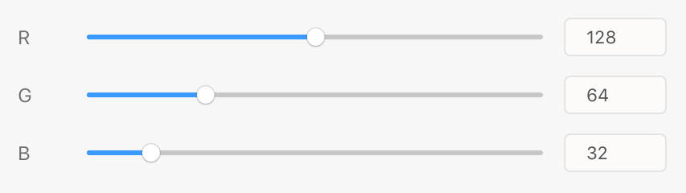
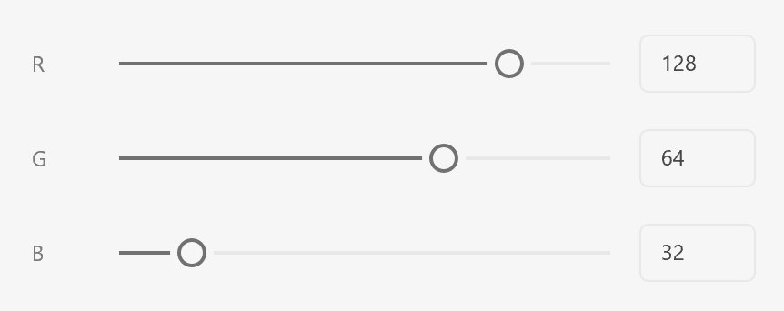

# Sliders

Sliders allow the user to pick from a continuum of values between a minimum and maximum value. Slider values are continuous by default, but may be discrete if desired (using the `step` attribute). Consider using text areas when the range of values is very wide, or when typing a value will be more precise than dragging a handle.

## Anatomy
















```html
<style>
    .colorrow {
        display: flex;
        flex-direction: row;
        align-items: center;
    }
    .colorrow span {
        flex: 0 0 32px;
    }
    .colorrow input[type=text] {
        flex: 0 0 64px;
    }
    .colorrow input[type=range] {
        flex: 1 1 auto;
    }
    .spread {
        justify-content: space-between;
    }
</style>
<label>
    <div class="row spread">
        <span>Opacity</span>
        <span>50%</span>
    </div>
    <input type="range" min=0 max=100 value=50 />
</label>
<label>
    <div class="row spread">
        <span>Heading Level</span>
        <span>3</span>
    </div>
    <input type="range" min=1 max=6 value=3 step=1 />
</label>
<h3>PICK A COLOR</h3>
<hr />
<label class="colorrow">
    <span>R</span>
    <input type="range" min=0 max=255 value=128 />
    <input type="text" value="128" />
</label>
<label class="colorrow">
    <span>G</span>
    <input type="range" min=0 max=255 value=64 />
    <input type="text" value="64" />
</label>
<label class="colorrow">
    <span>B</span>
    <input type="range" min=0 max=255 value=32 />
    <input type="text" value="32" />
</label>
```



## Usage

You can render a typical dropdown using the following:





```html
<style>
    .spread { justify-content: space-between; }
</style>
<label>
    <div class="row spread">
        <span>Opacity</span>
        <span>50%</span>
    </div>
    <input type="range" min=0 max=100 value=50 />
</label>
```



```js
const labelWrapper = document.createElement("label");

const label = document.createElement("span");
label.textContent = "Opacity";

const displayValue = document.createElement("span");
displayValue.textContent = "50%";

const labelAndDisplay = document.createElement("div");
labelAndDisplay.className = "row";
labelAndDisplay.style.justifyContent = "space-between";
labelAndDisplay.appendChild(label);
labelAndDisplay.appendChild(displayValue);

const slider = document.createElement("input");
slider.setAttribute("type", "range");
slider.setAttribute("min", "0");
slider.setAttribute("max", "100");
slider.setAttribute("value", "50");

labelWrapper.appendChild(labelAndDisplay);
labelWrapper.appendChild(slider);
```



```js
function render() {
    return (
        <label>
            <div className="row" style={{justifyContent: "space-between"}}>
                <span>Opacity</span>
                <span>50%</span>
            </div>
            <input type="range" min=0 max=100 value=50 />
        </label>
    );
}
```



## Guidelines

##### Include a Label and a Value

Sliders should always have a label and value. The value may be simple text, or it may be an editable text field (such as in a color picker).

##### Label and Value Position

Ensure that the label is rendered _above_ or _to the left of_ the dropdown.  When rendering labels to the left, render the _value_ to the right.

##### Value Units

Be sure to include the appropriate unit (such as a percent sign or "px", "in", etc.), unless rendering the value in a text field.

##### Positive and Negative Values

Be sure to include the sign on all values. When using a text-only display, add a space between the sign and the value for readability (e.g., "- 32%" or "+ 64%"). When using a text field, display the sign, but there's no need for an intervening space.

##### Capitalization

The slider's label should use title case.

## Keyboard

Key        | Action
-----------|--------------
UP ARROW   | Increases the slider's value (the amount is platform-dependent)
RIGHT ARROW| Increases the slider's value (the amount is platform-dependent)
LEFT ARROW | Decreases the slider's value (the amount is platform-dependent)
DOWN ARROW | Decreases the slider's value (the amount is platform-dependent)
ENTER      | Submits the active form
TAB        | Navigates to the next focusable control
SHIFT+TAB  | Navigates to the previous focusable control

## Styling

Sliders accept a limited amount of styling. You cannot change the following styles:

* Height
* Color of the slider's track, fill, or handle

## Attributes

### Supported Attributes

* `disabled`
* `value`
* `min`: the minimum value
* `max`: the maximum value
* `step`: if specified, the slider will return discrete values snapped to this value
* `autofocus`: `autofocus`

### Unsupported Attributes

* `autocomplete`
* `form`
* `formaction`
* `formenctype`
* `formmethod`
* `formnovalidate`
* `formtarget`
* `name`

## Supported Events

* `change`

## Known Issues

* Sliders do not receive keyboard or pointer events.