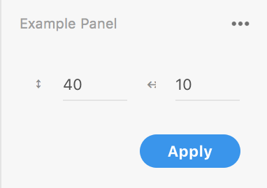

# Quick Start: Make your first XD panel plugin

Let’s walk through creating your first Adobe XD panel plugin together.

We'll keep things simple in this Quick Start tutorial. Once you're done, you'll have a solid grasp of the steps to take when starting to create your own XD panel plugin.

At the end of the tutorial, we'll suggest some next steps for going deeper with the XD plugin APIs.

## Prerequisites

- Basic knowledge of HTML, CSS, and JavaScript
- A text editor to write your code in (like VSCode, Sublime Text, Brackets, Atom, etc)

## Development Steps

> **Info**
> Complete code for this plugin can be found [on GitHub](https://github.com/AdobeXD/Plugin-Samples/tree/master/quick-start-panel).

### 0. Get a plugin ID from the I/O Developer Console

Before you start, you'll want to create a plugin project on the Adobe I/O Developer Console.

1. [Go to the I/O Console and sign in or sign up](https://console.adobe.io/plugins)
1. Click "Create Plugin"
1. Create a plugin project by giving it a project name and clicking "Create Plugin". Note that this project name is not public; it is only visible to you and can be changed directly on the Console later.
1. On the following page, get the 8-character unique plugin ID in the "Plugin Details" section.
1. Optionally on the same page, download the starter project, which contains a functioning Hello, World sample plugin.

We'll use your plugin ID in one of the next steps.

### 1. Identify where your plugins are located

Adobe XD loads plugins that are in development from a `develop` folder in a specific location on your machine. To get to that folder, simply go to this menu item: _Plugins > Development > Show Develop Folder_.

This will open the `develop` folder, which we'll use in the next step.

### 2. Create your plugin scaffold

Next, you'll need to make a new folder within the `develop` folder to store the plugin files that you'll create below. Name your new plugin folder anything you like.

Now, let's create your plugin files. Open your favorite text editor and create two files inside of your new plugin folder with these _exact_ names:

1.  `manifest.json`

This file includes information about the plugin, such as its name, the menu item(s) it adds to XD, and so on.

[Learn about the manifest here](/reference/structure/manifest.md).

2.  `main.js`

This file contains your JavaScript code that implements your plugin's functionality.

[Learn more about `main.js` here](/reference/structure/handlers.md).

These two files go into your plugin's parent directory. When you have the right structure, it will look like this:

```
my-plugin-folder
├── main.js
└── manifest.json
```

It's possible to have more files if you want, but these files are the bare minimum requirement for your plugin to work, and are all we'll need for this Quick Start tutorial.

### 3. Create your plugin’s manifest

In the previous step, you created a file named `manifest.json`. Open that file and paste in this JSON object:

```json
{
  "id": "YOUR_ID_HERE",
  "name": "Enlarge a Rectangle",
  "version": "0.0.1",
  "description": "Description of your plugin.",
  "summary": "Summary of your plugin",
  "languages": ["en"],
  "author": "Your Name",
  "helpUrl": "https://mywebsite.com/help",
  "host": {
    "app": "XD",
    "minVersion": "18.0"
  },
  "uiEntryPoints": [
    {
      "type": "panel",
      "label": "Enlarge a Rectangle",
      "panelId": "enlargeRectangle"
    }
  ]
}
```

Be sure to replace the `id` value with the unique plugin ID you got from the I/O Console in the first step:

```json
"id": "1234ABCD",
```

If you're curious about what each entry means, [see the manifest documentation](/reference/structure/manifest.md), where you can also learn about all manifest requirements for a plugin to be published in the XD Plugin Manager.

The value of the `panelId` property may be any string; in this case, it's `enlargeRectangle`. In the next section, we will see how this string is associated with the code for our plugin.

### 4. Create your plugin’s code

Next, we need to create the JavaScript code for our plugin. The code lives in a file named `main.js`, which we created in step #2.

#### Create a scaffold

Let's create some empty functions first. Copy and paste this code into `main.js`:

```js
function create() {}

function show(event) {}

function hide(event) {}

function update(selection) {}

module.exports = {
  panels: {
    enlargeRectangle: {
      show,
      hide,
      update
    }
  }
};
```

Now, let's look at each function in detail, starting with a `create` helper function that we'll use to build our UI.

#### Create the UI

The `create` function is just a helper function we'll make to help us get started. It is going to create an HTML `panel` element, insert our markup, and add a click event listener. The function returns our UI in code, but does not display it (we'll get to that next):

```js
function create() {
  // [1]
  const html = `
<style>
    .break {
        flex-wrap: wrap;
    }
    label.row > span {
        color: #8E8E8E;
        width: 20px;
        text-align: right;
        font-size: 9px;
    }
    label.row input {
        flex: 1 1 auto;
    }
    form {
        width:90%;
        margin: -20px;
        padding: 0px;
    }
</style>

<form method="dialog" id="main">
    <div class="row break">
        <label class="row">
            <span>↕︎</span>
            <input type="number" uxp-quiet="true" id="txtV" value="10" placeholder="Height" />
        </label>
        <label class="row">
            <span>↔︎</span>
            <input type="number" uxp-quiet="true" id="txtH" value="10" placeholder="Width" />
        </label>
    </div>
    <footer><button id="ok" type="submit" uxp-variant="cta">Apply</button></footer>
</form>

<p id="warning">This plugin requires you to select a rectangle in the document. Please select a rectangle.</p>
`;

  function exec() { // [2]
    const { editDocument } = require("application"); // [3]
    const height = Number(document.querySelector("#txtV").value); // [4]
    const width = Number(document.querySelector("#txtH").value); // [5]

    // [6]
    editDocument({ editLabel: "Increase rectangle size" }, function(selection) {
      const selectedRectangle = selection.items[0]; // [7]
      selectedRectangle.width += width; // [8]
      selectedRectangle.height += height;
    });
  }

  let panelContainer = document.createElement("div"); // [9]
  panelContainer.innerHTML = html; // [10]
  panelContainer.querySelector("form").addEventListener("submit", exec); // [11]

  return panelContainer; // [12]
}
```

This code does the following:

1. Creates a `const` called `html` for your UI markup, including elements for `style`, `form`, and so on. The `form` tag contains a `div` which includes two text input fields and a `footer` which has a button for users to click on. The `p` tag contains warning text which is used to warn users when they select a non-rectangle node inside the active XD document.
2. Creates a nested function called `exec`.
3. Gets a reference to the `editDocument` method available in the `application` module.
4. Gets user input value from the "height" input element.
5. Gets user input value from the "width" input element.
6. Makes a request XD to manipulate the active document by using the [`editDocument`](/reference/application.md) method.
7. Gets the first currently selected node. (Some UI logic will be added later to ensure this is a rectangle.)
8. Modifies the `width` and `height` of the selected rectangle.
9. Creates a `div` element to serve as a container for your panel UI.
10. Attaches the HTML created in step #1.
11. Adds a submit listener for the `form` element, attaching the `exec` function created in step #2.
12. Returns the panel UI container to be used in the next step.

#### Show the UI

Next, let's look at the `show` function. The `show` function is one of the _lifecycle methods_ for a panel plugin, and the only one that is required. The `show` function is called when your plugin is made visible to the user.

```js
function show(event) { // [1]
  const { selection } = require("scenegraph"); // [2]
  event.node.appendChild(create()); // [3]
  update(selection); // [4]
}
```

This code does the following:

1. The `show` lifecycle method gives you access to an `event` argument which includes a `node` property that you can attach your user interface to.
2. Gets a reference to the `selection` object imported from the `scenegraph` module. The `selection` is whatever the user has currently selected in the XD document.
3. Adds the panel UI container returned from the `create` helper function to `event.node`.
4. Updates the plugin UI by using the `update` lifecycle method (we'll look at this later) and passes the `selection` object

#### Remove the UI

One of the optional lifecycle methods for panels is `hide`, which runs when the user navigates away from your panel.

```js
function hide(event) { // [1]
  event.node.firstChild.remove(); // [2]
}
```

This code does the following:

1. The `event` argument that is passed includes a `node` property, just like we saw for the `show` lifecycle method.
2. You can choose to remove your UI at this time, as shown here, where we remove `event.node.firstChild`, which is the panel UI container `div` that we attached in the previous section.

#### Update your UI

The last lifecycle method, `update`, is an optional function which is called whenever the user changes the selection in the XD document or mutates a node within that selection. A mutation can be anything, including moves, resizes, etc.

We'll look at this code below:

```js
function update(selection) { // [1]
  const { Rectangle } = require("scenegraph"); // [2]

  const form = document.querySelector("form"); // [3]
  const warning = document.querySelector("#warning"); // [4]

  if (!selection || !(selection.items[0] instanceof Rectangle)) { // [5]
    form.style.display = "none";
    warning.style.display = "inline";
  } else {
    warning.style.display = "none";
    form.style.display = "block";
  }
}
```

This code does the following:

1. Uses the `selection` argument. `update` provides two arguments, `selection` and `documentRoot`. This example only uses `selection`.
2. Gets a reference to the `Rectangle` object imported from the `scenegraph` module.
3. Gets a reference to the `form` element in your HTML.
4. Gets a reference to the `p` element with the warning message in your HTML.
5. Checks if the user has selected anything and if the selection is a rectangle. If this validation passes, the form appears and the warning message is not shown. If not, the warning message is shown to the user and the form disappears.

#### Export your lifecycle methods

Finally, you need to export the panel lifecycle methods you created:

```js
module.exports = {
  panels: {
    enlargeRectangle: {
      show,
      hide,
      update
    }
  }
};
```

The above code exports an object with a `panels` property. The value of `panels` is also an object with a property that matches the `panelId` from your manifest, in this case `enlargeRectangle`.

Finally, `enlargeRectangle` is an object containing your panel lifecycle methods. Note that the `show` lifecycle methods is required for all panel plugins, while the `hide` and `update` methods are optional.

### 5. Run your plugin

So you’ve written a plugin! How do we run it?

If you haven’t already done so, launch XD and open a new document. Then navigate to the _Plugins > Enlarge a Rectangle_ menu item. This will open your panel in the plugin launchpad on the left-hand side of the XD application.



Congratulations! You’ve built your first panel plugin for Adobe XD!

## Next Steps

- Learn about [debugging plugins](/tutorials/debugging/index.md)
- Follow our [tutorials](/tutorials/)
- See working code in our [sample repos on GitHub](https://github.com/AdobeXD/Plugin-Samples)
- Browse the [API references](/reference/how-to-read.md)
