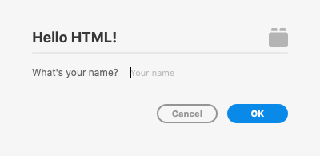

# UI HTML

This sample shows how to achieve the following UI using HTML:

It will also help you learn about handling OK/Cancel buttons, as well as Escape and Return key presses.

## Usage

1. In XD, open the Developer Console at _Plugins > Development > Developer Console_
1. Run this plugin at _Plugins > UI HTML_
1. Enter your name in the modal
1. Click the OK or Cancel button, or press your keyboard's return or escape key
1. See the output in the Developer Console
