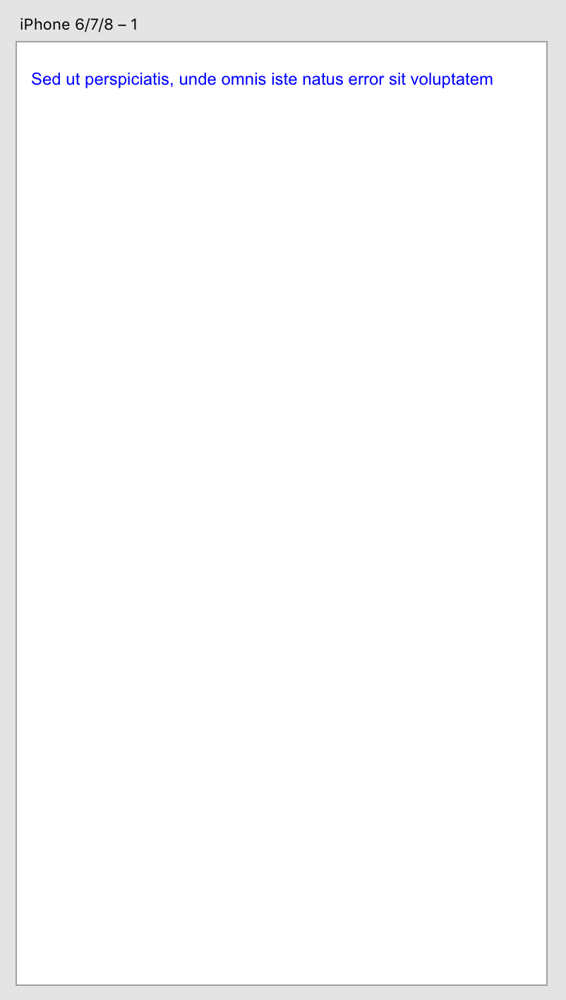

# How to read a file

This sample describes how an XD plugin can invoke the default file picker and display the text extracted from the file chosen by user. The plugin code can be found [here](https://github.com/AdobeXD/Plugin-Guides/tree/master/Guides/how-to-import-guide).

## Contents

1. [Technology Used](how-to-import-guide.md#technology-used)
2. [Prerequisites](how-to-import-guide.md#prerequisites)
3. [Development Steps](how-to-import-guide.md#development-steps)
4. [Next Steps](how-to-import-guide.md#next-steps)

## Technology Used

* References: [XD File I/O](https://github.com/AdobeXD/Plugin-Guides/tree/2d9ccbfb0d863bea69dadcc420a962c539c46156/Guides/how-to-import-guide/references/selection.md)

## Prerequisites

* Basic knowledge of HTML, CSS, and JavaScript.
* [Getting Started Guide](../getting-started/getting-started-guide.md)

## Development Steps

### 1.  Create plugin scaffold

As described in the [Getting Started Guide](../getting-started/getting-started-guide.md), create the directory for your plugin:

```text
$ cd ~/Library/Application Support/Adobe/Adobe XD CC (Prerelease)/plugins
$ mkdir com.adobe.xd.insertTextFromFile
$ cd com.adobe.xd.insertTextFromFile
$ touch manifest.json
$ touch main.js
```

Edit the manifest file for your plugin:

```javascript
{
    "id": "com.adobe.xd.insertTextFromFile",
    "name": "Insert Text from File",
    "host": {
        "app": "XD",
        "minVersion": "8.0"
    },
    "version": "1.0.0",
    "uiEntryPoints": [
        {
            "type": "menu",
            "label": "Insert Text From File",
            "commandId": "insertTextFromFileCommand"
        }
    ]
}
```

In the main.js file, link the commandId to a handler function

```javascript
async function insertTextFromFileHandler(selection) {
    // The body of this function is added later
}

module.exports = { 
    commands: {
        "insertTextFromFileCommand": insertTextFromFileHandler
    }
};
```

The remaining steps in this guide describe additional edits to the main.js file.

### 2.  Get references to the `Text` and `Color` classes from XD’s `scenegraph` module

```javascript
const { Text, Color } = require("scenegraph");
```

`Text` and `Color` classes are imported and ready to be used.

### 3. Import XD's `localFileSystem` module

```javascript
const fs = require("uxp").storage.localFileSystem;
```

This example uses File I/O to import a file from user's local drive, so we need to require XD's `localFileSystem` module.

### 4. Create an asynchronous handler function

```javascript
async function insertTextFromFileHandler(selection) { // [1]
    const [aFile] = await fs.getFileForOpening();     // [2]
    if (!aFile)                                       // [3]
    return;

    const contents = await aFile.read();              // [4]

    const text = new Text();                          // [5] 
    text.text = contents;
    text.styleRanges = [{
        length: contents.length,
        fill: new Color("#0000ff"),
        fontSize: 12
    }];
    selection.insertionParent.addChild(text);
    text.moveInParentCoordinates(10, 30);
}
```

1. This example uses XD's asynchronous Filo I/O APIs, so the handler function must be declared as an async method.
2. A file picker dialog is displayed, and the function waits for the user to select a file.  See below for more detail.
3. If `aFile` is undefined \(because the user did not select a file\), then plugin execution is aborted.
4. The contents of the file is read, and it is returned as a string.  See below for more detail.
5. The contents of the string is added to a `Text` object, and the `Text` object is added to the currently-selected artboard.  For more information, see [How to create styled text](../working-with-content/how-to-style-text-guide.md)

Line \[2\] uses a number of modern Javascript constructs. It is executed as follows:

* First,`fs.getFileForOpening()` function returns a `Promise` object.  
* Next, the `await` keyword causes this asynchronous function to pause until the `Promise` is fulfilled. 
* If the user selects a file, then the `Promise` is fulfiled. The value of the `await` expression is that of the fulfilled promise, which is an `Array` containing one `File` object.
* If the user closes the file picker dialog without selecting a file, then the promise is also fulfilled. The value of the `await` expression is that of the fulfilled promise, which is an empty array.
* Using the "destructuring assignment" syntax, the first element of the array is assigned to `aFile`.  If the array is empty \(because the user did not select a file\), then `aFile` is set to `undefined`.

Line \[4\] is also an asynchronous operation:

* First, `File.read` returns a `Promise` object.
* Next, the `await` keyword causes this asynchronous function to pause until the `Promise` is fulfiled.
* When the contents of the file has been read, the `Promise` is filfilled.  The value of the `await` expression is that of the fulfilled promise, which is a string containing the contents of the file.

### 5. Test the plugin

If you reload the plugin and execute it, you should see a file chooser like this one:


If you select a file containing text, the text should be added to the currently-selected artboard:



## Next Steps

Ready for more? Take a look at other guides:

* [Guides](https://github.com/AdobeXD/Plugin-Guides/tree/2d9ccbfb0d863bea69dadcc420a962c539c46156/Guides/README.md)

